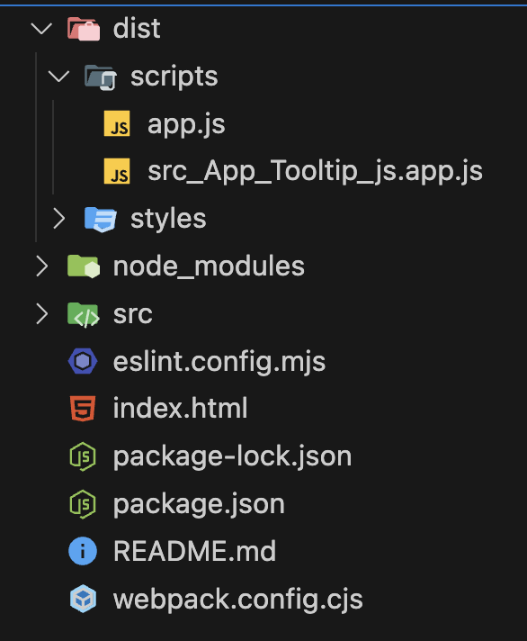

# [Webpack](https://webpack.kr/)

## 1. 설치

```bash
❯ npm i webpack webpack-cli --save-dev
```

## 2. webpack.config 생성 및 환경 설정

- **mode**: Webpack의 모드 설정으로, development, production, none 중 하나를 선택할 수 있다. development 모드는 개발 환경에 적합한 설정을 적용하며, production 모드는 최적화된 설정을 적용한다.
- **entry**: 번들링의 시작점이 되는 파일을 지정한다. 이 파일을 기준으로 의존성 그래프가 형성된다.
- **output**: 번들링된 결과 파일의 저장 위치와 이름을 지정한다.
- **filename**: 번들링 결과 파일의 이름을 지정한다.
- **path**: 번들링된 파일을 저장할 경로를 절대 경로로 지정합니다. path.resolve를 사용하여 경로를 생성한다.
- **publicPath**: 웹 애플리케이션에서 모든 출력 파일들이 위치할 공개 URL 경로를 지정한다. 이는 주로 서버에서 파일들을 제공할 때의 경로를 지정하며, 웹팩의 로더나 플러그인에서 사용된다.

<br/>
위 설명에 따르면 publicPath는 번들링된 파일들이 제공될 웹 서버 상의 경로를 지정하는 것이다.
<br/>
예를 들어, publicPath가 /scripts/로 설정된 경우, 웹 서버에서 http://yourdomain.com/scripts/ 경로를 통해 파일에 접근할 수 있다.

```cjs
// /webpack.config.cjs
const path = require("path");

module.exports = {
  mode: "development", // 모드 환경 설정 (development, production, none 중 하나)
  entry: "./src/app.js", // 어느 소스파일을 시작으로 번들링하는지 지정

  // 번들링한 결과 파일 저장 관련 정보
  output: {
    filename: "app.js", // 번들링 완료한 파일 이름
    path: path.resolve(__dirname, "./dist", "scripts"), // 번들링 완료한 파일을 저장할 경로
    publicPath: "/scripts/", // 번들링된 파일들이 제공될 웹 서버 상의 경로
  },
};
```

- path.resolve역할
  - output : `./dist/scripts/app.js`

## 3. 번들링 실행

### 1) config 파일을 지정하여 cli 실행

```bash
❯  npx webpack --config webpack.config.cjs
```

### 2) package.json 에 script 추가

```json
// package.json

  "scripts": {
    "test": "echo \"Error: no test specified\" && exit 1",
    "build": "webpack"
  },
  "devDependencies": {
    "eslint": "^6.4.0",
    "webpack": "^4.40.2",
    "webpack-cli": "^3.3.9"
  }
```

```bash

❯ npm run build

> javascript-complete-guide@1.0.0 build
> webpack

asset app.js 19.3 KiB [emitted] (name: main)
asset src_App_Tooltip_js.app.js 3.89 KiB [emitted]
runtime modules 5.68 KiB 8 modules
cacheable modules 7.8 KiB
  modules by path ./src/App/*.js 5.97 KiB
    ./src/App/ProjectList.js 2.17 KiB [built] [code generated]
    ./src/App/ProjectItem.js 1.98 KiB [built] [code generated]
    ./src/App/Tooltip.js 1.28 KiB [built] [code generated]
    ./src/App/Component.js 567 bytes [built] [code generated]
  ./src/app.js 904 bytes [built] [code generated]
  ./src/Utility/DOMHelper.js 965 bytes [built] [code generated]
webpack 5.92.0 compiled successfully in 109 ms
```



## 3. Loader

로더(Loader)는 웹팩이 웹 애플리케이션을 해석할 때 자바스크립트 파일이 아닌 웹 자원(HTML, CSS, Images, 폰트 등)들을 변환할 수 있도록 도와주는 속성이다.

### css loader

```bash
❯ npm i css-loader -D

```

```js
// webpack.config.js
module.exports = {
  entry: "./app.js",
  output: {
    filename: "bundle.js",
  },
  module: {
    rules: [
      {
        test: /\.css$/,
        use: ["css-loader"],
      },
    ],
  },
};
```

해당 프로젝트의 모든 CSS 파일에 대해서 CSS 로더를 적용하겠다는 의미

- **test** : 로더를 적용할 파일 유형 (일반적으로 정규 표현식 사용)
- **use** : 해당 파일에 적용할 로더의 이름

> scss 파일은 Sass로더로 전처리기(scss -> css 변환)을 거친다음 css파일을 인식할 수 있게한다.<br/>
>
> - 여러개의 로더를 적용할 경우에는 오른쪽에서 왼쪽으로 실행
> - style-loader : 웹팩으로 빌드한 것으로 실행했을때 css 파일이 웹 어플리케이션의 인라인 스타일 태그로 추가되는 것을 원할 때 추가
>
> ```js
>  {
>   test: /\.scss$/,
>   use: ['style-loader', 'css-loader', 'sass-loader'] // 오른쪽에서 왼쪽으로 적용
> }
> ```

### 그외 loader

- Babel Loader
- Sass Loader
- File Loader
- Vue Loader
- TS Loader

적용 시킬 ㄹ로더가 많을 경우에는 rules 배열에 적용해주면 된다.

```js
module.exports = {
  module: {
    rules: [
      { test: /\.css$/, use: "css-loader" },
      { test: /\.ts$/, use: "ts-loader" },
      // ...
    ],
  },
};
```

## 4. [Webpack-dev-server](https://webpack.kr/)

웹팩의 빌드 대상 파일이 변경 되었을 때, 매번 웹팩 명령어를 실행하지 않아도 코드만 변경하고 저장하면 웹팩으로 빌드한 후 브라우저를 새로고침 해준다.

브라우저 새로고침 뿐만 아니라 빌드 시간을 줄여주기 때문에 웹팩 기반의 개발에 필수로 사용된다.

```json
"scripts": {
  "dev": "webpack serve",
  "build": "webpack"
}
```

웹팩 데브 서버를 실행하여 웹팩 빌드를 하는 경우에는

- 빌드한 결과물은 메모리에 저장되고 파일로 생성하지는 않기 때문에
- 컴퓨터 내부적으로는 접근할 수 있지만 직접 파일을 조작할 순 없다.

웹팩 데브 서버는 개발할 때만 사용하다가 개발이 완료되면 웹팩 명령어를 이용해 결과물을 파일로 생성해야 한다.

> 개발 단계 : `webpack serve`
> 개발 완료 : `webpack --mode=production`

## 5. mode = development / production

`--config webpack.config.js`를 명시하지 않아도 기본 config 파일로 적용된다.

```json
// package.json
  "scripts": {
    "build:dev": "webpack --mode=development",
    "build:prod": "webpack --mode=production",
    "dev": "webpack serve --mode=development"
  },
```

```js
// webpack.config.js
const developmentConfig = require("./webpack.config.dev.js");
const productionConfig = require("./webpack.config.prod.js");

module.exports = (env, { mode }) => {
  return mode === "development" ? developmentConfig : productionConfig;
};
```

- **devtool**: `source-map`, `eval-source-map` : 전체 소스맵을 생성하여 디버깅에 유용하다.
- **filename** : `app.[contenthash].js`: 출력 파일 이름에 해시를 추가하여, 파일 내용이 변경될 때마다 새로운 해시가 생성되어 캐싱 문제를 해결한다.

### plugin

- **CleanWebpackPlugin**:빌드 전에 출력 디렉토리를 청소하여 이전 빌드 파일을 제거한다.
- **HtmlWebpackPlugin** : 빌드 과정에서 HTML 파일을 생성하거나 기존 HTML 파일을 업데이트하여, 빌드 결과물을 자동으로 포함시킨다.
  - 템플릿 기반 html 생성
  - 번들링된 자바스크립트(`<script>`) 및 CSS(`<link>`) 자동 삽입
  - HTML 파일의 압축 및 최적화 (옵션을 통해 가능)
- **MiniCssExtractPlugin** : 빌드 과정에서 CSS 파일을 별도의 파일로 추출한다. (Webpack Dev Server에서는 HMR(Hot Module Replacement)로 CSS 변경 사항을 자동으로 업데이트하지 않기 때문에 주로 production 모드에서 사용된다)
  - CSS 파일을 별도의 파일로 추출하여 <link> 태그로 포함시킴
  - CSS 파일 이름 지정 및 해시를 사용하여 캐시 무효화

```js
  plugins: [
    new CleanPlugin.CleanWebpackPlugin(),
    new HtmlWebpackPlugin({
      // index.html 템플릿을 기반으로 빌드 결과물을 추가해줌
      template: "index.html",
    }),
    new MiniCssExtractPlugin({
      filename: "styles/[name].css",
    }),
  ],
```

# [ESLint](./eslint.md)
