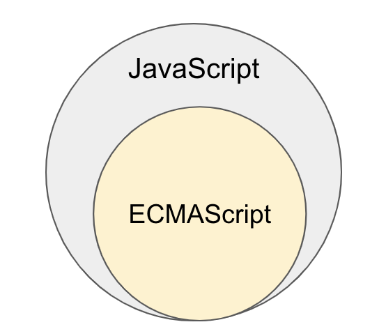

# 2장 자바스크립트란?

# 자바스크립트의 탄생

웹페이지의 보조적인 기능을 수행하기 위해 브라우저에서 동작하는 경량 프로그래밍 언어를 도입한 언어

- 브랜던 아이크가 개발
- 1996년 3월 , 넷스케이프 커뮤니케이션즈의 웹 브라우저인 넷스케이프 내비게이터2에 탑재되고
  모카(Mocha)로 명명됨
- 1996년 9월 ‘라이브스크립트(LiveScript)’로 이름 변경
- 1996년 12월에 ‘자바스크립트(JavaScript)’로 최종 명명됨
- 얼마 지나지 않아, 마이크로소프트에서 인터넷 익스프플로러 3.0에 탑재되는 자바스크립트의 파생버전 JScript 출시됨

# 자바스크립트의 표준화

### 크로스 브라우징 이슈 발생

JScript와 자바스크립트가 표준화되지 하고 적당히 호환됨

자사 브라우저의 시장 점유율을 높이기위해 자사 브라우저에서만 동작하는 기능을 경쟁적으로 추가하기 시작함

⇒모든 브라우저에서 정상적으로 동작하는 웹페이지 개발이 어려워짐

### 표준화된 자바스크립트 사양

자바스크립트의 파편화를 방지하고 모든 브라우저에서 정상적으로 동작하는 표준화된 자바스크립트 필요성 대두됨

1997년 7월 ECMA-262라 불리는 표준화된 자바스크립트(ECMAScript 1) 사양 완성

- 컴퓨터 시스템의 표준을 관리한느 비영리 표준화 기구 ECMA 인터네셔널
- 상표권 문제로 자바스크립트는 ECMAScript로 명명됨

- [출처 - 위키백과 : ECMA스크립트](https://ko.wikipedia.org/wiki/ECMA%EC%8A%A4%ED%81%AC%EB%A6%BD%ED%8A%B8)

| 판  | 출판일      | 이름                           | 이전 판과의 차이점                                                                                                                                                                                                                                                                                                                                                                                                                 |
| --- | ----------- | ------------------------------ | ---------------------------------------------------------------------------------------------------------------------------------------------------------------------------------------------------------------------------------------------------------------------------------------------------------------------------------------------------------------------------------------------------------------------------------- |
| 1   | 1997년 6월  | -                              | 초판                                                                                                                                                                                                                                                                                                                                                                                                                               |
| 2   | 1998년 6월  | -                              | ISO/IEC 16262 국제 표준과 완전히 동일한 규격을 적용하기 위한 변경.                                                                                                                                                                                                                                                                                                                                                                 |
| 3   | 1999년 12월 | -                              | 강력한 정규 표현식, 향상된 문자열 처리, 새로운 제어문 , try/catch 예외 처리, 엄격한 오류 정의, 수치형 출력의 포매팅 등.                                                                                                                                                                                                                                                                                                            |
| 4   | 버려짐      | -                              | 4번째 판은 언어에 얽힌 정치적 차이로 인해 버려졌다. 이 판을 작업 가운데 일부는 5번째 판을 이루는 기본이 되고 다른 일부는 ECMA스크립트의 기본을 이루고 있다.                                                                                                                                                                                                                                                                        |
| 5   | 2009년 12월 | -                              | 더 철저한 오류 검사를 제공하고 오류 경향이 있는 구조를 피하는 하부집합인 "strict mode"를 추가한다. 3번째 판의 규격에 있던 수많은 애매한 부분을 명확히 한 다.  HTML5 와 함께 출현한 표준안.   JSON, strict mode,접근자 프로퍼티, 프로퍼티 어트리뷰트 제어, 향상된 배열 조작기능(forEach, map, filter, reduce, some, every)                                                                                                  |
| 5.1 | 2011년 6월  | -                              | ECMA스크립트 표준의 제 5.1판은 ISO/IEC 16262:2011 국제 표준 제3판과 함께 한다.                                                                                                                                                                                                                                                                                                                                                     |
| 6   | 2015년 6월  | ES6 : ECMAScript 2015 (ES2015) | 6판에는 클래스와 모듈 같은 복잡한 응용 프로그램을 작성하기 위한 새로운 문법이 추가되었다. 하지만 이러한 문법의 의미는 5판의 strict mode와 같은 방법으로 정의된다. 이 판은 "ECMAScript Harmony" 혹은 "ES6 Harmony" 등으로 불리기도 한다.   let/const , 클래스, 화살표 함수, 템플릿 리터럴, 디스트럭처링 할당, 스프레드 문법, rest 파라미터, 심벌, 프로미스 ,Map/Set, 이터러블, for… of, 제너레이터, Proxy, 모듈 Import / export |
| 7   | 2016년 6월  | ES7: ECMAScript 2016 (ES2016)  | 제곱연산자(지수\*\* 연산자) 추가, Array.prototype.includes, String.prototype.includes                                                                                                                                                                                                                                                                                                                                              |
| 8   | 2017년 6월  | ES8: ECMAScript 2017 (ES2017)  | 함수 표현식의 인자에서 trailing commas 허용, Object values/entries 메소드(Object.values, Object.entries, Object.getOwnPropertyDescriptors), async/await 등.                                                                                                                                                                                                                                                                        |
| 9   | 2018년 6월  | ES9: ECMAScript 2018 (ES2018)  | Promise.finally, Async iteration, object rest/spread property 등.                                                                                                                                                                                                                                                                                                                                                                  |
| 10  | 2019년 6월  | ES10: ECMAScript 2019 (ES2019) | Object.fromEntries, flat, flatMap, Symbol.description, optional catch 등.                                                                                                                                                                                                                                                                                                                                                          |
| 11  | 2020        | ES11:(ECAMScript 2020)         | String.prototype.matchAll, BigInt.globalThis, Promise.allSettled, Nullish_coalescing(??), 옵셔널 체이닝 연산자(?), for...in                                                                                                                                                                                                                                                                                                        |

# 자바스크립트 성장의 역사

초창기 :

- 웹페이지 보조적인 기능을 수행하기 위해 한정적인 용도로 사용
- 대두분 로직은 웹 서버에서 실행
- 브라우저는 서버로 전달받은 HTML, CSS 를 단순하게 렌더링하는 수준

## 1. Ajax_Asynchronous JavaScript and XML

**XMLHttpRequest** 라는 이름으로**, 자**바스크립트를 이용해 서버와 브라우저가 비동기(asynchronous) 방식으로 데이터를 교환할 수 있는 통신 기능 등장

Ajax 등장 전

- html 태그로 시작해서 html 태그로 끝나는 완전한 HTML 코드를 서버로 전송받아 웹페이지 전체를 렌더링하는 방식으로 동작
- 페이지 전환될 때마다 서버로 부터 새로운 HTML을 전송받고 웹페이지 전체를 다시 렌더링함
  - 변경할 필요가 없는 부분까지 처음부터 다시 렌더링 필요
    - 불필요한 데이터통신 발생
    - 성능면에서 무척 불리
  - 화면이 전환되면 화면이 순간적으로 깜빡이는 현상 발생

Ajax 등장 후,

- 웹페이지에서 변경할 필요가 없는 부분을 다시 렌더링하지않음
- 서버로 부터 필요한 데이터 전송받고 변경해야하는 부분만 한정적으로 렌더링하는 방식 가능해짐
  - 빠른 성능과 부드러운 화면 전환 가능해 짐
- 2005년 구글이 발표한 웹 브라우저에서 자바스크립트와 Ajax를 기반으로 동작하는 구글맵스(Google Maps)가 대표적인 예임
  - 당시, 데스크톱 애플리케이션과 비교했을때 손색이 없었음

## 2. jQuery

2006년 DOM(Document Object Model)을 더욱 쉽게 제어할 수있는 jQuery 등장

크로스 브라우징 이슈도 어느저도 해결됨

## 3. V8 자바스크립트 엔진

2008년 구글의 V8 자바스크립트 엔진 등장

- 자바스크립트는 데스크톱 애플리케이션과 유사한 사용자 경험(UX: user experience)을 제공할 수 있는 웹 애플리케이션 프로그래밍 언어로 정착하게 됨

V8 자바스크립트 엔진으로 시작된 자바스크립트 발전

- 웹 서버에서 수행되던 로직들이 클라이언트(브라우저)로 이동
- 웹개발에서 프론트엔드 영역이 주목받게됨

## 4. Node.js

2009년 라이언 달이 발표한 구글 V8 자바스크립트 엔진으로 빌드된 자바스크립트 런타임 환경(runtime environment)

브라우저 이외의 환경에서도 자바스크립트를 동작할 수 있도록 자바스크립트 엔진을 브라우저에서 독립시킨 자바스크립트 실행 환경임

- 자바스크립트 언어를 사용해 서버 사이드 애플리케이션 개발에 주로 사용
- 모듈 , 파일시스템, HTTP 등 빌트인 API 제공함

비동기 I/O를 지원함.

- 파일 입출력, 네트워크 통신 등의 I/O 작업을 하면서도 다른 작업을 수행할 수 있도록 해줌 즉, I/O 작업이 완료되기 전까지 다른 작업을 기다리는 것이 아니라, I/O 작업이 완료될 때까지 다른 작업을 수행 가능

단일 스레드(single thread) 이벤트 루프 기반으로 동작함으로써 요청(request) 처리 성능이 좋음

- 하나의 스레드에서 요청을 처리하며, 이벤트 루프를 통해 요청을 비동기적으로 처리할 수 있게 해줌

그러므로, 데이터를 실시간으로 처리하기 위해 I/O가 빈번하게 발생하는 SPA(Single Page Application)에 적합

CPU 사용률이 높은 애플리케이션에는 권장하지 않음

- I/O 작업이 많을 때 성능이 뛰어나지만, CPU 사용률이 높은 작업을 처리할 때는 다른 언어나 프레임워크가 더 적합할 수 있음.

## 5. SPA 프레임 워크

모던 웹 애플리케이션은 높은 성능과 사용자 경험을 제공하는 것이 필수가 되고, 개발 규모와 복잡도도 상승함

복잡해진 개발 과정을 수행하기 어려워져, 필요에 따라 많은 패턴과 라이브러리 출현

CBD(Component based development) 방법론을 기반으로하는 SPA(Single Page Application)가 대중화됨

- Angular, React, Vue.js, Svelte 등 SPA 프레임워크 / 라이브러리 또한 많은 사용층 확보함

> **CBD 방법론이란?**
> Component-Based Development(구성 요소 기반 개발)의 약어임
>
> - 소프트웨어 개발에서 구성 요소를 중심으로 개발하는 방법
> - 구성 요소란, 독립적인 기능을 가진 재사용 가능한 소프트웨어 모듈을 의미함
>
> CBD 방법론은 다음과 같은 특징을 가짐
>
> 1. 재사용성: 구성 요소는 독립적인 기능을 가지고 있으므로, 다른 소프트웨어에서 재사용이 가능합함 이는 개발 생산성을 높이고, 코드의 일관성과 품질을 향상시킴.
> 2. 모듈화: 구성 요소는 모듈화된 개발 방식을 사용함. 이는 코드 유지 보수를 쉽게 만들어주고, 개발 생산성을 향상시킴
> 3. 높은 결합도와 낮은 응집도: 구성 요소는 높은 결합도와 낮은 응집도를 가짐. 이는 소프트웨어 개발에서 더욱 견고하고 유연한 설계를 가능하게 함.
> 4. 확장성: 구성 요소는 독립적으로 개발되므로, 새로운 요구사항에 대해 쉽게 대처 가능해짐.

> **SPA 이란?**
>
> SPA(Single Page Application)는 기존의 다중 페이지 애플리케이션(MPA, Multi-Page Application)과는 달리 하나의 페이지 안에서 필요한 부분만 동적으로 업데이트하는 웹 어플리케이션.
> SPA는 서버로부터 초기에 필요한 데이터를 받아온 후, 이후에는 필요한 데이터만 API를 통해 동적으로 받아오며, 필요한 부분만 갱신함
>
> SPA의 장점
>
> 1. 빠른 속도: 초기 로딩 시간 이외에는 서버로부터 데이터를 받아오는 비용이 줄어듦으로써, 페이지 로딩 속도가 빨라짐
> 2. 좋은 사용자 경험: 페이지가 다시 로드되는 것이 없기 때문에, 사용자가 페이지를 이동할 때마다 로딩 시간을 기다릴 필요가 없어지며, 새로운 데이터를 동적으로 업데이트하므로 사용자 경험도 좋아짐.
> 3. 높은 성능: SPA는 필요한 부분만 갱신하기 때문에, 불필요한 리소스 사용을 줄일 수 있으며, 모바일 기기에서도 높은 성능을 보장함.
>
> 대표적인 SPA 프레임워크로는 Angular, React, Vue.js, Svelte 등이 있습니다.

# 자바스크립트와 ECMAScript

자바스크립트는 일반적으로 ECMAScript를 아우르는 개념

### ECMAScript

- 자바스크립트의 표준 사양인 ECMA-262f
- 프로그래밍 언어의 값, 타입 , 객체와 프로퍼티, 함수, 표준 빌트인 객체(standard built-in object) 등 핵심문법을 규정함
- 각 브라우저 제조사는 ECMAScript 사양을 준수해서 브라우저에 내장되는 자바스크립트엔진을 구현함

### 자바스크립트

- 일반적으로 프로그래밍 언어로서 ECMAScript와 브라우저가 별도 지원하는 클라이언트 사이드 Web AP 등을 아우르는 개념
  - 브라우저가 별도 지원하는 클라이언트 사이드 Web API :
    DOM(Document Object Model),, BOM(Browser Object Model),, Canvas, XMLHttpRequest, fetch, requestAnimationFrame, SVG, Web storage, Web Component, Web Worker
    - 별도로 월드 와이드 웹 콘소시엄에서 별도의 사양으로 관리함
    - [MDN web docsdml Web API 페이지](https://developer.mozilla.org/en-US/docs/Web/API) 참고

# 자바스크립트의 특징

- HTML, CSS와 함께 웹을 구성하는 요소 중하나
- 웹 브라우저에서 동작하는 유일한 프로그래밍 언어
- 개발자가 별도의 컴파일 작업을 수행하지 않는 인터프리터 언어(interpreter language)임
  - 인터프리터와 컴파일러의 장점을 결합시켜 비교적 처리 속도가 느린 인터프리터의 단점 해결
    컴파일 단계에서 추가적인 시간이 필요함에도 더욱 빠르게 코드 실행 가능

자바스크립트는 일반적으로 인터프리터 언어로 구분함

전통적인 컴파일러 언어와 인터프리터 언어를 비교하면 아래와 같음

| 컴파일러 언어                                                                              | 인터프리터 언어                                                                                               |
| ------------------------------------------------------------------------------------------ | ------------------------------------------------------------------------------------------------------------- |
| 코드가 실행되기 전 단계인 컴파일 타임에 소스코드 전체를 한번에 머신 코드로 변화한후 실행함 | 코드가 실행되는 단계인 런타임에 문 단위로 한 줄씩 중간코드(intermediate code)인 바이트코드로 변환한 후 실행함 |

- 바이트 코드 : 특정 하드웨어가 아니라 가상 머신에서 실행하도록 만든 바이너리 코드 |
  | 실행 파일 생성함 | 실행 파일을 생성하지 않음 |
  | 컴파일 단계와 실행 단계가 분리되어 있음.
  명시적인 컴파일단계를 거치고, 명시적으로 실해 파일을 실행함 | 인터프리트 단계와 실행 단계가 분리되어있지 않음.
  인터프리터는 한 줄씩 바이트코드로 변환하고 즉시 실행함. |
  | 실행에 앞서 컴파일은 단 한번 수행됨 | 코드 실행될 떄마다 인터프리트 과정이 반복 수행됨 |
  | 컴파일과 실행 단계가 분리되어 있으므로 코드 실행 속도가 빠름 | 인터프리트 단계와 실행 단계가 분리되어 있지 않고 반복수행되므로 코드 실행 속도가 비교적 느림 |

대부분의 모던 브라우저에서 사용되는 인터프리터는 전통적인 컴파일러 언어처럼 명시적인 컴파일 단계를 거치지는 앉지만 복잡한 과정을 거치며 일부 소스를 컴파일하고 실행함

⇒ 인터프리터 언어의 장점인 동적 기능 지원을 살리면서 실행 속도가 느리다는 단점을 극복함

현재는 컴파일러와 인터프리터의 기술적 구분이 점차 모호해져 가는 추세

자바스크립트는 런타임에 컴파일되며 실행 파일이 생성되지않고 인터프리터 도움 없이 실행할 수 없기 때문에 컴파일러 언어라고 할 수 없음

- 자바스크립트는 명령형(imperative), 함수형(functional), 프로토타입 기반(protoytpe-based) 객체지향 프로그래밍을 지원하는 멀티 패러다임 프로그래밍 언어
- 프로토타입 기반의 객체지향 언어

# ES 브라우저 지원

브라우저에서 아직 지우너하지 않는 최신 기능을 사용하거나 구형 브라우저를 고려해야하는 상황이라면 바벨(babel)과 같은 트랜스파일러를 사용해 ES6 사양으로 구현한 소스코드를 ES5이하의 사양으로 다운그레이드 할 필요가 있음.
