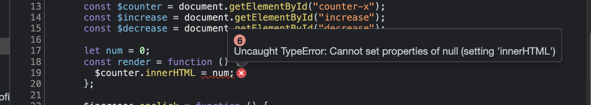
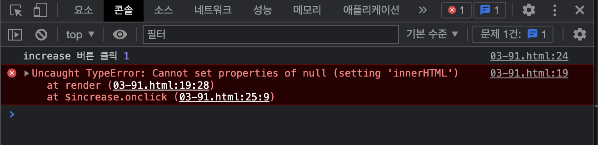

# 3장 자바스크립트 개발 환경과 실행 방법

## 자바스크립트 실행 환경

모든 브라우저 및 Node.js는 자바스크립트 엔진을 내장하고 있음

- 자바스크립트를 해성하고 실행 가능 하다는 의미
- 브라우저에서 동작하는 코드는 Node.js 환경에서도 동일하게 동작 함

브라우저와 Node.js 모두 자바스크립트 코어인 ECMAScript를 실행할 수 있지만 추가로 제공하는 기능은 호환되지않음

| 브라우저                                                                                                                                                  | Node.js                                               |
| --------------------------------------------------------------------------------------------------------------------------------------------------------- | ----------------------------------------------------- |
| HTML,CSS, 자바스크립를 실행해 웹페이지를 브라우저 화면에 렌더링하는 것                                                                                    | 브라우저 외부에서 자바스크립트 실행환경을 제공하는 것 |
| 파싱된 HTML 요소를 선택하거나 조작하는 기능의 집합인 DOM API 제공                                                                                         | 파일을 생성하고 수정할수 있는 파일시스템 제공         |
| ECMAScript, 클라이언트 사이드 Web API 지원 (DOM, BOM, Canvas, XMLHttpRequest, fetch, requestAnimation Frame, SVG, Web Storage, Web Component, Web Worker) | ECMAScript, Node.js 고유의 API 지원                   |

> 웹 크롤링
>
> - 서버에서 웹사이트의 콘텐츠를 수집하기위해 웹사이트에서 HTML 문서를 가져온 다음, 가공해서 필요한 데이터만 추출하는 경우를 일컫음
> - [cheerio](https://cheerio.js.org/)같은 DOM 라이브러리를 사용해 HTML 문서를 가공하기도 함

## 웹 브라우저

시장 점유율이 가장 높은 크롬.

크롬 브라우저의 V8 자바스크립트 엔진은 Node.js 에서도 사용하고 있음

### 개발자 도구

브라우저에 기본 내장되어있으며, 웹 개발에 유용한 다양한 기능을 제공함

| 패널        | 설명                                                                                                                                                                                      |
| ----------- | ----------------------------------------------------------------------------------------------------------------------------------------------------------------------------------------- |
| Elements    | - 로딩된 웹페이지의 DOM과 CSS를 편집해 렌더링된 뷰를 확인가능함.<br/>- 편진한 내용은 저장되지 않음.<br/>- 웹페이지가 의도된 대로 렌더링되지 않았다면 해당 패널을 확인해 힌트 얻을 수 있음 |
| Console     | - 로딩된 웹페이지의 에러확인<br/>- 자바스크립트 코드소스에 작성한 console.log 메서드의 실행 결과 확인 가능                                                                                |
| Source      | - 로딩된 웹페이지의 자바스크립트 코드를 디버깅 가능<br/> - 스니펫을 추가하여 코드 디버깅도 가능함                                                                                         |
| Network     | - 로딩된 웹페이에 관련된 네트워크 요청 정보와 성능을 확인 가능함                                                                                                                          |
| Application | - 웹 스토리지, 세션 쿠키를 확인하고 관리가능함                                                                                                                                            |

## 콘솔

개발자 도구의 console 패널(콘솔)

- 자바스크립트 코드에서 에러가 발생해 애플리케이션ㅇ니 정상적으로 동작하지 않을때 가장 우선적으로 살펴야 할 곳
- 콘솔은 자바스크립트코드를 직접 입력해 그 결과를 확인 할수 있는 REPL(Read Eval Print Loop:입렵 수행 출력 반복) 환경으로 사용 가능함

### 브라우저에서 자바스크립트 실행

에러를 발생시키는 코드를 실행할 경우, 콘솔창에서 확인 가능



### 디버깅

**디버깅이란?** 먼저 에러 메시지를 확ㅇ니하고 에러가 발생한 원인을 제거하는 것.

Source 패널에서 코드에서 에러난 부분을 확인 가능 (에러가 발생한 위치에 빨간 밑줄이 표시됨)

- 마우스를 올려보면 에러 정보를 표시해줌


중단점(브레이크 포인트)을 찍고 디버깅 모드에 들어가면, 에러메시지 내용인 $counter 변수값이 null 것을 확인 할수 있음

- $counter 변수값을 할당할때 HTML요소의 아이디를 `counter-x` 로 잘못 지정한 것.
- 해당 아이디를 가진 요소가 존재하지 않기 때문에 null 으로 표시되면 에러를 띄우는 것



## Node.js

- 간단한 웹 어플리케이션은 브라우저만으로도 개발 가능하지만, 규모가 커지면 Node.js 와 npm 이 필요해짐

  - React, Angular, Lodash 같은 프레임워크 또는 라이브러리 도입
  - Babel, Webpack, ESLint 등 여러가지 도구들

- 크롬 V8 자바스크립트 엔진

- 빌드된 자바스크립트 런타임 환경

- 브라우저에서만 동작하던 자바스크립트를 브라우저 이외의 환경에서 동작시킬 수 있는 자바스크립트 실행환 경 Node.js 임

### npm (node package manager)

- 자바스크립트 패키지 매니저
- Node.js 에서 사용할 수 있는 모듈들을 패키지화해서 모아둔 저장소 역할
- 패키지 설치 및 관리를 위한 CLI(Command line interface) 를 제공함

### Node.js REPL(Read Eval Print Loop)

Node.js 환경에서 간단한 자바스크립트 코드를 실행해 결과를 확인해볼 수 있음

```jsx
$node;
```

자바스크립트 파일을 실행하려면 node 명령어 뒤에 파일이름 입력. 파일 확장자는 생략 가능.

```jsx
$ node index.js
```

## 비주얼 스튜디오 코드

- 브라우저의 콘솔 , Node.js 의 REPL 에서 자바스크립트 코드를 실행할 수 있지만 개발용으로는 부족함이 존재.
- 코드에디터를 사용하자!<br/>⇒ 자동완성, 문법 오류 감지, 디버깅, Git 연동 등 강력하고 편리한 기능 활용 가능

### 내장 터미널

- VS Code 에는 터미널(윈도우에서는 명령 프롬프트)이 내장되어 있음
- 단축기 : Ctrl + `
