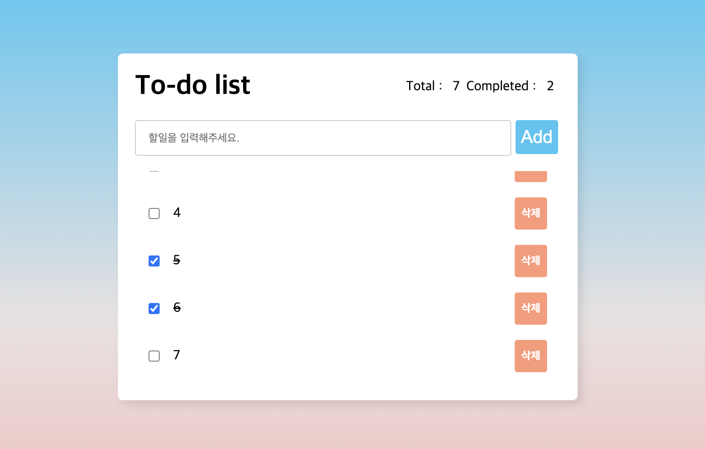
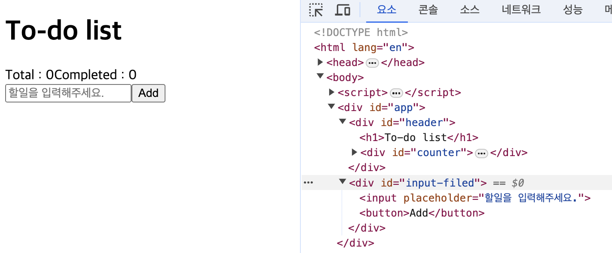

# 지겹지만 팔다리 묶고 TO-DO 리스트 만들기



## 1. DOM 조작

#### element 생성

- [createElement](https://developer.mozilla.org/en-US/docs/Web/API/Document/createElement) :`document.createElement(tagName, options)`

#### element 제거

- [removeChild](https://developer.mozilla.org/en-US/docs/Web/API/Node/removeChild) :`parent.removeChild(child)`
  ````js
    const node = document.getElementById("child");
    if (node.parentNode) {
        node.parentNode.removeChild(node);
    }
    ```
  ````
- [remove](https://developer.mozilla.org/en-US/docs/Web/API/Element/remove) : `element.remove()`

### createElement 함수 생성

일일이 하나씩 엘리먼트를 생성하고 연결하기 보다는 유틸함수를 만들어서 진행

```js
function createElement({ tagName, properties, parent, children, count = 1 }) {
  const create = () => {
    const element = document.createElement(tagName);
    Object.assign(element, properties);
    parent?.appendChild(element);
    children?.forEach((child) => {
      child.parent = element;
      createElement(child);
    });
    return element;
  };
  if (count > 1) {
    const result = [];
    for (let i = 0; i > count; i++) result.push(create());
    return result;
  }
  return create();
}
```

그룹마다 createElement를 호출하여 생성 및 연결

```js
const app = createElement({
  tagName: "div",
  properties: { id: "app" },
  parent: document.body,
});
const header = createElement({
  tagName: "div",
  properties: { id: "header" },
  parent: app,
  children: [
    {
      tagName: "h1",
      properties: { innerText: "To-do list" },
    },
    {
      tagName: "div",
      properties: { id: "counter" },
      children: [
        {
          tagName: "span",
          properties: { innerText: "Total : " },
        },
        {
          tagName: "span",
          properties: { innerText: "0" },
        },
        {
          tagName: "span",
          properties: { innerText: "Completed : " },
        },
        {
          tagName: "span",
          properties: { innerText: "0" },
        },
      ],
    },
  ],
});
const inputField = createElement({
  tagName: "div",
  properties: { id: "input-filed" },
  parent: app,
  children: [
    {
      tagName: "input",
      properties: { placeholder: "할일을 입력해주세요." },
    },
    {
      tagName: "button",
      properties: { innerText: "Add" },
    },
  ],
});
```



## CSS 조작

#### 인라인 스타일

**CSS 적용 방법**

```js
app.style.background = "#000";
app.style.setProperty("background", "#f00");
app.style.cssText = `background : #fff;
    max-width : 500px;
    width: 100%;
    margin: 100px auto;
    padding: 20px`;
```

`app.style.cssText`를 사용하게 되면 이전에 적용한 스타일은 초기화하여 덮어쓰기한다.

**CSS 제거 방법**

- [removeProperty](https://developer.mozilla.org/en-US/docs/Web/API/CSSStyleDeclaration/removeProperty) : `app.style.removeProperty('box-shadow)`

#### 스타일 시트

- [styleSheets](https://developer.mozilla.org/ko/docs/Web/API/Document/styleSheets) :`document.styleSheets`

  - style 태그 안에 들어가는 css style rule이 추가 된다.

- 스타일 값을 확인하기 위해서는 [getComputedStyle 메소드](https://developer.mozilla.org/en-US/docs/Web/API/Window/getComputedStyle)를 사용해야한다. : `getComputedStyle(element, pseudoElt)`

**CSS 적용 방법**

- [CSSStyleSheet: insertRule() method](https://developer.mozilla.org/en-US/docs/Web/API/CSSStyleSheet/insertRule) : `document.styleSheets[0].insertRule(rule, index)`

**CSS 제거 방법**

- [CSSStyleSheet: removeRule() method](https://developer.mozilla.org/en-US/docs/Web/API/CSSStyleSheet/insertRule) : `document.styleSheets[0].removeRule(index)`
  - Deprecated

**스타일 시트 전체를 추가/변경하는 경우**

- [CSSStyleSheet: replace() method](https://developer.mozilla.org/en-US/docs/Web/API/CSSStyleSheet/replace)

  - `replace(text)`
  - A Promise that resolves with the CSSStyleSheet.

- [Document: adoptedStyleSheets property](https://developer.mozilla.org/en-US/docs/Web/API/Document/adoptedStyleSheets)

```js
const stylesheet = new CSSStyleSheet();

stylesheet
  .replace("body { font-size: 1.4em; } p { color: red; }")
  .then(() => {
    console.log(stylesheet.cssRules[0].cssText);
  })
  .catch((err) => {
    console.error("Failed to replace styles:", err);
  });
```

```js
// Create an empty "constructed" stylesheet
const sheet = new CSSStyleSheet();
// Apply a rule to the sheet
sheet.replaceSync("a { color: red; }");

// Apply the stylesheet to a document
document.adoptedStyleSheets = [sheet];
```

해당스타일 시트에 css style rule 추가

```js
sheet.insertRule("* { background-color: blue; }");
// The document will now have blue background.
```

## 이벤트 처리

1.  인풋에 할일을 입력하고 추가버튼을 클릭하면 아이템이 리스트에 추가되고 토탈 카운터가 업데이트
2.  할일의 체크박스를 클릭하면 취소선이 표시되고 완료 카운터가 업데이트 되어야합니다.
3.  삭제버튼을 클릭하면 아이템이 삭제되고 카운터가 업데이트 되어야합니다.

```js
//1.  인풋에 할일을 입력하고 추가버튼을 클릭하면 아이템이 리스트에 추가되고 토탈 카운터가 업데이트
const addButton = document.querySelector("#input-field button");
addButton.addEventListener("click", () => {
  const itemContainer = document.querySelector("#item-list-container ul");
  const item = createElement({
    tagName: "li",
    parent: itemContainer,
    children: [
      {
        tagName: "input",
        properties: { type: "checkbox" },
      },
      {
        tagName: "span",
        properties: { innerText: addButton.previousSibling.value },
      },
      { tagName: "button", properties: { innerText: "삭제" } },
    ],
  });

  const [checkbox, text, removeButton] = item.children;
  const counter = document.getElementById("counter");
  counter.children[1].innerText = "" + itemContainer.children.length;

  //2.  할일의 체크박스를 클릭하면 취소선이 표시되고 완료 카운터가 업데이트 되어야합니다.
  checkbox.addEventListener("click", () => {
    checkbox.checked ? (text.style.textDecoration = "line-through") : text.style.removeProperty("text-decoration");

    const completeCount = Array.from(itemContainer.children).filter((child) => child.firstChild.checked).length;
    const counter = document.getElementById("counter");
    counter.children[3].innerText = "" + completeCount;
  });

  //3.  삭제버튼을 클릭하면 아이템이 삭제되고 카운터가 업데이트 되어야합니다.
  removeButton.addEventListener("click", () => {
    item.remove();
    const completeCount = Array.from(itemContainer.children).filter((child) => child.firstChild.checked).length;
    const counter = document.getElementById("counter");
    counter.children[1].innerText = "" + itemContainer.children.length;
    counter.children[3].innerText = "" + completeCount;
  });
});
```

- `Array.from(itemContainer.children).filter((child) => child.firstChild.checked).length;`
  - iterator 가 아니기 때문에 Array.from으로 배열로 변환하는 것
