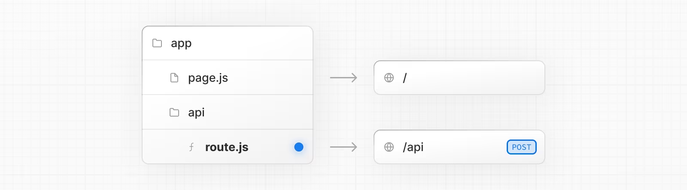

# Next.js : 풀스택 - 캐럿마켓 클론코딩

# 5.0 [Route Handlers](https://nextjs.org/docs/app/building-your-application/routing/route-handlers)

router handler를 사용하면 웹 요청 및 응답 API를 사용하여 지정된 경로에 대한 사용자 지정 request handlers를 만들 수 있습니다.

<p center ></p>

- router handler는 앱 디렉토리 내에서만 사용할 수 있습니다.
- router handler는 페이지 디렉터리 내의 API routes와 동일하므로 API 경로와 router handler를 함께 사용할 필요가 없습니다.

- 라우트 핸들러는 앱 디렉터리 내의 `route.js|ts` 파일에 정의됩니다.
- 기본 요청 및 응답을 지원할 뿐만 아니라 NextRequest 및 NextResponse로 이를 확장하여 추가적인 기능을 제공합니다.

# 5.1 [Server Actions](https://nextjs.org/docs/app/building-your-application/data-fetching/server-actions-and-mutations)

- 서버 액션은 서버에서 실행되는 비동기 함수입니다.
- 서버 및 클라이언트 컴포넌트에서 Next.js 애플리케이션의 form 제출 및 data mutation을 처리하는 데 사용할 수 있습니다.
- 서버 액션은 React ["use server"](https://ko.react.dev/reference/rsc/use-server) 지시어로 정의할 수 있습니다. 비동기 함수의 맨 위에 지시어를 배치하여 해당 함수를 서버 액션으로 표시하거나, 별도의 파일 상단에 배치하여 해당 파일의 모든 내보내기를 서버 액션으로 표시할 수 있습니다.
- 서버 컴포넌트는 인라인 함수 수준 또는 모듈 수준의 "서버 사용" 지시문을 사용할 수 있습니다. 서버 액션을 인라인하려면 함수 본문 상단에 "use server"를 추가합니다:

> #### [React 의 Server Actions](https://ko.react.dev/reference/rsc/server-actions)
>
> Server Actions를 사용하면 클라이언트 컴포넌트가 서버에서 실행되는 비동기 함수를 호출할 수 있습니다.
>
> - Server Action이 `"use server"` 지시어로 정의되면, 프레임워크는 자동으로 서버 함수에 대한 참조를 생성하고 해당 참조를 클라이언트 컴포넌트에 전달합니다. 클라이언트에서 해당 함수가 호출되면, React는 서버에 함수를 실행하라는 요청을 보내고 결과를 반환합니다.
> - Server Actions는 서버 컴포넌트에서 생성하여 클라이언트 컴포넌트 props로 전달하거나 클라이언트 컴포넌트에서 가져와서 사용할 수 있습니다.
>
> ```jsx
> // Server Component
> import Button from "./Button";
>
> function EmptyNote() {
>   async function createNoteAction() {
>     // Server Action
>     "use server";
>
>     await db.notes.create();
>   }
>
>   return <Button onClick={createNoteAction} />;
> }
> ```
>
> 1. React가 `EmptyNote` 서버 컴포넌트를 렌더링할 때,
> 2. `createNoteAction` 함수에 대한 참조를 생성하고, 그 참조를 `Button` 클라이언트 컴포넌트에 전달합니다.
> 3. 버튼이 클릭 되면, React는 제공된 참조로 `createNoteAction` 함수를 실행하라는 요청을 서버로 보냅니다.
>
> **클라이언트 컴폰너트에서 Sever Actions을 가져온다면** : `EmptyNote` 컴포넌트가 클라이언트 컴포넌트라면
>
> 1. bundler가 `EmptyNote` 클라이언트 컴포넌트를 빌드할 때,
> 2. bundle에서 `createNoteAction` 함수에 대한 참조를 생성합니다.
> 3. 버튼이 클릭 되면, React는 제공된 참조를 사용해 `createNoteAction` 함수를 실행하도록 서버에 요청을 보냅니다.

> #### ['use server'](https://ko.react.dev/reference/rsc/use-server)
>
> `'use server'`는 클라이언트 측 코드에서 호출할 수 있는 서버 측 함수를 표시합니다.
>
> - `'use server'`는 함수 또는 모듈의 맨 처음에 있어야 합니다. import를 포함한 다른 코드보다 위에 있어야 합니다.(지시어 위의 주석은 괜찮습니다). 백틱이 아닌 단일 또는 이중 따옴표로 작성해야 합니다.
> - `'use server'`는 서버 측 파일에서만 사용할 수 있습니다. 결과적인 Server Action은 props를 통해 클라이언트 컴포넌트로 전달할 수 있습니다. 제공되는 직렬화 타입을 참고하세요.
> - Server Action을 클라이언트 코드에서 import 하기 위해, 지시어는 모듈 수준에서 사용되어야 합니다.
> - 기본 네트워크 호출이 항상 비동기이므로 `'use server'`는 비동기 함수에서만 사용할 수 있습니다.
> - 항상 Server Action의 인자를 신뢰할 수 없는 입력으로 취급하고 모든 변경을 검토하세요. 보안 고려사항을 확인하세요.
> - Server Action은 transition 안에서 호출되어야합니다. `<form action>` 또는 formAction로 전달된 Server Action은 자동으로 transition 내에서 호출됩니다.
> - Server Action은 서버 측 상태를 업데이트하는 mutation을 위해 설계되었으며 데이터 fetching에는 권장되지 않습니다. 따라서 서버 액션을 구현하는 프레임워크는 일반적으로 한 번에 하나의 액션을 처리하며 반환 값을 캐시할 방법이 없습니다.

```js
// Server Component
export default function Page() {
// Server Action
async function create() {
 'use server'

 // ...
}

return (
 // ...
)
}
```

- `<form>` 요소의 action 속성을 사용하여 server action을 호출할 수 있습니다.
  - 서버 구성 요소는 기본적으로 점진적 향상을 지원하므로 JavaScript가 아직 로드되지 않았거나 비활성화되어 있어도 form이 제출됩니다.
  - 클라이언트 구성 요소에서 server action을 호출하는 form은 JavaScript가 아직 로드되지 않은 경우 제출을 대기열에 넣고 클라이언트 하이드레이션을 우선시합니다.
  - 하이드레이션 후 브라우저는 form 제출 시 새로 고침되지 않습니다.
- server action은 `<form>`에 국한되지 않으며 이벤트 핸들러, useEffect, 타사 라이브러리 및 `<button>`과 같은 다른 form 요소에서 호출할 수 있습니다.
- server action은 Next.js 캐싱 및 재검증 아키텍처와 통합됩니다. action이 호출되면 Next.js는 단일 서버 왕복에서 업데이트된 UI와 새 데이터를 모두 반환할 수 있습니다.
- 백그라운드에서 작업은 POST 메서드를 사용하고 이 HTTP 메서드만 작업을 호출할 수 있습니다.
- server action의 인자와 반환 값은 React에서 직렬화할 수 있어야 합니다. 직렬화 가능한 인수 및 값 목록은 React 문서를 참조하세요.
- server action은 함수입니다. 즉, 애플리케이션의 어느 곳에서나 재사용할 수 있습니다.
- server action은 사용되는 페이지 또는 레이아웃에서 런타임을 상속합니다.
- server action은 사용되는 페이지 또는 레이아웃에서 경로 세그먼트 구성을 상속하며, 여기에는 maxDuration과 같은 필드가 포함됩니다.

# 5.2 [useFormStatus](https://ko.react.dev/reference/react-dom/hooks/useFormStatus)

useFormStatus는 마지막 form submit의 상태 정보를 제공하는 Hook입니다.

- `const { pending, data, method, action } = useFormStatus();`
  - _pending_ : boolean, 제출 중인지
  - _data_ : FormData 인터페이스를 구현한 객체, `<form>`이 제출하는 데이터, 없다면 null
  - _method_ : 'get' 또는 'post' 중 하나
  - _action_ : 상위 `<form>`의 action prop에 전달한 함수의 레퍼런스
- 💡 상태 정보를 제공받기 위해 제출 버튼용 컴포넌트를 `<form>` 내부에 렌더링해야 합니다.
- 💡 `useFormStatus는` 오직 상위 `<form>`에 대한 상태 정보만 반환합니다. 동일한 컴포넌트나 자식 컴포넌트에서 렌더링한 `<form>`의 상태 정보는 반환하지 않습니다.
- 폼이 현재 제출하고 있는 상태인지를 의미하는 pending 프로퍼티와 같은 상태 정보를 반환합니다.
  - pending 프로퍼티를 상요하여 폼이 제출 중일 때 `<button>`을 누를 수 없도록 합니다.

```jsx
function Submit() {
  // ✅ `pending`은 Submit 컴포넌트를 감싸는 폼에서 파생됩니다
  const { pending } = useFormStatus();
  return <button disabled={pending}>...</button>;
}

function Form() {
  // `useFormStatus`가 추적하는 <form>입니다
  return (
    <form action={submit}>
      <Submit />
    </form>
  );
}
```

# 5.3 useFormState

> - [Next.js-useFormState](https://nextjs.org/docs/app/building-your-application/data-fetching/server-actions-and-mutations#server-side-validation-and-error-handling)
> - [React-useActionState](https://ko.react.dev/reference/react/useActionState) : 훅 이름이 변경되었으며 기능은 동일하다.

server action으로 다루는 값들에 의해 변경되는 상태를 클라이언트에 인터렉티브하게 보여줄기 위해 사용

- 컴포넌트 최상위 레벨에서 `useActionState`를 호출하여 폼 액션이 실행될 때 업데이트되는 컴포넌트 state를 생성합니다.
- `const [state, formAction] = useActionState(fn, initialState, permalink?);`
  - _state_: 첫 번째 렌더링에서는 initialState와 일치합니다. 액션이 실행된 이후에는 액션에서 반환된 값과 일치합니다.
  - _formAction_: form 컴포넌트의 action prop에 전달하거나 폼 내부 button 컴포넌트의 formAction prop에 전달할 수 있는 새로운 액션입니다.
  - _fn_: 폼이 제출되거나 버튼을 눌렀을 때 호출될 함수. 함수가 실행될 때, 첫 번째 인수로 폼의 이전 state를 전달합니다. state는 초기에 전달한 initialState이고, 이후에는 이전 실행의 반환값입니다. 그 후 일반적으로 폼 액션에 전달하는 인수들이 이어집니다.
  - _initialState_: 초기 state로 설정하고자 하는 값으로, 직렬화 할 수 있는 값일 수 있습니다. 액션이 처음 호출된 후에는 이 인수를 무시합니다.
  - _permalink_: 이 폼이 수정하는 고유의 URL이 포함된 문자열입니다. 점진적인 향상과 함께 동적 콘텐츠(예: 피드)가 있는 페이지에서 사용합니다. `fn`이 서버 액션이고 폼이 자바스크립트 번들이 로드되기 전에 제출된다면, 브라우저는 현재의 페이지 URL이 아닌 명시된 permalink의 URL로 이동합니다. React가 상태를 전달하는 방법을 알 수 있도록 동일한 폼 컴포넌트가 대상 페이지에 렌더링 되어야 합니다(동일한 액션 fn 및 permalink 포함). 폼이 hydrated하면 이 매개변수는 아무런 영향을 미치지 않습니다.
- `useActionState`에 기존의 폼 작업 함수와 초기 state를 전달하면, 최신 폼 state와 함께 폼에서 사용하는 새로운 액션을 반환합니다. 최신 폼 state 또한 제공된 함수에 전달됩니다.

```js
import { useActionState } from "react";

async function increment(previousState, formData) {
  return previousState + 1;
}

function StatefulForm({}) {
  const [state, formAction] = useActionState(increment, 0);
  // state : 폼을 마지막으로 제출했을 때 액션에서 반환되는 값, 폼이 제출되기 전이라면 전달한 초기 state와 동일
  return (
    <form>
      {state}
      <button formAction={formAction}>Increment</button>
    </form>
  );
}
```

- **Server Action과 함께 사용하는 경우, `useActionState`를 사용하여 hydration이 완료되기 전에도 폼 제출에 대한 서버의 응답을 보여줄 수 있습니다.**
