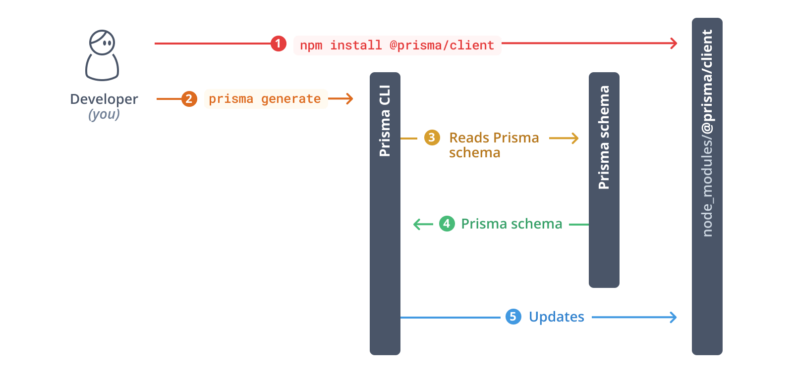
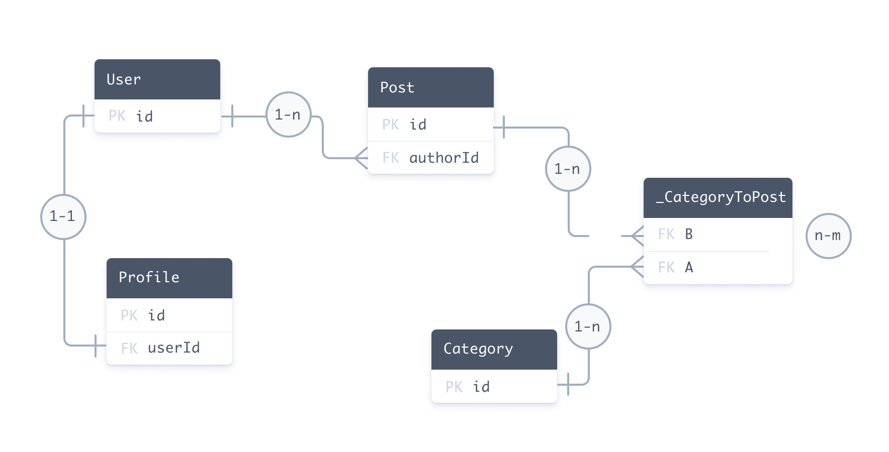

# Prisma

> **참고**
>
> 1. 설치 및 데이터베이스 연결
>
> ```bash
> $ npm install prisma --save-dev
> $ npx prisma init --datasource-provider sqlite
>
> ```
>
> 2. 스키마작성 : `schema.prisma`
> 3. prisma migrate 진행
>
> ```bash
> $ npx prisma migrate dev --name init
> ```
>
> 4. prisma client로 데이터베이스에 쿼리 보내기 : `const prisma = new PrismaClient()`

## 7.0 Setup

### [Prisma](https://www.prisma.io/orm)

- 직관적인 데이터 모델, 자동 마이그레이션, 유형 안전성 및 자동 완성 덕분에 데이터베이스 작업 시 새로운 수준의 개발자 경험을 제공
- 차세대 Node.js 및 TypeScript ORM

#### Prisma Schema 파일을 생성하여 Prisma ORM 프로젝트를 설정

```bash
$ npm install prisma -D
$ npx prisma init
```

- 데이터베이스 연결 변수 및 스키마 모델과 함께 Prisma 스키마가 포함된 `schema.prisma`라는 파일을 포함하는 prisma라는 새 디렉터리를 생성
- 데이터베이스 연결과 같은 환경 변수를 정의하는 데 사용되는 `.env` 파일을 프로젝트의 루트 디렉터리에 생성

## 7.1 Schemas

### [모델 (Models)](Models)

Prisma 스키마의 데이터 모델 정의 부분은 애플리케이션 모델(Prisma 모델이라고도 함)을 정의합니다. 모델은 다음과 같은 역할을 합니다:

- 애플리케이션 도메인의 엔터티를 나타냅니다.
- 데이터베이스(예: PostgreSQL)에서는 테이블, MongoDB에서는 컬렉션과 매핑됩니다.
- 생성된 Prisma Client API에서 사용할 수 있는 쿼리의 기반을 형성합니다.
- TypeScript와 함께 사용할 때, Prisma Client는 모델 및 그 변형에 대한 타입 정의를 생성하여 데이터베이스 접근을 타입 안전하게 만듭니다.

#### 예시 스키마

아래 스키마는 블로그 플랫폼을 설명하며, 데이터 모델 정의가 강조되어 있습니다:

```prisma
datasource db {
  provider = "postgresql"
  url      = env("DATABASE_URL")
}

generator client {
  provider = "prisma-client-js"
}

model User {
  id      Int      @id @default(autoincrement())
  email   String   @unique
  name    String?
  role    Role     @default(USER)
  posts   Post[]
  profile Profile?
}

model Profile {
  id     Int    @id @default(autoincrement())
  bio    String
  user   User   @relation(fields: [userId], references: [id])
  userId Int    @unique
}

model Post {
  id         Int        @id @default(autoincrement())
  createdAt  DateTime   @default(now())
  updatedAt  DateTime   @updatedAt
  title      String
  published  Boolean    @default(false)
  author     User       @relation(fields: [authorId], references: [id])
  authorId   Int
  categories Category[]
}

model Category {
  id    Int    @id @default(autoincrement())
  name  String
  posts Post[]
}

enum Role {
  USER
  ADMIN
}
```

#### 데이터 모델 정의 구성 요소

- **모델**: 모델 원시 타입을 사용하여 여러 필드를 정의하며, 모델 간의 관계를 포함합니다.
- **열거형**: 열거형 원시 타입을 사용합니다(연결자가 열거형을 지원하는 경우).
- **속성과 함수**: 필드와 모델의 동작을 변경합니다.

#### 데이터베이스 매핑

모델은 데이터 소스의 기본 구조와 매핑됩니다. 다음은 생성된 Prisma Client를 사용하여 데이터를 생성하는 예시입니다:

```javascript
const user = await prisma.user.create({
  data: {
    email: "ariadne@prisma.io",
    name: "Ariadne",
    posts: {
      create: [
        {
          title: "My first day at Prisma",
          categories: {
            create: {
              name: "Office",
            },
          },
        },
        {
          title: "How to connect to a SQLite database",
          categories: {
            create: [{ name: "Databases" }, { name: "Tutorials" }],
          },
        },
      ],
    },
  },
});
```

#### 애플리케이션 도메인 반영

예를 들어:

- **전자상거래 애플리케이션**: Customer, Order, Item, Invoice와 같은 모델이 있을 수 있습니다.
- **소셜 미디어 애플리케이션**: User, Post, Photo, Message와 같은 모델이 있을 수 있습니다.

#### 데이터 모델 정의 방법

1. **Prisma Migrate 사용**: 수동으로 데이터 모델을 작성하고 이를 데이터베이스에 매핑합니다.
2. **인트로스펙션(Introspection) 사용**: 기존 데이터베이스가 있거나 SQL로 데이터베이스 스키마를 마이그레이션하는 경우, 데이터베이스를 인트로스펙션하여 데이터 모델을 생성합니다.

#### 필드 정의

모델의 속성은 필드라고 하며, 다음과 같은 요소로 구성됩니다:

- **필드 이름**
- **필드 타입**
- **선택적 타입 수정자**
- **선택적 속성**, 예를 들어 네이티브 데이터베이스 타입 속성

필드의 타입은 구조를 결정하며, 두 가지 카테고리로 나뉩니다:

- **스칼라 타입**: 데이터베이스의 열이나 문서 필드에 매핑됩니다 (예: String, Int)
- **모델 타입**: 관계 필드라고도 합니다 (예: Post 또는 Comment[])

#### 예시

**User 모델의 필드 설명**:

- `id`: Int 타입, 기본 키, 자동 증가
- `email`: String 타입, 유일 값
- `name`: String 타입, 선택적 필드
- `role`: Role 타입, 기본 값 USER
- `posts`: Post 모델과의 관계 필드
- `profile`: Profile 모델과의 관계 필드

**Comment와 Tag 모델의 확장 예시**:

```prisma
model Comment {
  id      Int    @id @default(autoincrement())
  title   String
  content String
}

model Tag {
  name String @id
}
```

#### 네이티브 타입 매핑

버전 2.17.0 이후로 네이티브 데이터베이스 타입 속성을 지원합니다:

```prisma
model Post {
  id      Int    @id
  title   String @db.VarChar(200)
  content String
}
```

#### 타입 수정자

- `[]`: 필드를 리스트로 만듭니다.
- `?`: 필드를 선택적으로 만듭니다.

#### 예시

**리스트 필드**:

```prisma
model Post {
  id       Int       @id @default(autoincrement())
  comments Comment[] // 댓글 리스트
  keywords String[]  // 키워드 리스트
}
```

#### 속성 정의

속성은 필드나 모델 블록의 동작을 수정합니다:

- **@id**: 기본 키
- **@default**: 기본 값
- **@unique**: 유일 값
- **@@unique**: 복합 유일 값

예시:

```prisma
model User {
  id        Int     @id @default(autoincrement())
  firstName String
  lastName  String
  email     String  @unique
  isAdmin   Boolean @default(false)

  @@unique([firstName, lastName])
}
```

#### ID 필드 정의

ID는 모델의 개별 레코드를 고유하게 식별합니다. 모델은 하나의 ID만 가질 수 있습니다.

**단일 필드 ID**:

```prisma
model User {
  id      Int      @id @default(autoincrement())
  email   String   @unique
  name    String?
  role    Role     @default(USER)
  posts   Post[]
  profile Profile?
}
```

**복합 ID**:

```prisma
model User {
  firstName String
  lastName  String
  email     String  @unique
  isAdmin   Boolean @default(false)

  @@id([firstName, lastName])
}
```

#### 기본 값 정의

기본 값을 정의할 수 있습니다:

```prisma
model Post {
  id         Int        @id @default(autoincrement())
  createdAt  DateTime   @default(now())
  title      String
  published  Boolean    @default(false)
  data       Json       @default("{ \"hello\": \"world\" }")
  author     User       @relation(fields: [authorId], references: [id])
  authorId   Int
  categories Category[] @relation(references: [id])
}
```

#### 유일 필드 정의

유일 속성을 추가하여 모델의 개별 레코드를 고유하게 식별할 수 있습니다:

**단일 필드 유일 속성**:

```prisma
model User {
  id    Int     @id @default(autoincrement())
  email String  @unique
  name  String?
}
```

**복합 유일 속성**:

```prisma
model Post {
  id         Int        @id @default(autoincrement())
  createdAt  DateTime   @default(now())
  title      String
  published  Boolean    @default(false)
  author     User       @relation(fields: [authorId], references: [id])
  authorId   Int
  categories Category[] @relation(references: [id])

  @@unique([authorId, title])
}
```

#### 인덱스 정의

인덱스를 정의할 수 있습니다:

```prisma
model Post {
  id      Int     @id @default(autoincrement())
  title   String
  content String?

  @@index([title, content])
}
```

#### 열거형 정의

데이터베이스 커넥터가 열거형을 지원하는 경우 데이터 모델에 열거형을 정의할 수 있습니다:

```prisma
model User {
  id    Int     @id @default(autoincrement())
  email String  @unique
  name  String?
  role  Role    @default(USER)
}

enum Role {
  USER
  ADMIN
}
```

#### 복합 타입 정의

복합 타입은 MongoDB에서만 사용 가능합니다. 새로운 객체 타입을 정의하여 레코드 내에 레코드를 포함할 수 있습니다:

```prisma
model Product {
  id     String  @id @default(auto()) @map("_id") @db.ObjectId
  name   String
  photos Photo[]
}


type Photo {
  height Int
  width  Int
  url    String
}
```

#### 함수 사용

기본 값을 지정할 때 함수를 사용할 수 있습니다:

```prisma
model Post {
  id        Int      @id @default(autoincrement())
  createdAt DateTime @default(now())
}
```

#### Prisma Client에서의 모델

모델은 Prisma Client API에서 다음과 같은 CRUD 쿼리를 생성합니다:

- `findMany()`
- `findFirst()`
- `findFirstOrThrow()`
- `findUnique()`
- `findUniqueOrThrow()`
- `create()`
- `update()`
- `upsert()`
- `delete()`
- `createMany()`
- `createManyAndReturn()`
- `updateMany()`
- `deleteMany()`

#### 타입 정의

Prisma Client는 모델 구조를 반영하는 타입 정의도 생성합니다. 이는 생성된 `@prisma/client` 노드 모듈의 일부입니다. TypeScript를 사용할 때 이러한 타입 정의는 모든 데이터베이스 쿼리가 타입 안전하고 컴파일 타임에 유효성이 검사되도록 합니다.

예시:

```typescript
export type User = {
  id: number;
  email: string;
  name: string | null;
  role: string;
};
```

관계 필드(`posts`와 `profile`)는 기본적으로 타입 정의에 포함되지 않지만, Prisma Client의 생성된 헬퍼 타입을 사용하여 정의할 수 있습니다.

### [Using Prisma Migrate : Creating the database schema](https://www.prisma.io/docs/getting-started/setup-prisma/start-from-scratch/relational-databases/using-prisma-migrate-typescript-sqlserver)

##### 1. prisma/schema.prisma의 Prisma 스키마에 다음 Prisma 데이터 모델을 추가

##### 2. 데이터 모델을 데이터베이스 스키마에 매핑하려면 prisma 마이그레이션 CLI 명령을 사용해야 한다:

개발 환경에서는 마이그레이션 개발 명령을 사용하여 마이그레이션을 생성하고 적용합니다:

```bash
$ npx prisma migrate dev --name init

```

이 명령은 두 가지 작업을 수행합니다.

- 이 마이그레이션을 위한 새 SQL 마이그레이션 파일을 생성
- 데이터베이스에 대해 SQL 마이그레이션 파일을 실행

> 참고: 생성은 기본적으로 `prisma migrate dev`를 실행한 후 내부에서 호출됩니다. 스키마에 `prisma-client-js` 생성기가 정의되어 있는 경우 `@prisma/client`가 설치되어 있는지 확인하고 누락된 경우 설치합니다.

#### [Migrate workflows](https://www.prisma.io/docs/orm/prisma-migrate/workflows/development-and-production)

개발 환경에서는 migrate dev 명령어를 사용하여 마이그레이션을 생성하고 적용합니다:

> ❗️ migrate dev는 개발 명령어이며 프로덕션 환경에서는 절대 사용하면 안 된다.

1. **데이터베이스 변경 사항을 확인하고, 수정되었거나 삭제된 부분을 찾습니다.**

   - 쉐도우 데이터베이스에서 기존 마이그레이션 히스토리를 다시 실행하여 스키마 드리프트를 감지합니다.

2. **새로운 변경 사항이 있다면, 그것을 시험해 볼 수 있는 별도의 데이터베이스에 먼저 적용합니다. (테스트 목적)**

   - 보류 중인 마이그레이션을 쉐도우 데이터베이스에 적용합니다. (예: 동료가 만든 새로운 마이그레이션)

3. **데이터 모델에 변화가 있으면, 그에 맞는 새로운 마이그레이션을 만듭니다.**

   - Prisma 스키마에 변경 사항이 감지되면, 이를 반영하여 새로운 마이그레이션을 생성합니다.

4. **모든 새로운 마이그레이션을 실제 데이터베이스에 적용하고, 이를 기록합니다.**

   - 모든 미적용 마이그레이션을 개발 데이터베이스에 적용하고 `_prisma_migrations` 테이블을 업데이트합니다.

5. **필요한 코드를 자동으로 생성합니다. (Prisma Client 등..)**
   - 아티팩트(예: Prisma Client) 생성을 트리거합니다.

- migrate dev 명령어는 다음과 같은 시나리오에서 데이터베이스를 리셋하도록 요청할 수 있습니다:

  - 수정되었거나 누락된 마이그레이션으로 인한 마이그레이션 히스토리 충돌
  - 데이터베이스 스키마가 마이그레이션 히스토리의 최종 상태에서 벗어난 경우

- [migrate workflows에 대해 한글로 정리된 블로그](https://pyh.netlify.app/prisma/prisma_migrate/)

## 7.2 [Prisma Client](https://www.prisma.io/docs/orm/prisma-client/setup-and-configuration/introduction)

Prisma Client는 데이터에 맞춰 자동 생성되는 type-safe 쿼리 빌더입니다.

Prisma Client를 시작하려면 다음 @prisma/client패키지를 설치해야 합니다.

```js
// Installation
npm install @prisma/client

// Importing Prisma Client
import { PrismaClient } from '@prisma/client'

const prisma = new PrismaClient()
```



Prisma 스키마를 업데이트할 때마다 `prisma migrate dev`또는 `prisma db push` 중 하나를 사용하여 데이터베이스 스키마를 업데이트해야 합니다.<br/>이렇게 하면 데이터베이스 스키마가 Prisma 스키마와 동기화된 상태로 유지됩니다. 이 명령은 Prisma 클라이언트도 다시 생성합니다.

## 7.3 [Prisma Studio](https://www.prisma.io/studio)

- Prisma 프로젝트에서 데이터를 탐색하고 조작하는 가장 쉬운 방법
- `npx prisma studio`

## 7.4 [Relationships](https://www.prisma.io/docs/orm/prisma-schema/data-model/relations)

- relation은 프리즈마 스키마에서 두 모델 간의 연결입니다.
- 예를 들어, 한 사용자가 여러 개의 게시물을 가질 수 있으므로 User와 Post 간에는 일대다 관계가 있습니다.

```prisma
model User {
  id    Int    @id @default(autoincrement())
  posts Post[]
}

model Post {
  id       Int  @id @default(autoincrement())
  author   User @relation(fields: [authorId], references: [id])
  authorId Int // relation scalar field  (used in the `@relation` attribute above)
}
```

### Prisma ORM 레벨에서의 관계

Prisma ORM 레벨에서 User와 Post 관계는 다음으로 구성됩니다:

- **두 개의 관계 필드**: `author`와 `posts`. 이 필드는 Prisma ORM 레벨에서 모델 간의 연결을 정의하며, 실제 데이터베이스에는 존재하지 않습니다. 이 필드는 Prisma Client를 생성할 때 사용됩니다.
- **스칼라 필드 authorId**: 이는 `@relation` 속성에서 참조됩니다. 이 필드는 데이터베이스에 존재하며, Post와 User를 연결하는 외래 키 역할을 합니다.

### 데이터베이스에서의 관계

관계형 데이터베이스에서는 다음과 같은 방식으로 User와 Post 간의 일대다 관계를 정의합니다:

- Post 테이블에 있는 외래 키 컬럼 `authorId`
- User 테이블에 있는 기본 키 컬럼 `id`. Post 테이블의 `authorId` 컬럼은 User 테이블의 `id` 컬럼을 참조합니다.

### Prisma 스키마에서의 관계

Prisma 스키마에서는 외래 키와 기본 키 관계가 `@relation` 속성으로 나타납니다:

```prisma
author   User @relation(fields: [authorId], references: [id])
```

### Prisma Client에서의 관계

Prisma Client는 Prisma 스키마로부터 생성됩니다. 다음은 Prisma Client를 사용하여 관계를 처리하는 예시입니다:

1. **레코드 및 중첩된 레코드 생성**:

```javascript
const userAndPosts = await prisma.user.create({
  data: {
    posts: {
      create: [{ title: "Prisma Day 2020" }, { title: "How to write a Prisma schema" }],
    },
  },
});
```

이 쿼리는 데이터베이스에서 User 레코드를 생성하고, 두 개의 새로운 Post 레코드를 생성하며, 이 Post 레코드의 `authorId`를 User의 `id`로 설정합니다.

2. **레코드 및 관련된 레코드 조회**:

```javascript
const getAuthor = await prisma.user.findUnique({
  where: {
    id: "20",
  },
  include: {
    posts: true,
  },
});
```

이 쿼리는 `id`가 20인 User 레코드를 조회하고, `authorId`가 20인 모든 Post 레코드를 포함합니다.

3. **기존 레코드 간의 관계 설정**:

```javascript
const updateAuthor = await prisma.user.update({
  where: {
    id: 20,
  },
  data: {
    posts: {
      connect: {
        id: 4,
      },
    },
  },
});
```

이 쿼리는 `id`가 20인 User 레코드와 `id`가 4인 Post 레코드를 연결합니다.
쿼리는 먼저 `id`가 20인 User를 찾고, 그 다음 Post의 `authorId`를 20으로 설정하여 두 레코드를 연결합니다.

### 관계의 유형


Prisma ORM에서 지원하는 관계 유형에는 다음이 있습니다:

- **일대일 관계 (1-1)**: 한 User가 한 Profile을 가질 때
- **일대다 관계 (1-n)**: 한 User가 여러 Post를 가질 때
- **다대다 관계 (m-n)**: 여러 Post가 여러 Category에 속할 때

다음은 모든 유형의 관계를 포함하는 Prisma 스키마 예시입니다:

```prisma
model User {
  id      Int      @id @default(autoincrement())
  posts   Post[]
  profile Profile?
}

model Profile {
  id     Int  @id @default(autoincrement())
  user   User @relation(fields: [userId], references: [id])
  userId Int  @unique
}

model Post {
  id         Int        @id @default(autoincrement())
  author     User       @relation(fields: [authorId], references: [id])
  authorId   Int
  categories Category[]
}

model Category {
  id    Int    @id @default(autoincrement())
  posts Post[]
}
```

## 7.5 [Referential actions : onDelete](https://www.prisma.io/docs/orm/prisma-schema/data-model/relations/referential-actions)

### 참조 행동 (Referential Actions)

참조 행동은 관련된 레코드를 삭제하거나 업데이트할 때 해당 레코드에 대해 어떤 동작이 수행되는지 정의합니다.

> **버전 차이**
>
> - **3.0.1 이상 버전**: 참조 행동을 그대로 사용할 수 있습니다.
> - **2.26.0 ~ 3.0.0 버전**: 참조 행동을 사용하려면 프리뷰 기능 플래그 `referentialActions`를 활성화해야 합니다.
> - **2.25.0 이하 버전**: 데이터베이스에서 수동으로 연쇄 삭제를 설정해야 합니다.

### 예시

아래 예시는 `Post` 모델의 `author` 필드에 `onDelete: Cascade`를 추가하여 User 레코드를 삭제할 때 관련된 모든 Post 레코드도 삭제되도록 설정합니다.

```prisma
model Post {
  id       Int    @id @default(autoincrement())
  title    String
  author   User   @relation(fields: [authorId], references: [id], onDelete: Cascade)
  authorId Int
}

model User {
  id    Int    @id @default(autoincrement())
  posts Post[]
}
```

- 참조 행동을 명시하지 않으면 Prisma ORM은 기본 값을 사용합니다.

### 데이터베이스 레벨에서의 참조 행동

- 참조 행동은 `@relation` 속성에서 정의되며, 기본 데이터베이스의 외래 키 제약 조건과 매핑됩니다.
- 참조 행동을 명시하지 않으면 Prisma ORM은 기본 값을 사용합니다.

### 예시

아래 모델은 User와 Post 간의 일대다 관계와 Post와 Tag 간의 다대다 관계를 정의하며, 명시적으로 참조 행동을 설정합니다:

```prisma
model User {
  id    Int    @id @default(autoincrement())
  posts Post[]
}

model Post {
  id     Int          @id @default(autoincrement())
  title  String
  tags   TagOnPosts[]
  User   User?        @relation(fields: [userId], references: [id], onDelete: SetNull, onUpdate: Cascade)
  userId Int?
}

model TagOnPosts {
  id     Int   @id @default(autoincrement())
  post   Post? @relation(fields: [postId], references: [id], onUpdate: Cascade, onDelete: Cascade)
  tag    Tag?  @relation(fields: [tagId], references: [id], onUpdate: Cascade, onDelete: Cascade)
  postId Int?
  tagId  Int?
}

model Tag {
  id    Int          @id @default(autoincrement())
  name  String       @unique
  posts TagOnPosts[]
}
```

### 지원하는 참조 행동

Prisma ORM은 다음과 같은 참조 행동을 지원합니다:

- **Cascade**: 삭제 또는 업데이트가 연쇄적으로 일어납니다.
- **Restrict**: 참조된 레코드가 존재하면 삭제나 업데이트를 제한합니다.
- **NoAction**: 아무 동작도 하지 않습니다.
- **SetNull**: 참조된 레코드를 삭제하거나 업데이트할 때 관련 필드를 NULL로 설정합니다.
- **SetDefault**: 참조된 레코드를 삭제하거나 업데이트할 때 관련 필드를 기본 값으로 설정합니다.

### 기본 참조 행동

참조 행동을 명시하지 않으면 Prisma ORM은 다음 기본 값을 사용합니다:

- **onDelete**: 선택적 관계는 `SetNull`, 필수 관계는 `Restrict`
- **onUpdate**: 모두 `Cascade`

### 예시 스키마

```prisma
model Post {
  id       Int    @id @default(autoincrement())
  title    String
  author   User   @relation(fields: [authorId], references: [id])
  authorId Int
}

model User {
  id    Int    @id @default(autoincrement())
  posts Post[]
}
```

이 스키마는 필수 `author` 관계 필드에 대해 참조 행동을 명시하지 않으므로, 기본 참조 행동 `Restrict`와 `Cascade`가 적용됩니다.

### 주의 사항

- 암묵적 다대다 관계에서는 참조 행동을 지원하지 않습니다. 명시적 다대다 관계를 정의해야 합니다.
- 특정 참조 행동과 필수/선택적 관계의 조합은 호환되지 않을 수 있습니다. 예를 들어, 필수 관계에서 `SetNull`을 사용하면 데이터베이스 오류가 발생합니다.

### 참조 행동 예시

1. **Cascade**

```prisma
model Post {
  id       Int    @id @default(autoincrement())
  title    String
  author   User   @relation(fields: [authorId], references: [id], onDelete: Cascade, onUpdate: Cascade)
  authorId Int
}

model User {
  id    Int    @id @default(autoincrement())
  posts Post[]
}
```

- User 레코드를 삭제하면 해당 User의 모든 Post가 삭제됩니다.
- User의 ID가 변경되면 관련된 모든 Post의 `authorId`가 업데이트됩니다.

2. **Restrict**

```prisma
model Post {
  id       Int    @id @default(autoincrement())
  title    String
  author   User   @relation(fields: [authorId], references: [id], onDelete: Restrict, onUpdate: Restrict)
  authorId Int
}

model User {
  id    Int    @id @default(autoincrement())
  posts Post[]
}
```

- 포스트가 있는 사용자는 삭제할 수 없습니다.
- 사용자의 ID를 변경할 수 없습니다.

3. **NoAction**

```prisma
model Post {
  id       Int    @id @default(autoincrement())
  title    String
  author   User   @relation(fields: [authorId], references: [id], onDelete: NoAction, onUpdate: NoAction)
  authorId Int
}

model User {
  id    Int    @id @default(autoincrement())
  posts Post[]
}
```

- 포스트가 있는 사용자는 삭제할 수 없습니다.
- 사용자의 ID를 변경할 수 없습니다.

4. **SetNull**

```prisma
model Post {
  id       Int    @id @default(autoincrement())
  title    String
  author   User?  @relation(fields: [authorId], references: [id], onDelete: SetNull, onUpdate: SetNull)
  authorId Int?
}

model User {
  id    Int    @id @default(autoincrement())
  posts Post[]
}
```

- 사용자를 삭제하면 해당 사용자의 모든 포스트의 `authorId`가 NULL로 설정됩니다.
- 사용자의 ID를 변경하면 해당 사용자의 모든 포스트의 `authorId`가 NULL로 설정됩니다.

5. **SetDefault**

```prisma
model Post {
  id             Int     @id @default(autoincrement())
  title          String
  authorUsername String? @default("anonymous")
  author         User?   @relation(fields: [authorUsername], references: [username], onDelete: SetDefault, onUpdate: SetDefault)
}

model User {
  username String @id
  posts    Post[]
}
```

- 사용자를 삭제하면 해당 사용자의 모든 포스트의 `authorUsername` 필드 값이 'anonymous'로 설정됩니다.
- 사용자의 `username`이 변경되면 해당 사용자의 모든 포스트의 `authorUsername` 필드 값이 'anonymous'로 설정됩니다.

## \*) [Indexes : 인덱스](https://www.prisma.io/docs/orm/prisma-schema/data-model/indexes)

### 인덱스란 무엇인가?

- 데이터베이스에서 **인덱스**는 도서관의 **책 색인**과 비슷한 역할
- 책의 색인은 특정 주제나 단어를 빠르게 찾을 수 있게 도와주듯이, 데이터베이스 인덱스는 특정 데이터를 더 빠르게 찾을 수 있게 도와준다.

### 왜 인덱스가 중요한가요?

- 만약 데이터베이스에 인덱스가 없다면, 특정 데이터를 찾기 위해 데이터베이스는 모든 데이터를 처음부터 끝까지 살펴봐야 한다.
- 예를 들어, 수천 명의 사용자 중 특정 사용자를 찾으려면 모든 사용자를 하나씩 확인해야 하기 때문에 시간이 많이 걸린다.

하지만 **인덱스가 있다면** 데이터베이스는 미리 만들어둔 색인(즉, 인덱스)을 사용하여 특정 데이터를 빠르게 찾을 수 있다. 예를 들어, 사용자의 이름으로 인덱스를 만들면, 데이터베이스는 이름을 기준으로 데이터를 정렬해 두고, 특정 사용자를 훨씬 빠르게 찾을 수 있다.

### Prisma ORM에서의 인덱스

- Prisma는 데이터베이스에 인덱스를 설정하고 관리하는 방법을 제공한다.
- 예를 들어, 데이터베이스에서 특정 필드에 대해 인덱스를 만들거나, 여러 필드를 조합하여 인덱스를 만들 수 있다. Prisma를 사용하면 이러한 인덱스를 손쉽게 설정하고 관리할 수 있다.

### Prisma에서 인덱스를 설정하는 방법

1. **단일 필드 인덱스**: 특정 필드에 인덱스를 설정하여 해당 필드의 데이터를 빠르게 검색할 수 있습니다.

   ```prisma
   model User {
     id       Int    @id @default(autoincrement())
     username String @unique
   }
   ```

   여기서 `username` 필드에 `@unique` 속성을 추가하면 Prisma는 자동으로 `username`에 대해 고유 인덱스를 생성한다. 이렇게 하면 데이터베이스가 `username`을 기준으로 사용자를 빠르게 찾을 수 있다.

2. **복합 인덱스**: 여러 필드를 조합하여 인덱스를 만들 수 있다.

   ```prisma
   model Post {
     id         Int    @id @default(autoincrement())
     title      String
     author     String

     @@index([title, author])
   }
   ```

   이 예시에서 `title`과 `author` 필드를 조합한 인덱스를 만든다. 이 인덱스는 제목과 저자를 기준으로 포스트를 빠르게 검색할 수 있게 해준다.

### Prisma에서 인덱스의 고급 설정

Prisma는 인덱스를 더욱 세밀하게 설정할 수 있는 다양한 기능을 제공한다. 예를 들어:

- **정렬 순서 설정 (sort)**: 인덱스가 데이터베이스에 저장되는 순서를 지정할 수 있다. 오름차순(Asc) 또는 내림차순(Desc)으로 정렬할 수 있다.

  ```prisma
  model Unique {
    value Int @unique(sort: Desc)
  }
  ```

  여기서 `value` 필드는 내림차순으로 정렬된 인덱스를 가진다.

- **MySQL에서의 인덱스 길이 설정 (length)**: MySQL에서는 긴 문자열 필드의 일부만 인덱싱하여 데이터베이스의 인덱스 크기 제한을 초과하지 않도록 할 수 있다.

  ```prisma
  model Id {
    id String @id(length: 100) @db.VarChar(3000)
  }
  ```

  이 예시에서는 `id` 필드의 처음 100자만 인덱싱하여 MySQL의 제한을 피할 수 있다.

- **PostgreSQL에서의 인덱스 접근 방식 설정 (type)**: PostgreSQL에서는 `@@index` 속성을 사용하여 인덱스 접근 방식을 설정할 수 있다. 예를 들어, 특정 검색에 더 효율적인 Hash 인덱스를 사용할 수 있다.

  ```prisma
  model Example {
    value Int
    @@index([value], type: Hash)
  }
  ```

  이 예시에서는 `value` 필드에 대해 Hash 인덱스를 설정한다.

### Prisma에서 인덱스를 사용하는 이유

- 인덱스는 데이터베이스의 성능을 크게 향상시킬 수 있다.
- 예를 들어, Prisma를 사용해 설정한 인덱스는 데이터베이스가 데이터를 훨씬 빠르게 검색할 수 있게 한다. 이는 특히 대용량 데이터베이스에서 검색 속도를 크게 향상시킬 수 있다.

- 결론적으로, 인덱스는 데이터베이스의 중요한 최적화 도구이다.
- Prisma를 사용하면 이러한 인덱스를 쉽게 설정하고 관리할 수 있어, 애플리케이션 성능을 최적화하는 데 큰 도움이 된다.
