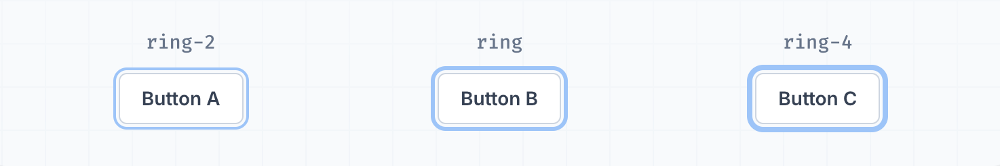
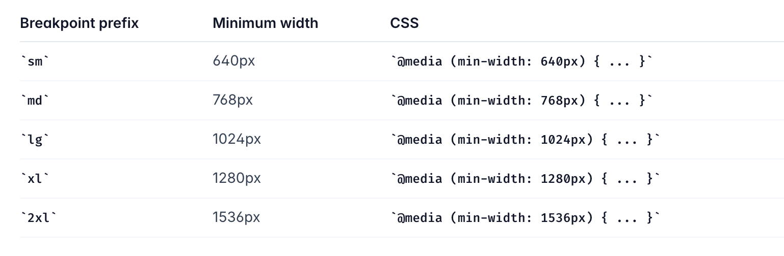
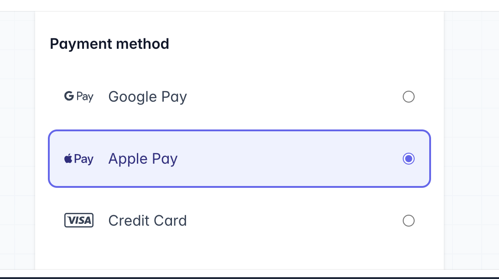

# tailwind

## [3.TailwindCSS](https://tailwindcss.com)

신속한 UI개발을 위한 Utility Fist CSS Framework

### 3.1 IntelliSense

#### [Tailwind CSS IntelliSense](https://marketplace.visualstudio.com/items?itemName=bradlc.vscode-tailwindcss)

- Visual Studio Code 사용자에게 자동 완성, 구문 강조, Linting과 같은 고급 기능을 제공하여 Tailwind 개발 환경을 향상.

#### [Headwind](https://github.com/heybourn/headwind)

- Visual Studio Code용 Tailwind CSS 클래스 분류기
- 코드를 구문 분석하고 클래스 태그를 지정된 순서에 따라 다시 리페인팅하여 일관된 클래스 순서를 적용.

#### [Tailwind CSS Explorer](https://marketplace.visualstudio.com/items?itemName=PeterMekhaeil.vscode-tailwindcss-explorer)

- 프로젝트의 tailwind 설정에서 사용할 수 있는 클래스를 탐색

> **Mac에서 TailwindCSS 자동완성 열기**
>
> - `command` + `i`
> - `option` + `esc`

### 3.3 Modifiers

### [Handling Hover, Focus, and Other States](https://tailwindcss.com/docs/hover-focus-and-other-states)

- 유틸리티를 사용하여 마우스 오버, 포커스 등에 대한 요소의 스타일을 지정

```jsx
<button class="bg-sky-500 hover:bg-sky-700 ...">Save changes</button>
```

#### [Dark Mode](https://tailwindcss.com/docs/dark-mode)

- Tailwind CSS를 사용하여 Dark Mode에서 사이트 스타일을 지정
- tailwind.config.ts에서 지정하지 않는 이상, 사용자의 시스템 모드에 따라서 테일윈드의 다크모드 적용이 된다.(사용자 모드가 다크모드라면 테일윈드에서 다크모드 스타일링이 자동으로 적용된다. )

```jsx
<div class="bg-white dark:bg-slate-800">
  <h3 class="text-slate-900 dark:text-white ">Writes Upside-Down</h3>
  <p class="text-slate-500 dark:text-slate-400">
    The Zero Gravity Pen can be used to write in any orientation, including upside-down. It even works in outer space.
  </p>
</div>
```

### 3.4 Tailwind Variables

#### [Ring Width](https://tailwindcss.com/docs/ring-width)

- 박스 그림자를 사용하여 아웃라인 링을 생성하는 유틸리티

<p center></p>

```jsx
<button class="... ring-offset-2 ring-2">Button A</button>
<button class="... ring-offset-2 ring">Button B</button>
<button class="... ring-offset-2 ring-4">Button C</button>

```

### 3.5 Responsive Modifiers

#### [Responsive Design](https://tailwindcss.com/docs/responsive-design)

- 반응형 유틸리티 variants를 사용하여 적응형 사용자 인터페이스를 구축한다.
- HTML을 벗어나지 않고도 복잡한 반응형 인터페이스를 구축하는 것이 쉽다.

  1. document의 <head>에 뷰포트 메타 태그를 추가했는지 확인

     ```html
     <meta name="viewport" content="width=device-width, initial-scale=1.0" />
     ```

     - 브라우저의 뷰포트는 웹 콘텐츠를 볼 수 있는 창의 영역
     - 종종 렌더링된 페이지의 크기와 같지않으며, 브라우저는 스크롤 하여 모든 콘텐츠에 엑세스할 수 있게 함
     - 일부 모바일 기기와 다른 좁은 화면은 일반적으로 화면보다 넓은 가상 창 또는 뷰포트에서 페이지를 렌더링한 다음 렌더링된 결과를 축소하여 모두 한 번에 볼 수 있도록 한다. 그런 다음 사용자는 확대/축소하여 페이지의 다른 영역을 더 자세히 볼 수 있다.

       - 예를 들어 모바일 화면의 너비가 640px인 경우 페이지는 980px의 가상 뷰포트로 렌더링된 다음 640px 공간에 맞게 축소
       - 이는, 미디어쿼리를 사용한다면 가상 뷰포트가 980px인 경우 640px 또는 480px 이하에서 작동하는 미디어 쿼리는 결코 사용되지 않게 된다.
       - `<meta>`요소를 사용하여 이러한 문제 완화 시킨다.

     - **width** : 뷰포트의 (최소) 너비 크기
     - **height** : 뷰포트의 (최소) 높이 크기
     - **initial-scale** : 페이지가 처음 로드될 때 확대 수준을 제어.
       - 최소값: 0.1. 최대값: 10. 기본값: 1. 음수 값: 무시됨.
     - **minimum-scale** : 페이지에서 허용되는 축소 정도를 제어.
       - 최소값: 0.1. 최대값: 10. 기본값: 0.1. 음수 값: 무시됨
     - **maximum-scale** : 페이지에서 허용되는 확대 정도를 제어. 3보다 작은 값은 접근성에 실패합니다.
       - 최소값: 0.1. 최대값: 10. 기본값: 10. 음수 값: 무시됨.
     - **user-scalable** : 페이지에서 확대 및 축소 작업이 허용되는지 여부를 제어.
       - 유효한 값: 0, 1, yes, 또는 no. 기본값: 1, 와 동일합니다 yes. 값을 로 설정하면 0와 동일합니다 no. 는 웹 콘텐츠 접근성 지침(WCAG)에 위배됩니다.
     - **interactive-widget** : 가상 키보드와 같은 대화형 UI 위젯이 페이지의 뷰포트에 미치는 효과를 지정.
       - 유효한 값: resizes-visual, resizes-content, 또는 overlays-content. 기본값: resizes-visual.

  2. 유틸리티를 추가하되 특정 중단점에서만 적용되도록 하려면 유틸리티 이름 앞에 중단점 이름과 : 문자를 붙임
     ```html
     <!-- Width of 16 by default, 32 on medium screens, and 48 on large screens -->
     
     ```

- 테일윈드는 모바일 퍼스트로 만들어졌다.

  - 접두사가 없는 유틸리티(예: `uppercase`)는 모든 화면 크기에서 적용
  - 접두사가 있는 유틸리티(예: md:`uppercase`)는 지정된 중단점 이상에서만 적용

- Responsive
    <p center></p>

### 3.6 Form Modifiers

#### [Styling based on sibling state : 형제 상태에 따른 스타일 지정(peer-{modifier})](https://tailwindcss.com/docs/hover-focus-and-other-states#styling-based-on-sibling-state)

- 형제 요소의 상태에 따라 요소의 스타일을 지정해야 하는 경우 형제를 peer 클래스로 표시하고 peer-invalid와 같은 peer-\* 수정자를 사용하여 대상 요소의 스타일을 지정합니다.

  ```html
  <form>
    <label class="block">
      <span class="block text-sm font-medium text-slate-700">Email</span>
      <input type="email" class="peer ..." />
      <p class="mt-2 invisible peer-invalid:visible text-pink-600 text-sm">Please provide a valid email address.</p>
    </label>
  </form>
  ```

- ❗️ CSS에서 [후속 형제 결합자(Subsequent-sibling combinator)](https://developer.mozilla.org/ko/docs/Learn/CSS/Building_blocks/Selectors/Combinators#%EC%9D%BC%EB%B0%98_%ED%98%95%EC%A0%9C_%EA%B2%B0%ED%95%A9%EC%9E%90)가 작동하는 방식 때문에 peer 마커는 이전 형제에서만 사용할 수 있다는 점을 유의하기

  ```jsx
  // 작동하지 않습니다. 이전 형제 자매만 peer로 표시될 수 있습니다.
  // input이 span보다 앞에 있어야 함
  <label>
    <span class="peer-invalid:text-red-500 ...">Email</span>
    <input type="email" class="peer ..." />
  </label>
  ```

#### 3.7 State Modifiers

#### [`has()` variant](https://tailwindcss.com/blog/tailwindcss-v3-4#new-has-variant)

- 인자로 전달된 relative selector가 이 요소에 대해 앵커링될 때 하나 이상의 요소와 일치하는 경우 요소를 나타낸다.
- relative selector 목록을 인수로 받아 참조 요소에 대해 부모 요소 또는 이전 형제 요소를 선택하는 방법을 제시합니다
- 최초로 부모를 기준으로 하는 것이 아니라 자식을 기준으로 요소의 스타일을 지정가능
- `has()`를 사용해서 코드에서 엄청난 양의 JavaScript를 대체 가능.

> **Relative selector (상대 선택기)**
>
> - 결합기 앞에 오는 하나 이상의 앵커 요소에 상대적인 요소를 나타내는 선택기
> - 명시적 결합자로 시작하지 않는 상대 선택자에는 암시적 하위 결합자 존재
> - 상대 선택자는 선택자 목록에서 사용할 수 없습니다. 대신 `:has()` 의사 클래스와 같은 특정 컨텍스트 내에서 허용됩니다.
>
> ```css
> :has(+ div#topic > #reference) {
> }
>
> :has(> .icon) {
> }
>
> dt:has(+ img) ~ dd {
> }
> ```

```jsx
<label class="has-[:checked]:ring-indigo-500 has-[:checked]:text-indigo-900 has-[:checked]:bg-indigo-50 ..">
  <svg fill="currentColor">
    <!-- ... -->
  </svg>
  Google Pay
  <input type="radio" class="accent-indigo-500 ..." />
</label>
```

<p center></p>

### 3.7 Lists and Animations

#### [Animation](https://tailwindcss.com/docs/animation)

- Skeleton UI 에서 사용하기 좋은 [Pulse](https://tailwindcss.com/docs/animation#pulse)

#### [`:empty`](https://developer.mozilla.org/en-US/docs/Web/CSS/:empty)

- `:empty` CSS 수도 클래스는 자식이 없는 모든 요소를 ​​나타냅니다.
- 하위 항목은 엘리먼트 노드이거나 텍스트(공백 포함)일 수 있습니다.

#### 3.9 Group Modifiers

#### [Styling based on parent state : 상위 상태에 따른 스타일 지정(group-{modifier})](https://tailwindcss.com/docs/hover-focus-and-other-states#styling-based-on-parent-state)

- 일부 상위 요소의 상태를 기반으로 요소의 스타일을 지정해야 하는 경우 상위 요소를 group 클래스로 표시하고 group-hover와 같은 group-\* 수정자를 사용하여 대상 요소의 스타일을 지정

  ```jsx
  <a href="#" class="group block max-w-xs mx-auto rounded-lg p-6 bg-white ring-1 ring-slate-900/5 shadow-lg space-y-3 hover:bg-sky-500 hover:ring-sky-500">
    <div class="flex items-center space-x-3">
      <svg class="h-6 w-6 stroke-sky-500 group-hover:stroke-white" fill="none" viewBox="0 0 24 24"><!-- ... --></svg>
      <h3 class="text-slate-900 group-hover:text-white text-sm font-semibold">New project</h3>
    </div>
    <p class="text-slate-500 group-hover:text-white text-sm">Create a new project from a variety of starting templates.</p>
  </a>

  ```

- **Differentiating nested groups : 중첩된 그룹 구분하기**
  그룹을 중첩할 때 `그룹/{이름}` 클래스를 사용하여 해당 부모 그룹에 고유한 그룹 이름을 부여하고 `그룹-hover/{이름}` 같은 클래스를 사용하여 해당 이름을 수정자에 포함하면 특정 부모 그룹의 상태에 따라 스타일을 지정할 수 있다.

  ```html
  <ul role="list">
    {#each people as person}
    <li class="group/item hover:bg-slate-100 ...">
      
      <div>
        <a href="{person.url}">{person.name}</a>
        <p>{person.title}</p>
      </div>
      <a class="group/edit invisible hover:bg-slate-200 group-hover/item:visible ..." href="tel:{person.phone}">
        <span class="group-hover/edit:text-gray-700 ...">Call</span>
        <svg class="group-hover/edit:translate-x-0.5 group-hover/edit:text-slate-500 ..."></svg>
      </a>
    </li>
    {/each}
  </ul>
  ```

### 3.10 JIT

#### [Just-in-Time Mode](https://v2.tailwindcss.com/docs/just-in-time-mode)

### 3.10 JIT

#### [Just-in-Time Mode](https://v2.tailwindcss.com/docs/just-in-time-mode)

- **정의**: JIT(Just-In-Time) 모드는 초기 빌드 시 모든 스타일을 미리 생성하는 대신, 템플릿을 작성할 때 필요에 따라 스타일을 즉시 생성하는 Tailwind CSS의 새로운 컴파일러. 이는 Tailwind CSS v2.1에서 도입되었다.
- **동작 방식**: 개발 환경에서 파일을 저장할 때마다 `tailwind.config.ts` 파일의 `content` 속성에 지정된 모든 파일에서 사용된 클래스들을 읽어 들여 해당 클래스들만 포함된 CSS 파일로 변환
- **유연성**: 컴파일러는 Tailwind의 기본 클래스뿐만 아니라, 입력한 임의의 값(arbitrary value)을 기반으로도 클래스를 생성할 수 있어 커스터마이징이 매우 편리
- **확장성**: `tailwind.config.ts` 파일의 `theme > extend` 속성에서 커스텀 클래스를 정의할 수 있다. 이를 통해 프로젝트에 필요한 고유한 스타일을 쉽게 추가할 수 있다.

##### 주요 특징과 장점

1. **빠른 컴파일 속도**:

   - JIT 모드는 필요한 스타일만 즉시 생성하기 때문에, 기존의 전체 빌드 방식에 비해 컴파일 속도가 매우 빠릅니다.
   - 특히 대규모 프로젝트에서 초기 빌드 시간을 크게 단축할 수 있습니다.

2. **작은 파일 크기**:

   - 사용된 클래스만 포함된 CSS 파일을 생성하므로, 최종 CSS 파일의 크기가 작아집니다.
   - 이는 웹 페이지 로드 속도를 향상시키고, 사용자 경험을 개선합니다.

3. **즉각적인 피드백**:

   - 저장할 때마다 변경 사항이 즉시 반영되므로, 개발자가 실시간으로 스타일 변경 결과를 확인할 수 있습니다.
   - 개발 속도와 생산성을 크게 향상시킵니다.

4. **높은 유연성**:

   - Tailwind CSS의 기본 클래스 외에도, 임의의 값을 입력하여 커스텀 클래스를 쉽게 생성할 수 있습니다.
   - 예시: `bg-[#1da1f2]`와 같이 특정 색상을 바로 적용할 수 있습니다.

5. **간편한 확장성**:
   - `tailwind.config.ts` 파일의 `theme > extend` 속성에서 사용자 정의 클래스를 추가하여, 프로젝트에 필요한 고유한 스타일을 쉽게 적용할 수 있습니다.

- [JIT 관련 유튜브 영상](https://www.youtube.com/watch?v=3O_3X7InOw8&ab_channel=TailwindLabs)

### 3.11 Directives

#### [Functions & Directives](https://tailwindcss.com/docs/functions-and-directives)

지시어(Directives)는 Tailwind CSS 프로젝트에 특별한 기능을 제공하는 CSS에서 사용할 수 있는 사용자 정의 Tailwind 관련 at-규칙입니다.

#### [@tailwind](https://tailwindcss.com/docs/functions-and-directives#tailwind)

@tailwind 지시문을 사용하여 Tailwind의 base, components, utilities 및 variants 스타일을 CSS에 삽입할 수 있다.

#### [@apply](https://tailwindcss.com/docs/functions-and-directives#apply)

기존 유틸리티 클래스를 사용자 커스텀 CSS에 인라인하려면 @apply를 사용하세요.

#### [@layer](https://tailwindcss.com/docs/functions-and-directives#layer)

@layer 지시문을 사용하여 사용자 정의 스타일 세트가 속한 '버킷'을 Tailwind에 알립니다.

```css
/**
 * 이것은 Tailwind의 기본 스타일과 플러그인에 의해 등록된
 * 모든 기본 스타일을 주입합니다.
 */
@tailwind base;

/**
 * 이것은 Tailwind의 컴포넌트 클래스와 플러그인에 의해
 * 등록된 모든 컴포넌트 클래스를 주입합니다.
 */
@tailwind components;

/**
 * 이것은 Tailwind의 유틸리티 클래스와 플러그인에 의해
 * 등록된 모든 유틸리티 클래스를 주입합니다.
 */
@tailwind utilities;

/**
 * 이 지시어를 사용하여 Tailwind가 각 클래스의 호버, 포커스,
 * 반응형, 다크 모드 및 기타 변형을 주입하는 위치를 제어할 수 있습니다.
 *
 * 생략된 경우, Tailwind는 기본적으로 이 클래스들을 스타일 시트의
 * 맨 끝에 추가합니다.
 */
@tailwind variants;

@layer base {
  /* global CSS로 기본적인 스타일링 */
  h1 {
    @apply text-2xl;
  }
  h2 {
    @apply text-xl;
  }
}

@layer components {
  /* CSS의 조합, 다른 형태의 태그에 같은 디자인을 적용할 때 사용 */
  .btn-blue {
    @apply bg-blue-500 hover:bg-blue-700 text-white font-bold py-2 px-4 rounded;
  }
}

@layer utilities {
  /* 커스텀 유틸리티 CSS 생성 가능 */
  .filter-none {
    filter: none;
  }
  .filter-grayscale {
    filter: grayscale(100%);
  }
}
```

### 3.12 Plugins

- [tailwindcss/forms](https://github.com/tailwindlabs/tailwindcss-forms)

  - 유틸리티를 사용하여 form 요소를 쉽게 재정의할 수 있도록 form 스타일에 대한 기본 reset을 제공하는 플러그인입니다.
  - `npm install -D @tailwindcss/forms`

- [tailwindcss/forms 테스트](https://tailwindcss-forms.vercel.app)

- [Official plugins](https://tailwindcss.com/docs/plugins#official-plugins)

  - 플러그인은 npm을 통해 설치한 후 tailwind.config.js 파일에 추가하여 프로젝트에 추가할 수 있습니다.

- [daisyUI](https://daisyui.com)

  - Tailwind CSS용 가장 인기있는 컴포넌트 라이브러리
  - `npm i -D daisyui@latest`

- [TailwindCSS 공식 플러그인](https://tailwindcss.com/docs/plugins#official-plugins)
