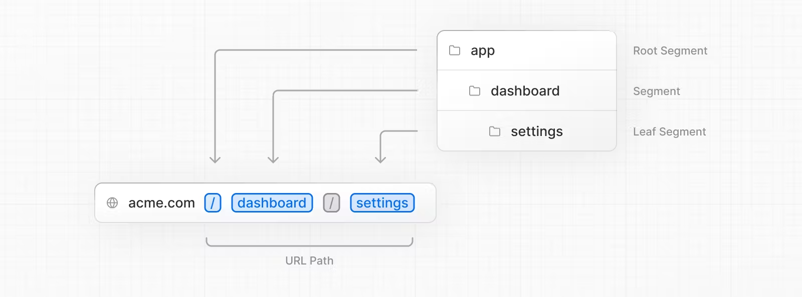
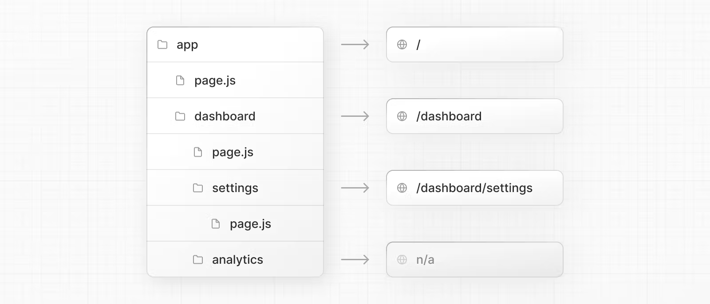

## 2.1 Defining Routes

### [Creating Routes](https://nextjs.org/docs/app/building-your-application/routing/defining-routes)

- Next.js는 폴더를 사용하여 경로를 정의하는 파일 시스템 기반 라우터를 사용
- 각 폴더는 URL 세그먼트에 매핑되는 경로 세그먼트를 나타낸다.중첩된 경로를 만들려면 폴더를 서로 중첩하여 사용
  ex) app/dashboard/setting/page.tsx
  
  

> **Good to know**: 특수 파일에는 .js, .jsx 또는 .tsx 파일 확장자를 사용할 수 있습니다.

### Creating UI

특별한 파일 규칙을 사용하여 각 경로 세그먼트에 대한 UI를 만듭니다. 가장 일반적인 것은 경로에 고유한 UI를 표시하는 페이지와 여러 경로에서 공유되는 UI를 표시하는 레이아웃입니다.<br/>
예를 들어, 첫 페이지를 만들려면 앱 디렉토리에 page.js 파일을 추가하고 React 컴포넌트를 내보내면 됩니다.<br/>
ex) app/page.tsx

```tsx
export default function Page() {
  return <h1>Hello, Next.js!</h1>;
}
```

## 2.2 Not Found Routes

### [Not Found](https://nextjs.org/docs/app/api-reference/file-conventions/not-found)

not-found 파일은 경로 세그먼트 내에서 notFound 함수가 던져질 때 UI를 렌더링하는 데 사용됩니다. <br/>
사용자 지정 UI를 제공하는 것과 함께 Next.js는 스트리밍된 응답의 경우 200 HTTP 상태 코드를 반환하고 스트리밍되지 않은 응답의 경우 404를 반환합니다.<br/>

> **Good to know**: root `app/not-found.js` 파일은 예상되는 `notFound()` 오류를 포착하는 것 외에도 전체 애플리케이션의 일치하지 않는 URL도 처리합니다. 즉, 앱에서 처리하지 않는 URL을 방문하는 사용자에게는 `app/not-found.js` 파일에서 내보낸 UI가 표시됩니다.

```tsx
import Link from "next/link";

export default function NotFound() {
  // props 존재하지 않음
  return (
    <div>
      <h2>Not Found</h2>
      <p>Could not find requested resource</p>
      <Link href="/">Return Home</Link>
    </div>
  );
}
```

### Data Fetching

기본적으로 `NotFound`는 서버 컴포넌트입니다. `async`(비동기)로 표시하여 데이터를 가져오고 표시할 수 있습니다.

```tsx
import Link from "next/link";
import { headers } from "next/headers";

export default async function NotFound() {
  const headersList = headers();
  const domain = headersList.get("host");
  const data = await getSiteData(domain);
  return (
    <div>
      <h2>Not Found: {data.name}</h2>
      <p>Could not find requested resource</p>
      <p>
        View <Link href="/blog">all posts</Link>
      </p>
    </div>
  );
}
```

### [usePathname](https://nextjs.org/docs/app/api-reference/functions/use-pathname)

현재 URL의 pathname(경로명)을 읽을 수 있게 해주는 클라이언트 컴포넌트 훅입니다.

```tsx
"use client";

import { usePathname } from "next/navigation";

export default function ExampleClientComponent() {
  const pathname = usePathname(); // 매개변수를 받지 않는다
  return <p>Current pathname: {pathname}</p>;
}
```

`usePathname`을 사용하려면 의도적으로 클라이언트 컴포넌트를 사용해야 합니다. 클라이언트 컴포넌트는 최적화를 헤제하는 것이 아니라는 점에 유의해야 합니다.<br/>
클라이언트 컴포넌트는 서버 컴포넌트 아키텍처의 필수적인 부분입니다.<br/>

예를 들어, `usePathname`이 있는 클라이언트 컴포넌트는 초기 페이지 로드 시 HTML로 렌더링됩니다. 새 경로로 이동할 때 이 컴포넌트를 다시 가져올 필요가 없습니다. 대신 컴포넌트가 (클라이언트 자바스크립트 번들에서) 한 번 다운로드되고 현재 상태에 따라 다시 렌더링됩니다.<br/>

> **Good to know**:
> 서버 컴포넌트에서 현재 URL 읽기는 지원되지 않습니다. 이 디자인은 페이지 탐색 전반에 걸쳐 레이아웃 상태가 유지되도록 지원하기 위한 의도입니다.
>
> **Compatibility mode 호환성 모드**:
>
> - fallback route가 렌더링 중이거나 페이지 디렉터리 페이지가 Next.js에 의해 자동으로 정적으로 최적화되어 라우터가 준비되지 않은 경우 `usePathname`은 `null`을 반환할 수 있습니다.
> - 프로젝트에서 앱(app)과 페이지(page) 디렉터리를 모두 감지하면 Next.js가 자동으로 유형을 업데이트합니다.

### Do something in response to a route change

```tsx
"use client";

import { usePathname, useSearchParams } from "next/navigation";

function ExampleClientComponent() {
  const pathname = usePathname();
  const searchParams = useSearchParams();
  useEffect(() => {
    // Do something here...
  }, [pathname, searchParams]);
}
```

## 2.3 SSR vs CSR

### [Rendering 렌더링](https://nextjs.org/docs/app/building-your-application/rendering)

NextJS가 리액트 컴포넌트를 브라우저가 이해할 수 있는 html로 변환하는 작업<br/>

렌더링은 작성한 코드를 사용자 인터페이스(user interfaces)로 변환합니다.<br/>
React와 Next.js를 사용하면 코드의 일부가 서버 또는 클라이언트에서 렌더링될 수 있는 하이브리드 웹 애플리케이션을 만들 수 있습니다.

### Fundamentals\_기본 사항

> 세 가지 기본 웹 개념
>
> 1. 애플리케이션 코드가 실행될 수 있는 [환경](https://nextjs.org/docs/app/building-your-application/rendering#rendering-environments): 서버와 클라이언트.
> 2. 사용자가 애플리케이션을 방문하거나 애플리케이션과 상호 작용할 때 시작되는 [Request-Response LifeCycle\_ 요청-응답 수명 주기](https://nextjs.org/docs/app/building-your-application/rendering#request-response-lifecycle).
> 3. 서버와 클라이언트 코드를 구분하는 [네트워크 경계](https://nextjs.org/docs/app/building-your-application/rendering#network-boundary).

### 1. Rendering Environments\_렌더링 환경

웹 애플리케이션을 렌더링할 수 있는 환경에는 두 가지가 있습니다. : **client와 server**

- **client** : 애플리케이션 코드에 대한 요청을 서버로 보내는 사용자 디바이스의 브라우저를 말합니다. 그런 다음 서버의 응답을 사용자 인터페이스로 변환합니다.
- **server** : 애플리케이션 코드를 저장하고 클라이언트로부터 요청을 받은 후 적절한 응답을 다시 보내는 데이터 센터의 컴퓨터를 말합니다.

기존에는 개발자가 서버와 클라이언트를 위한 코드를 작성할 때 서로 다른 언어(예: JavaScript, PHP)와 프레임워크를 사용해야 했습니다. <br/>
React를 사용하면 개발자는 동일한 언어(JavaScript)와 동일한 프레임워크(예: Next.js 또는 선택한 프레임워크)를 사용할 수 있습니다. 이러한 유연성 덕분에 컨텍스트 전환 없이 두 환경 모두에 대한 코드를 원활하게 작성할 수 있습니다.<br/>

그러나 각 환경에는 고유한 기능과 제약 조건이 있습니다. 따라서 서버와 클라이언트에 대해 작성하는 코드가 항상 동일하지는 않습니다. <br/>
특정 작업(예: 데이터 가져오기 또는 사용자 상태 관리)이 다른 환경보다 한 환경에 더 적합한 경우가 있습니다.<br/>

### 2. Request-Response Lifecycle

대체로 모든 웹사이트는 동일한 request-response lifecycle을 따릅니다:<br/>

1. **User Action\_사용자 작업**: 사용자가 웹 애플리케이션과 상호 작용. 링크를 클릭하거나 양식을 제출하거나 브라우저의 주소창에 URL을 직접 입력하는 등 다양한 방법 존재.
2. **HTTP request_HTTP 요청**: 클라이언트는 요청 중인 리소스, 사용 중인 Method(예: GET, POST), 필요한 경우 추가 데이터 등 필요한 정보가 포함된 HTTP 요청을 서버로 보냄.
3. **Server\_서버**: 서버는 요청을 처리하고 적절한 리소스로 응답. 이 프로세스에는 routing, fetching data 등의 몇 가지 단계가 포함될 수 있음.
4. **HTTP 응답**: 요청을 처리한 후 서버는 HTTP 응답을 클라이언트에 다시 보냄. 이 응답에는 요청의 성공 여부를 클라이언트에 알려주는 상태 코드와 요청된 리소스(예: HTML, CSS, JavaScript, 정적 자산 등)가 포함됨.
5. **Client\_클라이언트**: 클라이언트가 리소스를 파싱하여 사용자 인터페이스를 렌더링함.
6. **User Action\_사용자 작업**: 사용자 인터페이스가 렌더링되면 사용자는 인터페이스와 상호 작용할 수 있으며 전체 프로세스가 다시 시작됨.

하이브리드 웹 애플리케이션 구축의 가장 중요한 부분은 수명 주기에서 작업을 분할하는 방법과 네트워크 경계를 어디에 배치할지 결정하는 것.<br/>

### 3. Network Boundary\_네트워크 경계

웹 개발에서 네트워크 경계는 서로 다른 환경을 구분하는 개념적 경계입니다. 예를 들어 클라이언트와 서버 또는 서버와 데이터 저장소가 이에 해당합니다.<br/>

React에서는 클라이언트-서버 네트워크 경계를 가장 적합한 곳에 배치할 위치를 선택합니다.<br/>

내부적으로 작업은 **the client module graph and the server module graph**의 두 부분으로 나뉩니다.<br/>

- 서버 모듈 그래프에는 서버에서 렌더링되는 모든 컴포넌트가 포함되며,
- 클라이언트 모듈 그래프에는 클라이언트에서 렌더링되는 모든 컴포넌트가 포함됩니다.

모듈 그래프는 애플리케이션의 파일들이 서로 어떻게 의존하는지를 시각적으로 표현하는 것으로 생각하면 도움이 될 수 있습니다.<br/>

React "use client" 규칙을 사용하여 경계를 정의할 수 있습니다.<br/>
또한 서버에서 일부 계산 작업을 수행하도록 React에 지시하는 "use server" 규칙도 있습니다.

> Nextjs에서 모든 컴포넌트와 페이지들은 먼저 서버에서 렌더됨
> ('use client' 사용 여부와 상관없음)

### 1) CSR(Client Side Rendering)

- 모든 렌더링이 클라이언트 측에서 발생합니다.
- 클라이언트는 자바스크립트를 로드하고, 자바스크립트가 UI를 렌더링합니다.

### 2) SSR(Server Side Rendering)

- 각 페이지 요청이 있을 때마다 서버에서 페이지를 새로 생성합니다.
- NextJS는 웹 사이트를 빌드할 때 페이지에 대한 초기 HTML을 서버에서 생성하고 전달합니다.

#### pages router

pages 디렉토리에서 getServerSideProps는 서버에서 데이터를 가져와서 파일에 있는 기본 내보낸 React 컴포넌트로 프롭을 전달하는 데 사용됩니다.<br/>
페이지의 초기 HTML은 서버에서 미리 렌더링된 후 브라우저에서 페이지를 "hydrating"(인터랙티브하게 만들기)합니다.

```tsx
// `pages` directory

export async function getServerSideProps() {
  const res = await fetch(`https://...`);
  const projects = await res.json();

  return { props: { projects } };
}

export default function Dashboard({ projects }) {
  return (
    <ul>
      {projects.map((project) => (
        <li key={project.id}>{project.name}</li>
      ))}
    </ul>
  );
}
```

Node.js HTTP API를 기반으로 request-based data를 검색 가능<br/>

- `getServerSideProps`에서 `req` 객체를 검색하여 요청의 쿠키 및 헤더를 검색하는 데 사용할 수 있습니다.

```tsx
// `pages` directory

export async function getServerSideProps({ req, query }) {
  const authHeader = req.getHeaders()['authorization'];
  const theme = req.cookies['theme'];

  return { props: { ... }}
}

export default function Page(props) {
  return ...
}
```

#### app router

앱 디렉토리에서 서버 컴포넌트를 사용하여 데이터 불러오기를 React 컴포넌트 내부에 배치할 수 있습니다.<br/>
이렇게 하면 서버에서 렌더링된 HTML을 유지하면서 클라이언트에 보내는 자바스크립트 양을 줄일 수 있습니다.<br/>

`cache` 옵션을 `no-store`로 설정하면 가져온 데이터를 캐시하지 않도록 지정할 수 있습니다. 이는 페이지 디렉토리의 `getServerSideProps`와 유사합니다.<br/>

```tsx
// `app` directory

// This function can be named anything
async function getProjects() {
  const res = await fetch(`https://...`, { cache: "no-store" }); // cache 옵션 참고(getServerSideProps와 유사하게 접근할때마다 새로이 fetch 함)
  const projects = await res.json();

  return projects;
}

export default async function Dashboard() {
  const projects = await getProjects();

  return (
    <ul>
      {projects.map((project) => (
        <li key={project.id}>{project.name}</li>
      ))}
    </ul>
  );
}
```

request data를 검색할 수 있는 새로운 읽기 전용 함수를 노출함:<br/>

- `headers()`: Web Headers API를 기반으로 하며 서버 컴포넌트 내부에서 요청 헤더를 검색하는 데 사용 가능
- `cookies()`: Web Cookies API 기반으로 하며 서버 컴포넌트 내부에서 쿠키를 검색하는 데 사용 가능

```tsx
// `app` directory
import { cookies, headers } from "next/headers";

async function getData() {
  const authHeader = headers().get("authorization");

  return "...";
}

export default async function Page() {
  // You can use `cookies()` or `headers()` inside Server Components
  // directly or in your data fetching function
  const theme = cookies().get("theme");
  const data = await getData();
  return "...";
}
```

### 3) SSG(Static Site Generation )

- 페이지가 빌드 시간에 미리 생성되어 HTML 파일로 저장됩니다.
- 프로젝트 빌드 시에 모든 페이지를 미리 생성할 수 있을 때 가장 효과적이며, 속도가 가장 빠릅니다.

#### pages router

`pages` 디렉터리에서`getStaticProps` 함수는 빌드 시 페이지를 미리 렌더링하는 데 사용됩니다.<br/>
이 함수는 외부 API 또는 데이터베이스에서 직접 데이터를 가져와 빌드 중에 생성되는 전체 페이지에 이 데이터를 전달하는 데 사용할 수 있습니다.<br/>

```tsx
// `pages` directory

export async function getStaticProps() {
  const res = await fetch(`https://...`);
  const projects = await res.json();

  return { props: { projects } };
}

export default function Index({ projects }) {
  return projects.map((project) => <div>{project.name}</div>);
}
```

#### app router

`app` 디렉터리에서 `fetch()`로 데이터를 가져오면 기본적으로 **`force-cache`**로 캐시가 설정되어 수동으로 무효화될 때까지 요청 데이터를 캐시합니다.<br/>
이는 페이지 디렉터리의 `getStaticProps`와 유사합니다.<br/>

```tsx
// `app` directory

// This function can be named anything
async function getProjects() {
  const res = await fetch(`https://...`);
  const projects = await res.json();

  return projects;
}

export default async function Index() {
  const projects = await getProjects();

  return projects.map((project) => <div>{project.name}</div>);
}
```

### 4) Dynamic paths (getStaticPaths)

#### pages router

`pages` 디렉터리에서 `getStaticPaths` 함수는 빌드 시 pre-rendered 해야 하는 dynamic path를 정의하는 데 사용됩니다.<br/>

```tsx
// `pages` directory
import PostLayout from "@/components/post-layout";

export async function getStaticPaths() {
  return {
    paths: [{ params: { id: "1" } }, { params: { id: "2" } }],
  };
}

export async function getStaticProps({ params }) {
  const res = await fetch(`https://.../posts/${params.id}`);
  const post = await res.json();

  return { props: { post } };
}

export default function Post({ post }) {
  return <PostLayout post={post} />;
}
```

#### app router

`app` 디렉터리에서 `getStaticPaths`는 `generateStaticParams`로 대체됩니다.<br/>

`generateStaticParams`는 `getStaticPaths`와 비슷하게 동작하지만 경로 매개변수를 반환하는 API가 간소화되어 레이아웃 내부에서 사용할 수 있습니다.<br/>
`generateStaticParams의` 반환 형태는 중첩된 매개변수 객체 배열이나 확인된 경로 문자열이 아닌 세그먼트 배열입니다.<br/>

```tsx
// `app` directory
import PostLayout from "@/components/post-layout";

export async function generateStaticParams() {
  return [{ id: "1" }, { id: "2" }];
}

async function getPost(params) {
  const res = await fetch(`https://.../posts/${params.id}`);
  const post = await res.json();

  return post;
}

export default async function Post({ params }) {
  const post = await getPost(params);

  return <PostLayout post={post} />;
}
```

- app 디렉토리에 있는 새 모델에는 `getStaticPaths`보다 `generateStaticParams`라는 이름을 사용하는 것이 더 적절합니다.
- get 접두사는 더 자세한 설명을 제공하는 generate로 대체되며, 이제 `getStaticProps` 및 `getServerSideProps`가 더 이상 필요하지 않으므로 단독으로 더 잘 어울립니다.
- Paths 접미사는 여러 동적 세그먼트가 있는 중첩 라우팅에 더 적합한 Params로 대체됩니다.

### 5) Incremental Static Regeneration (getStaticProps with revalidate)

- SSG와 유사하지만, revalidate 옵션을 사용하여 지정된 시간 간격 후에 개별 페이지를 재생성할 수 있습니다.
- 콘텐츠가 주기적으로 업데이트되어야 하지만 모든 요청에 대해 서버에서 렌더링할 필요는 없는 경우에 적합합니다.

#### pages router

`pages` 디렉터리에서 `getStaticProps` 함수를 사용하면 일정 시간이 지나면 페이지를 자동으로 다시 생성하는 `revalidate`(재검증) 필드를 추가할 수 있습니다.<br/>

```tsx
// `pages` directory

export async function getStaticProps() {
  const res = await fetch(`https://.../posts`);
  const posts = await res.json();

  return {
    props: { posts },
    revalidate: 60, // 60초 마다 재검증
  };
}

export default function Index({ posts }) {
  return (
    <Layout>
      <PostList posts={posts} />
    </Layout>
  );
}
```

#### app router

`app` 디렉터리에서 `fetch()`로 데이터를 가져오는 경우 `revalidate`(재검증)을 사용하여 지정된 시간(초) 동안 요청을 캐시할 수 있습니다.

```tsx
// `app` directory

async function getPosts() {
  const res = await fetch(`https://.../posts`, { next: { revalidate: 60 } }); // 60초 마다 재검증
  const data = await res.json();

  return data.posts;
}

export default async function PostList() {
  const posts = await getPosts();

  return posts.map((post) => <div>{post.name}</div>);
}
```

## 2.4 Hydration

서버사이드 렌더링(SSR)을 통해 만들어 진 인터랙티브 하지 않는 HTML을 클라이언트 측 자바스크립트를 사용하여 인터랙티브한 리액트 컴포넌트로 변환하는 과정을 말한다.<br/>
(서버 환경에서 이미 렌더링된 HTML에 React를 붙이는 것)

## 2.5 'use client'

#### [React client hook in Server Component 오류](https://nextjs.org/docs/messages/react-client-hook-in-server-component)

서버 컴포넌트에서 React 클라이언트 훅을 사용하고 있을 때 발생하는 오류로 'use client' 를 추가해 클라이언트 컴포넌트로 바꿔줘야 합니다.<br/>

```tsx
"use client"; // useEffect를 사용하고 있기 때문에 추가하여 클라이언트 컴포넌트로 변경

import { useEffect } from "react";

export default function Example() {
  // client hook
  useEffect(() => {
    console.log("in useEffect");
  });
  return <p>Hello world</p>;
}
```

## 2.6

#### 지원되지 않는 패턴: [서버 컴포넌트를 클라이언트 컴포넌트로 가져오기](https://nextjs.org/docs/app/building-your-application/rendering/composition-patterns#unsupported-pattern-importing-server-components-into-client-components)

서버 컴포넌트를 클라이언트 컴포넌트로 import 할 수 없습니다.<br/>

**잘못된 사용e**

```tsx
"use client";

// You cannot import a Server Component into a Client Component.
import ServerComponent from "./Server-Component";

export default function ClientComponent({ children }: { children: React.ReactNode }) {
  const [count, setCount] = useState(0);

  return (
    <>
      <button onClick={() => setCount(count + 1)}>{count}</button>

      <ServerComponent />
    </>
  );
}
```

##### 지원되는 패턴: [서버 컴포넌트를 클라이언트 컴포넌트에 props로 전달](https://nextjs.org/docs/app/building-your-application/rendering/composition-patterns#supported-pattern-passing-server-components-to-client-components-as-props)

서버 컴포넌트를 클라이언트 컴포넌트에 prop으로 전달할 수 있습니다.<br/>
일반적인 패턴은 React children prop을 사용하여 클라이언트 컴포넌트에 "slot"을 만드는 것입니다.<br/>

```tsx
"use client";

import { useState } from "react";

export default function ClientComponent({ children }: { children: React.ReactNode }) {
  const [count, setCount] = useState(0);

  return (
    <>
      <button onClick={() => setCount(count + 1)}>{count}</button>
      {children}
    </>
  );
}
```

`<ClientComponent>`는 서버 컴포넌트의 결과에 의해 자식이 채워질 것이라는 것을 알지 못합니다. <br/>
`<ClientComponent>`가 가진 유일한 책임은 결국 자식이 어디에 배치될지 결정하는 것뿐입니다.<br/>

부모 서버 컴포넌트에서 `<ClientComponent>`와 `<ServerComponent>`를 모두 가져와서 `<ServerComponent>`를 `<ClientComponent>`의 자식으로 전달할 수 있습니다:<br/>

```tsx
// This pattern works:
// You can pass a Server Component as a child or prop of a
// Client Component.
import ClientComponent from "./client-component";
import ServerComponent from "./server-component";

// Pages in Next.js are Server Components by default
export default function Page() {
  return (
    <ClientComponent>
      <ServerComponent />
    </ClientComponent>
  );
}
```

## 2.7 [Layouts](./migration.md/#2-step-2-creating-a-root-layout)

## 2.8 [Metadata](https://nextjs.org/docs/app/building-your-application/optimizing/metadata)

Next.js에는 SEO 및 웹 공유성을 개선하기 위해 애플리케이션 메타데이터(예: HTML 헤드 요소 내부의 메타 및 링크 태그)를 정의하는 데 사용할 수 있는 메타데이터 API가 있습니다.<br/>

#### 메타데이터를 추가하는 방법 두 가지

1. 구성 기반 메타데이터: 정적 메타데이터 객체 또는 동적 생성 메타데이터 함수를 `layout.j`s 또는 `page.js` 파일로 내보냅니다.
2. 파일 기반 메타데이터: 정적 또는 동적으로 생성된 특수 파일을 경로 세그먼트에 추가합니다.

이 두 가지 옵션을 모두 사용하면 Next.js가 페이지의 관련 `<head>` 요소를 자동으로 생성합니다.<br/>
ImageResponse 생성자를 사용하여 동적 OG 이미지를 생성할 수도 있습니다.

### [Static Metadata(정적 메타데이터)](https://nextjs.org/docs/app/building-your-application/optimizing/metadata#static-metadata)

정적 메타데이터를 정의하려면 `layout.js` 또는 정적 `page.js` 파일에서 메타데이터 개체를 export 하시오.<br/>

```tsx
//layout.tsx | page.tsx

import type { Metadata } from "next";

export const metadata: Metadata = {
  title: "...",
  description: "...",
};

export default function Page() {}
```

### [Dynamic Metadata (동적 메타데이터)](https://nextjs.org/docs/app/building-your-application/optimizing/metadata#dynamic-metadata)

`generateMetadata` 함수를 사용하여 동적 값이 필요한 메타데이터를 가져올 수 있습니다.<br/>

```tsx
//app/products/[id]/page.tsx

import type { Metadata, ResolvingMetadata } from "next";

type Props = {
  params: { id: string };
  searchParams: { [key: string]: string | string[] | undefined };
};

export async function generateMetadata({ params, searchParams }: Props, parent: ResolvingMetadata): Promise<Metadata> {
  // read route params
  const id = params.id;

  // fetch data
  const product = await fetch(`https://.../${id}`).then((res) => res.json());

  // optionally access and extend (rather than replace) parent metadata
  const previousImages = (await parent).openGraph?.images || [];

  return {
    title: product.title,
    openGraph: {
      images: ["/some-specific-page-image.jpg", ...previousImages],
    },
  };
}

export default function Page({ params, searchParams }: Props) {}
```

> **Good to know**:
>
> - `generateMetadata`를 통한 정적 메타데이터와 동적 메타데이터는 **모두 서버 컴포넌트에서만 지원**됩니다.
> - `fetch` 요청은 생성 메타데이터, 생성 정적 매개변수, 레이아웃, 페이지 및 서버 컴포넌트에서 동일한 데이터에 대해 자동으로 메모화됩니다. `fetch`를 사용할 수 없는 경우 React 캐시를 사용할 수 있습니다.
>   Next.js는 클라이언트에 UI를 스트리밍하기 전에 `generateMetadata` 내부의 데이터 불러오기가 완료될 때까지 기다립니다. 이렇게 하면 스트리밍된 응답의 첫 부분에 `<head>` 태그가 포함되도록 보장합니다.

### [Ordering 순서](https://nextjs.org/docs/app/building-your-application/optimizing/metadata#ordering)

메타데이터는 루트 세그먼트에서 시작하여 최종 ₩page.js₩ 세그먼트에 가장 가까운 세그먼트까지 순서대로 평가됩니다.<br/>

1. app/layout.tsx(루트 레이아웃)
2. app/blog/layout.tsx(중첩 블로그 레이아웃)
3. app/blog/[slug]/page.tsx(블로그 페이지)

### [Merging 병합](https://nextjs.org/docs/app/building-your-application/optimizing/metadata#merging)

#### Overwriting fields

평가 순서에 따라 동일한 경로의 여러 세그먼트에서 내보낸 메타데이터 개체를 얕게 병합하여 경로의 최종 메타데이터 출력을 형성합니다. 중복 키는 순서에 따라 교체됩니다.<br/>

즉, 이전 세그먼트에서 정의된 오픈그래프 및 로봇과 같이 중첩된 필드가 있는 메타데이터는 마지막 세그먼트에서 이를 정의하기 위해 덮어쓰게 됩니다.<br/>

```tsx
//app/layout.js

export const metadata = {
  title: "Acme",
  openGraph: {
    title: "Acme",
    description: "Acme is a...",
  },
};
```

```tsx
//app/blog/page.js

export const metadata = {
  title: "Blog",
  openGraph: {
    title: "Blog",
  },
};

// Output:
// <title>Blog</title>
// <meta property="og:title" content="Blog" />
```

- `app/layout.js`의 title(`"Acme"`)은 `app/blog/page.js`에서 title(`"Blog"`)로 대체됩니다.
- `app/blog/page.js`는 openGraph 메타데이터를 설정하기 때문에 `app/layout.js`의 모든 openGraph 필드가 `app/blog/page.js`에서 대체됩니다. openGraph.description이 없다는 점에 유의하세요.
- 세그먼트 간에 일부 중첩된 필드를 공유하면서 다른 필드를 덮어쓰고 싶다면 해당 필드를 별도의 변수로 가져올 수 있습니다.

```tsx
//app/shared-metadata.js

export const openGraphImage = { images: ["http://..."] };
```

```tsx
//app/page.js

import { openGraphImage } from "./shared-metadata";

export const metadata = {
  openGraph: {
    ...openGraphImage,
    title: "Home",
  },
};
```

#### Inheriting fields

- 중첩된다.

```tsx
// app/layout.js

export const metadata = {
  title: "Acme",
  openGraph: {
    title: "Acme",
    description: "Acme is a...",
  },
};
```

```tsx
// app/about/page.js

export const metadata = {
  title: "About",
};

// Output:
// <title>About</title>
// <meta property="og:title" content="Acme" />
// <meta property="og:description" content="Acme is a..." />
```

#### [Dynamic Image Generation](https://nextjs.org/docs/app/building-your-application/optimizing/metadata#dynamic-image-generation)

## 2.9 [Dynamic Route](https://nextjs.org/docs/app/building-your-application/routing/dynamic-routes)

동적 세그먼트는 폴더 이름을 대괄호(`[folderName]`)로 묶어 생성할 수 있습니다.<br/>
동적 세그먼트는 `layout`, `page`, `route` 및 생성 메타데이터 함수에 대한 매개변수(`params`)로 전달됩니다.<br/>

```tsx
// app/blog/[slug]/page.tsx
export default function Page({ params }: { params: { slug: string } }) {
  return <div>My Post: {params.slug}</div>;
}
```

- page router와 동일
