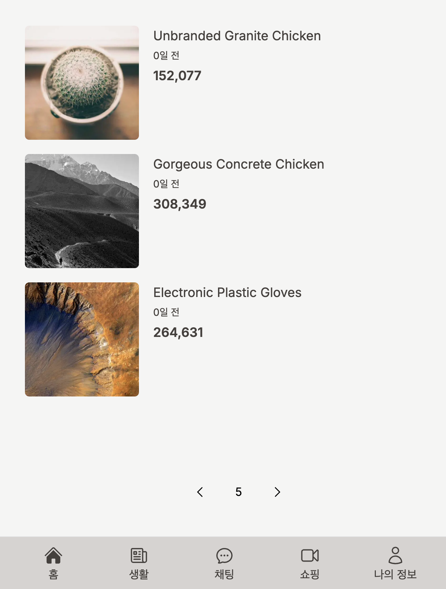
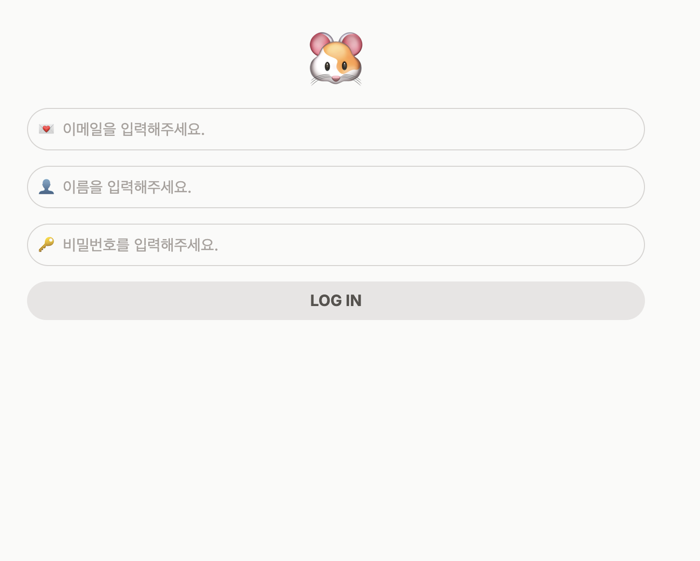
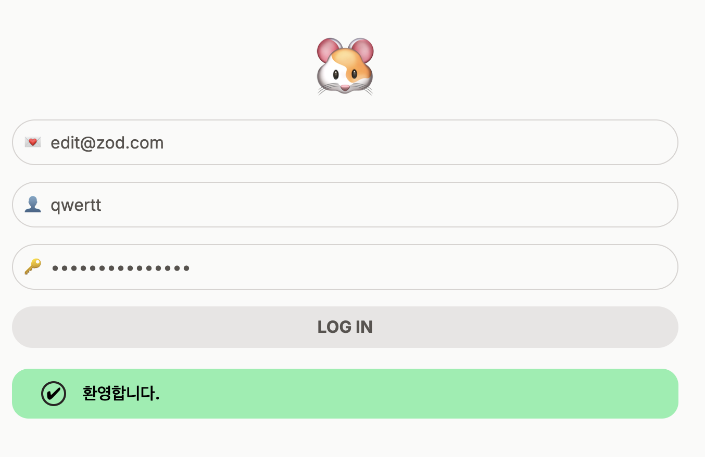
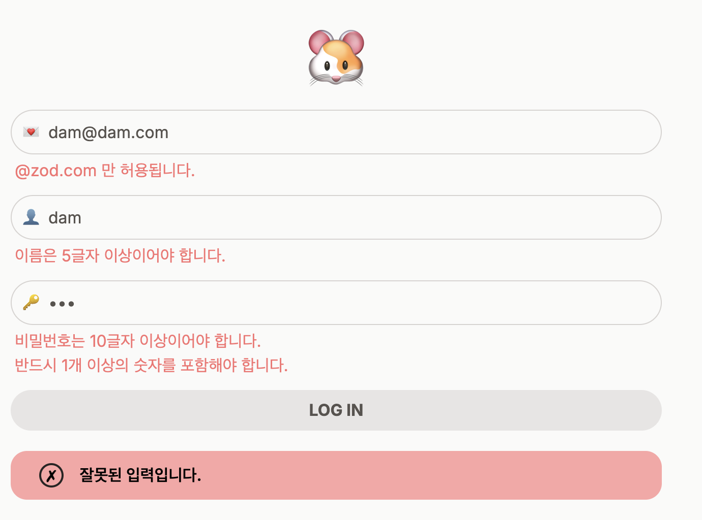
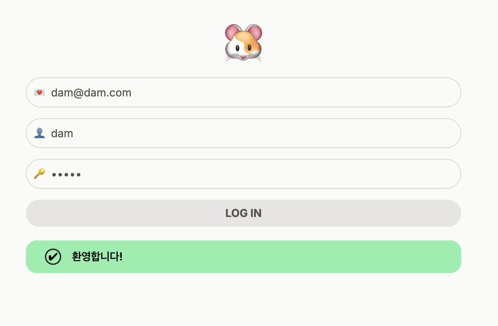

# Next.js Server Actions 실습

### 요구사항

#### 과제.7

- Implement the /search page where users should be able to search for tweets by keyword.
- Implement the /users/[username] page to display the profile of a user and the Tweets the user has posted.
- If the user is the owner of the profile show a link to the /users/[username]/edit page.
- In the edit profile page the user should be able to edit the username, email, bio and change password.
- Use Zod, Server Actions, useOptimistic and revalidatePath.
- Deploy to Vercel and Vercel Postgres after watching this section.

- 사용자가 키워드로 트윗을 검색할 수 있는 /search 페이지를 구현합니다.
- 사용자의 프로필과 사용자가 올린 트윗을 표시하는 /users/[username] 페이지를 구현합니다.
- 사용자가 프로필의 소유자인 경우 /users/[username]/수정 페이지로 연결되는 링크를 표시합니다.
- 프로필 수정 페이지에서 사용자는 사용자 아이디, 이메일, 자기소개를 수정하고 비밀번호를 변경할 수 있어야 합니다.
- Zod, 서버 작업, useOptimistic 및 재검증 경로를 사용합니다.
- 이 섹션을 살펴본 후 Vercel 및 Vercel Postgres에 배포하세요.

#### 과제.6

- `/tweets/[id]` 페이지에서 유저가 트윗에 답글을 추가할 수 있어야 하며 트윗에 좋아요 표시할 수 있어야 합니다.
- 프리즈마에서 `Response` 모델을 만들고 서버 액션, Zod 유효성 검사, `revalidatePath` 및 `useOptimistic`을 사용합니다.
- 좋아요와 트윗 답글은 `useOptimistic` 으로 처리해야 합니다.

#### 과제. 5

- `<AddTweet />` 컴포넌트를 만들어 / 페이지 상단에 배치합니다.
- `<AddTweet />` 에는 트윗을 업로드하는 폼이 있어야 합니다.
- 폼을 처리하는 서버 액션을 구현하고, Zod로 유효성 검사를 수행한 다음, Prisma로 트윗을 DB에 저장합니다.
- useFormState 및 useFormStatus 사용합니다.

#### 과제. 4

- `/` 페이지를 구현합니다.
- 로그인한 유저만 `/` 페이지로 이동할 수 있습니다.
- `/` 페이지에는 데이터베이스에 있는 모든 트윗의 목록이 표시되어야 합니다.
- 유저가 다음 페이지로 이동하거나 이전 페이지로 돌아갈 수 있도록 화살표를 표시하는 페이지네이션(pagination)을 구현합니다.
- 유저가 트윗을 클릭하면 `/tweets/[id]` 페이지로 이동하여 해당 트윗의 상세 보기를 볼 수 있어야 합니다
- (나중에 여기에 답글을 표시할 예정임).

#### 과제. 3

- SQLite로 프리즈마를 초기화하고 유저, 트윗, 좋아요 모델을 생성합니다.
- `User` 모델에는 `username`, `password`, `email`, `bio`, `created_at` `updated_at` 필드가 있어야 합니다.
- `Tweet` 모델에는 `tweet`, `created_at` 및 `updated_at` 필드가 있어야 합니다. 또한 `User` 와의 관계가 있어야 합니다.
- `Like` 모델에는 `created_at` 필드가 있어야 하며 `User` 및 `Tweet`과의 관계가 있어야 합니다.
- 모든 모델에는 primary key 가 있어야 합니다.

#### 과제. 2

- Zod 를 활용하여 server action의 form 을 검증하세요.
- 검증이 성공적이면 성공 메시지를 아닐 경우 에러를 유저에게 표기하세요.
- 아래는 검증 제약 조건입니다:
  - 오직 "@zod.com" 이메일만 허용 된다.
  - 유저명은 5 글자 이상이어야 한다.
  - 비밀번호는 10 글자 이상이어야 하며, 반드시 1개 이상의 숫자를 포함해야 한다.

#### 과제. 1 : [커밋로그](https://github.com/j2h30728/take_notes/commit/40508249b8ffb0f182905b7990b3c28c9fe3abc0)

- 유저의 비밀번호가 '12345' 라면, 성공 메시지를 보여야 하고 아닐 경우 에러 메시지를 보여야 합니다.

## 프리뷰

#### 과제. 4

페이지 네이션

#### 과제. 2

| 초기 상태                         | 성공 상태                          | 에러 상태                         |
| --------------------------------- | ---------------------------------- | --------------------------------- |
|  |  |  |

#### 과제. 1

| 초기 상태                         | 성공 상태                         | 에러 상태                        |
| --------------------------------- | --------------------------------- | -------------------------------- |
|  |  |  |

## 상세내용

- server action을 통한 비밀번호 검증
- `useFormState`를 사용한 상태값에 따른 알람 처리
- `useFormStatus`를 사용하여 form 제출시, input과 button을 비활성화 시킴
- zod 를 사용한 입력 값 검증
