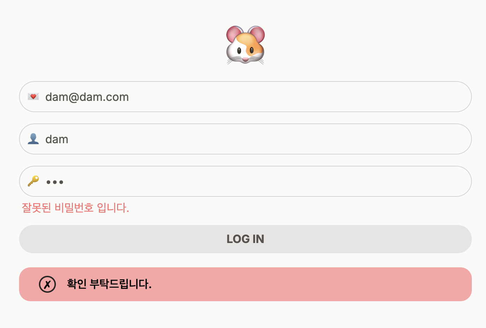

# Next.js Server Actions

### 요구사항

- 유저의 비밀번호가 '12345' 라면, 성공 메시지를 보여야 하고 아닐 경우 에러 메시지를 보여야 합니다.

## 프리뷰

| 초기 상태                         | 성공 상태                         | 에러 상태                        |
| --------------------------------- | --------------------------------- | -------------------------------- |
|  |  |  |

## 상세내용

- server action을 통한 비밀번호 검증
- `useFormState`를 사용한 상태값에 따른 알람 처리(초기/성공/에러 메시지)
- `useFormStatus`를 사용하여 form 제출시, input과 button을 비활성화 시킴
