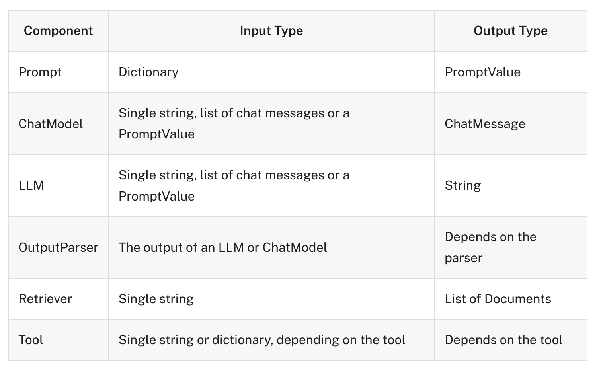

# FULLSTACK-GPT

## 2 INTRODUCE

### 2.0 Welcome (02:06)

### 2.1 Requirements (02:47)

### 2.2 What Are We Using (04:55)

### 2.3 OpenAI Requirements (03:18)

### 2.4 Disclaimer (02:33)

### 2.5 [Virtual Environment](https://docs.python.org/ko/3/library/venv.html) (11:03)

#### [가상환경 만들기](https://docs.python.org/ko/3/library/venv.html#how-venvs-work)

1. 가상환경 생성

```bash
$ python -m venv <venv>

# python3 -m venv env
```

2. 가상환경 활성화

```bash
# mac OS기준
$ source <venv>/bin/activate

# source env/bin/activate
```

3. 패키지 추가 및 설치

- requirements.txt 추가

```bash
$ pip3 install -r requirements
```

4. 가상환경 확인

```py
import tiktoken

print(tiktoken)

#❯ python main.py

```

#### 인터프리터 인식 하지 못할때 수동으로 지정하기

1. 가상환경의 Python 경로 확인: 먼저, 터미널에서 현재 가상환경의 Python 실행 파일 경로를 확인

```bash
which python
# > 가상환경의 python 실행 파일 경로를 출력함
```

2. VSCode에서 인터프리터 선택:
   - VSCode에서 Ctrl+Shift+P (macOS에서는 Cmd+Shift+P)를 눌러 명령 팔레트를 엽니다.
   - "Python: Select Interpreter"를 선택합니다.
   - 표시되는 목록 하단에 "Enter interpreter path..."를 선택합니다.
   - 가상환경의 Python 경로를 입력합니다.

### 2.6 Jupyter Notebooks (05:26)

1. `.ipynb` 확장자 파일

# 3 Welcome To Langchain

## 3.0 LLMs and Chat Models (08:07)

- 환경변수를 읽지 못해서 직접 dotenv와 os를 불러서 진행한다.

```py
from dotenv import load_dotenv
import os
from langchain.chat_models import ChatOpenAI

load_dotenv()
api_key = os.getenv("OPENAI_API_KEY")


chat = ChatOpenAI(openai_api_key=api_key)


b = chat.predict("전 세계에서 나라가 몇개야?")

b
```

- '2021년 현재 전 세계에는 195개의 나라가 있습니다. 이 숫자는 유엔에 회원국으로 등록된 나라들을 기준으로 한 것이며, 이외에도 일부 비인정국가나 지역이 존재합니다.'

## 3.1 Predict Messages (05:04)

## 3.2 Prompt Templates (07:59)

### 프롬프트 문장

- ` PromptTemplate.from_template("프롬프트 내용 {format 함수로 채워 줄 변수}")` : 템플릿 생성
- `template.format(format 함수로 채워 줄 변수="실제 넣어줄 값")`: 원하는 값을 템플리에 넣어서 프롬프트를 완성시킴
- `chat.predict(prompt)` : 프롬프트 실행

```py
from langchain.chat_models import ChatOpenAI
from langchain.prompts import PromptTemplate
from dotenv import load_dotenv
import os

load_dotenv()
api_key = os.getenv("OPENAI_API_KEY")


chat = ChatOpenAI(openai_api_key=api_key, temperature=0.1)


template = PromptTemplate.from_template(
    "{country_a} 와 {country_b}의 거리가 어떻게 돼?",
)

prompt = template.format(country_a="멕시코", country_b="태국")


chat.predict(prompt)
```

### 프롬프트 대화

- `ChatPromptTemplate.from_messages` : 간소화된 프롬프트 대화 템플릿 생성 가능
  - 'system', 'ai', 'human' 의 대화주체를 정하고 컨텐츠를 튜플에 넣어서 리스트로 만든다.
- `template.format_messages` : 생성한 템플릿을 포맷팅한다.

```py
from langchain.prompts import  ChatPromptTemplate

template = ChatPromptTemplate.from_messages(
    [
        ("system", "당신은 지리학자 입니다. 오직 {language}로 대답해야합니다."),
        ("ai", "안녕하세요. 제 이름은 {name}입니다!"),
        (
            "human",
            "{country_a}와 {country_b}의 거리가 어떻게 되나요? 그리고 당신의 이름은 무엇인가요?",
        ),
    ]
)

prompt = template.format_messages(
    language="한국어",
    name="홍길동",
    country_a="멕시코",
    country_b="태국",
)


chat.predict_messages(prompt)
```

## 3.3 OutputParser and [LCEL](https://python.langchain.com/v0.1/docs/expression_language/) (11:51)

- `chain = template | chat | CommaOutputParser()`
  - template 실행 => cath 실행 => CommaOutputParser() 실행한 값을 반환

### [invoke](https://python.langchain.com/v0.1/docs/expression_language/why/#invoke)

가장 간단한 경우, 토픽 문자열을 전달하고 joke 문자열을 반환하려고 합니다:

### [Runnable interface](https://python.langchain.com/v0.1/docs/expression_language/interface/)



## 3.4 [Chaining Chains](https://python.langchain.com/v0.1/docs/expression_language/why/#invoke) (14:11)

1. `chef_prompt | chat`: `chef_prompt`를 사용하여 프롬프트를 생성하고, 이를 `chat`으로 전달하여 AI로부터 메시지를 받습니다. 이 결과가 `chef_chain`입니다.

2. `veg_chef_prompt | chat`: `veg_chef_prompt`를 사용하여 또 다른 프롬프트를 생성하고, 이를 `chat`으로 전달하여 AI로부터 메시지를 받습니다. 이 결과가 `veg_chain`입니다.

3. `{"recipe": chef_chain} | veg_chain`: `chef_chain`의 결과를 `recipe` 변수로 사용하여, 이를 `veg_chain`에 전달합니다.

마지막으로, `final_chain.invoke({"cuisine": "indian"})`를 호출하면, "indian"이라는 입력을 기반으로 `final_chain`이 실행됩니다.

```py

chef_chain = chef_prompt | chat


veg_chain = veg_chef_prompt | chat


final_chain = {"recipe": chef_chain} | veg_chain

final_chain.invoke({"cuisine": "indian"})
```

### Streaming

- 서버가 데이터를 처리하면서 바로바로 결과를 보내줄 수 있어, 응답을 기다리지 않고도 부분적인 결과를 확인 가능
- SSE 표준을 따름

### [GPT parameters](https://python.langchain.com/v0.1/docs/integrations/llms/gpt4all/#import-gpt4all)

- [StreamingStdOutCallbackHandler](https://api.python.langchain.com/en/latest/callbacks/langchain_core.callbacks.streaming_stdout.StreamingStdOutCallbackHandler.html)
  - 스트리밍용 콜백 핸들러. 스트리밍을 지원하는 LLM에서만 작동한다.
  - 모델이 데이터를 생성하는 즉시 해당 데이터를 콘솔에 출력하여 사용자에게 보여줄 수 있습니다.
  - 긴 응답을 기다릴 필요 없이, 점진적으로 결과를 확인할 수 있게 해주는 매우 유용한 도구

```py
chat = ChatOpenAI(openai_api_key=api_key,temperature=0.1,
                  streaming=True,
                  callbacks=[
                      StreamingStdOutCallbackHandler(),
                      ],)
```

## 3.5 Recap (05:21)

# 4 Model IO

## 4.0 Introduction (03:02)

LangChain은 다양한 주요 모듈을 위한 확장 가능한 표준 인터페이스와 외부 통합 기능을 제공한다

- **Model I/O**: 언어 모델과의 상호작용을 위한 인터페이스를 제공

- **Retrieval**: 애플리케이션에서 특정 데이터를 검색하고 사용할 수 있는 인터페이스를 제공

- **Agents**: 높은 수준의 지침이 주어졌을 때, 체인이 어떤 도구를 사용할지 선택 가능

- **Chains**: 일반적인 빌딩 블록 구성을 위한 모듈로, 여러 작업을 연결하여 처리 가능

- **Memory**: 체인 실행 간의 응용 프로그램 상태를 지속적으로 유지하는 역할

- **Callbacks**: 체인의 중간 단계에서 발생하는 모든 이벤트를 기록하거나 스트리밍하는 기능을 제공

## 4.1 [FewShotPromptTemplate](https://python.langchain.com/v0.1/docs/modules/model_io/prompts/few_shot_examples/) (13:52)

### 1. 예제 목록 생성 : (키 : input variables, 값 :해당 입력 변수의 값)

- 예제 데이터를 작성
- examples 리스트는 각 질문과 그에 대한 답변을 포함하는 사전(dictionary)으로 구성
- 이 예제는 나중에 `FewShotPromptTemplate`에 입력으로 사용됩니다.

```py
examples = [
    {
        "question": "프랑스에 대해 무엇을 알고 있나요?",
        "answer": """
        제가 아는 것은 다음과 같습니다:
        수도: 파리
        언어: 프랑스어
        음식: 와인과 치즈
        통화: 유로
        """,
    },
    {
        "question": "이탈리아에 대해 무엇을 알고 있나요?",
        "answer": """
        제가 아는 것은 다음과 같습니다:
        수도: 로마
        언어: 이탈리아어
        음식: 피자와 파스타
        통화: 유로
        """,
    },
    {
        "question": "그리스에 대해 무엇을 알고 있나요?",
        "answer": """
        제가 아는 것은 다음과 같습니다:
        수도: 아테네
        언어: 그리스어
        음식: 수블라키와 페타 치즈
        통화: 유로
        """,
    },
]


```

### 2. few-shot 예제를 위한 포맷터 만들기

- `PromptTemplate` 객체를 사용하여 예제 질문과 답변을 특정 형식으로 포맷하는 과정
- 두 가지 방법으로 `PromptTemplate` 객체를 생성할 수 있으며, 둘 다 동일한 결과를 생성합니다.

```py
example_prompt = PromptTemplate.from_template("Human: {question}\nAI:{answer}")

# 다른 예시
example_prompt = PromptTemplate(
    input_variables=["question", "answer"], template="Human: {question}\nAI:{answer}"
)

print(example_prompt.format(**examples[0]))
# examples[0]에 있는 데이터를 사용하여 프롬프트를 포맷한 결과를 출력합니다.
```

### 3. 예제와 포맷터를 FewShotPromptTemplate에 피드

- `FewShotPromptTemplate` 객체를 생성하고, 이를 사용해 입력 변수에 따른 프롬프트를 생성
- 이 객체는 여러 개의 예제와 그 예제들을 포맷하는 템플릿을 받아, 새로운 입력이 주어졌을 때 어떻게 응답할지를 결정하는 데 사용된다.

```py

prompt = FewShotPromptTemplate(
    example_prompt=example_prompt, # 예제 프롬프트 템플릿
    examples=examples, # 예제
    suffix="Human:  {country}에 대해 무엇을 알고 있나요?", # 사용자로부터의 새로운 질문을 위한 포맷입
    input_variables=["country"], # 새로운 입력을 받을 변수
)

```

## 4.2 [FewShotChatMessagePromptTemplate](https://api.python.langchain.com/en/latest/prompts/langchain_core.prompts.few_shot.FewShotChatMessagePromptTemplate.html) (07:24)

#### - **몇 개의 짧은 예시를 지원하는 채팅 프롬프트 템플릿**

- `FewShotChatMessagePromptTemplate`는 이름 그대로, 몇 개의 짧은 예시(Few-shot examples)를 기반으로 프롬프트를 생성하는 템플릿입
- 이 템플릿은 대화형 AI 모델이 특정 상황에서 어떻게 응답할지 학습하도록 돕기 위해 사용된다.

#### - **프롬프트 템플릿으로 생성되는 높은 수준의 구조**

- 이 템플릿을 사용하면 `prefix message(s)`, `example message(s)`, `suffix message(s)`로 구성된 메시지 목록이 생성된다.
- 프롬프트의 구조는 다음과 같습니다:
  1.  **Prefix messages**: 대화의 초기 설정을 위한 메시지. 보통 시스템 또는 배경 설명과 같은 역할.
  2.  **Example messages**: 실제 예시를 포함한 메시지. AI가 학습할 수 있도록 예시 질문과 답변이 포함.
  3.  **Suffix messages**: 사용자가 입력한 질문에 대해 AI가 응답하도록 유도하는 마지막 메시지.

#### - **중간 예시가 포함된 대화를 만들 수 있다**

- 이 템플릿은 예시를 중간에 삽입하여 대화의 맥락을 설정하거나, AI가 예시를 참고하여 더 나은 응답을 생성할 수 있도록 돕는다.
- 예시는 대화의 흐름을 끊지 않으면서도 추가적인 정보를 제공하는 역할을 한다.

#### - **고정된 예제 목록을 생성하거나 입력에 따라 예제를 동적으로 선택하는 데 사용할 수 있다**

- `FewShotChatMessagePromptTemplate`는 고정된 예제 목록을 사용하거나, 입력에 따라 예제를 동적으로 선택할 수 있다.

### 1. 예제데이터 생성

- FewShotChatMessagePromptTemplate에 사용

```py
examples = [
    {
        "country": "프랑스",
        "answer": """
        제가 아는 것은 다음과 같습니다:
        수도: 파리
        언어: 프랑스어
        음식: 와인과 치즈
        통화: 유로
        """,
    },
    {
        "country": "이탈리아",
        "answer": """
        제가 아는 것은 다음과 같습니다:
        수도: 로마
        언어: 이탈리아어
        음식: 피자와 파스타
        통화: 유로
        """,
    },
    {
        "country": "그리스",
        "answer": """
        제가 아는 것은 다음과 같습니다:
        수도: 아테네
        언어: 그리스어
        음식: 수블라키와 페타 치즈
        통화: 유로
        """,
    },
]
```

### 2. ChatPromptTemplate으로 메시지 템플릿 생성

- ChatPromptTemplate을 사용하여 human(사용자)과 ai(모델) 간의 대화를 위한 메시지 템플릿을 만든다.
- 각 예시에서 사용될 메시지의 형식을 정의

```py
# 예시에 맞게 메시지 템플릿 생성
example_prompt = ChatPromptTemplate.from_messages([
    ("human",  "{country}에 대해 무엇을 알고 있나요?",),
    ("ai", "{answer}")
])
```

### 3. FewShotChatMessagePromptTemplate 생성

- `FewShotChatMessagePromptTemplate`을 사용하여 여러 개의 예시를 포함하는 프롬프트를 생성.
- 이 템플릿은 앞서 정의한 example_prompt를 기반으로 예시를 동적으로 생성

```py
# 예시 프롬프트 생성
example_prompt = FewShotChatMessagePromptTemplate(
    example_prompt=example_prompt,
    examples=examples,
)
```

### 4. 최종 프롬프트 생성

- 시스템 메시지와 예시를 포함한 최종 프롬프트를 생성.
- 대화의 초기 설정을 하고, 예시 데이터를 포함하며, 사용자로부터 추가적인 질문을 받을 준비를 한다.

```py
# 생성한 예시 프롬프트를 삽입해서 최종 프롬프트 생성
final_prompt = ChatPromptTemplate.from_messages([
    ("system", "당신은 모든 나라를 새로운 컨텐츠를 분석하고 자세하게 알고있는 전문가입니다."),  # 초기 설정
    example_prompt,  # 예시 포함
    ("human", "{country}에 대해 무엇을 알고 있나요?")  # 사용자 질문
])


```

## 4.3 [LengthBasedExampleSelector](https://python.langchain.com/v0.1/docs/modules/model_io/prompts/example_selectors/#custom-example-selector) (07:55)

## 4.4 Serialization and Composition (08:12)

### [Using PipelinePrompt](https://python.langchain.com/v0.1/docs/modules/model_io/prompts/composition/#using-pipelineprompt)

- **[PipelinePromptTemplate](https://api.python.langchain.com/en/latest/prompts/langchain_core.prompts.pipeline.PipelinePromptTemplate.html)**: LangChain에서 프롬프트의 일부를 재사용하거나 조합할 때 유용하게 사용할 수 있는 추상화. 이를 통해 복잡한 프롬프트 구조를 효율적으로 관리 가능

- **구성 요소:**
  - **최종 프롬프트(Final prompt)**: 모든 프롬프트가 결합된 후 반환되는 최종 프롬프트. 이 프롬프트는 최종 출력으로 사용된다.
  - **파이프라인 프롬프트(Pipeline prompts)**: 문자열 이름과 프롬프트 템플릿으로 구성된 튜플 목록. 이 목록에 포함된 각 프롬프트 템플릿은 서식이 지정된 후, 해당 이름의 변수로 저장되어 이후 프롬프트 템플릿에 전달된다.

#### 1. 템플링을 생성

- 각기 다른 상황에 맞는 프롬프트 템플릿들을 생성
- intro, example, start, final 템플릿이 각각 생성되며, 이들은 나중에 조합되어 하나의 완성된 프롬프트를 만든다.

```py

intro = PromptTemplate.from_template(
    """
    당신은 역할극을 하는 어시스턴트입니다.
    그리고 당신은 {character} 역할을 맡고 있습니다.
    """
)

example = PromptTemplate.from_template(
    """
    당신이 어떻게 말하는지에 대한 예시입니다:

    Human: {example_question}
    You: {example_answer}
    """
)

start = PromptTemplate.from_template(
    """
    지금 시작하세요!

    Human: {question}
    You:
    """
)

final = PromptTemplate.from_template(
    """
    {intro}

    {example}

    {start}
    """
)

```

#### 2. 프롬프트를 연결

- `PipelinePromptTemplate`을 사용하여 생성된 프롬프트들을 연결
- `PipelinePromptTemplate`은 각 프롬프트를 조합하여 최종 프롬프트를 만들어내는 역할을 한다.

```py
# 이 부분에서 prompts 리스트는 문자열 이름과 해당하는 템플릿 객체를 짝지어 넣은 튜플 목록
# # 이 목록을 PipelinePromptTemplate에 전달하여 최종 프롬프트를 생성
prompts = [
    ("intro", intro),
    ("example", example),
    ("start", start),
]

full_prompt = PipelinePromptTemplate(
    final_prompt=final,
    pipeline_prompts=prompts,
)
```

#### 3. 체인 호출

- 앞서 정의한 full_prompt를 사용하여 AI 모델과의 상호작용을 처리.
- 이때 필요한 입력 변수들을 `chain.invoke`를 통해 전달합니다.

```py
chain = full_prompt | chat

chain.invoke(
    {
        "character": "해적",
        "example_question": "당신의 위치는 어디입니까?",
        "example_answer": "Arrrrg! 그건 비밀이다!! Arg arg!!",
        "question": "당신이 가장 좋아하는 음식은 무엇인가요?",
    }
)
```

## 4.5 [Caching](https://python.langchain.com/v0.1/docs/modules/model_io/llms/llm_caching/) (05:54)

- LangChain이 LLM을 위한 캐싱 레이어를 옵션으로 제공한다.
- 동일한 완료를 여러 번 요청하는 경우 LLM 공급자에 대한 API 호출 횟수를 줄여 비용을 절감할 수 있다.
- LLM 제공업체에 대한 API 호출 횟수를 줄임으로써 애플리케이션 속도를 높일 수 있다.
- [InmMemoryCache](https://api.python.langchain.com/en/latest/cache/langchain_community.cache.InMemoryCache.html), SQLiteCache 제공

```py

from langchain.globals import set_llm_cache, set_debug
from langchain.cache import InMemoryCache, SQLiteCache

set_llm_cache(SQLiteCache("cache.db"))

```

## 4.6 Serialization (05:23)

```py
from langchain.callbacks import get_openai_callback

with get_openai_callback() as usage:
    a = chat.predict("소주 레시피가 무엇인가요?")
    b = chat.predict("뻥 레시피가 무엇인가요?")
    print(a, "\n")
    print(b, "\n")
    print(usage)
```

### `with` 문과 `get_openai_callback()`의 역할

#### 1. 컨텍스트 매니저(`with` 문):

     - Python의 `with` 문은 컨텍스트 매니저라는 기능을 사용
     - 코드 블록이 시작될 때 특정 설정 작업을 하고, 블록이 종료될 때 정리 작업을 자동으로 처리한다.

#### 2. `get_openai_callback()` 함수:

     - `get_openai_callback()` 함수는 OpenAI API 호출을 추적하는 컨텍스트 매니저 객체를 반환
     - 이 객체는 API 사용량(예: 토큰 수, 비용 등)을 기록하고 추적하는 역할을 한다.
