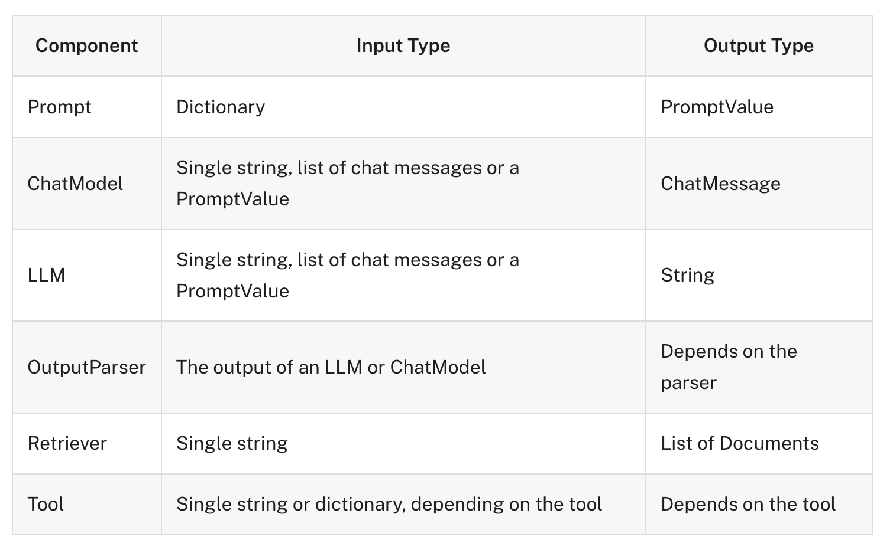
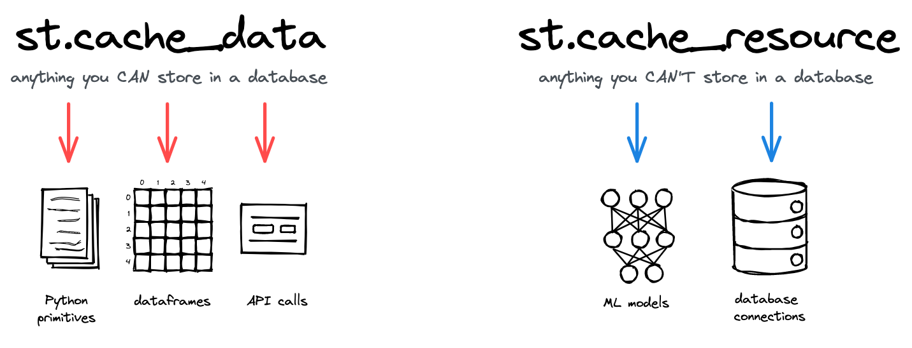

# FULLSTACK-GPT

## 2 INTRODUCE

### 2.0 Welcome

### 2.1 Requirements

### 2.2 What Are We Using

### 2.3 OpenAI Requirements

### 2.4 Disclaimer

### 2.5 [Virtual Environment](https://docs.python.org/ko/3/library/venv.html)

#### [가상환경 만들기](https://docs.python.org/ko/3/library/venv.html#how-venvs-work)

1. 가상환경 생성

```bash
$ python -m venv <venv>

# python3 -m venv env
```

2. 가상환경 활성화

```bash
# mac OS기준
$ source <venv>/bin/activate

# source env/bin/activate
```

3. 패키지 추가 및 설치

- requirements.txt 추가

```bash
$ pip3 install -r requirements.txt
```

4. 가상환경 확인

```py
import tiktoken

print(tiktoken)

#❯ python main.py

```

#### 인터프리터 인식 하지 못할때 수동으로 지정하기

1. 가상환경의 Python 경로 확인: 먼저, 터미널에서 현재 가상환경의 Python 실행 파일 경로를 확인

```bash
which python
# > 가상환경의 python 실행 파일 경로를 출력함
```

2. VSCode에서 인터프리터 선택:
   - VSCode에서 Ctrl+Shift+P (macOS에서는 Cmd+Shift+P)를 눌러 명령 팔레트를 엽니다.
   - "Python: Select Interpreter"를 선택합니다.
   - 표시되는 목록 하단에 "Enter interpreter path..."를 선택합니다.
   - 가상환경의 Python 경로를 입력합니다.

### 2.6 Jupyter Notebooks

1. `.ipynb` 확장자 파일

# 3 Welcome To Langchain

## 3.0 LLMs and Chat Models

- 환경변수를 읽지 못해서 직접 dotenv와 os를 불러서 진행한다.

```py
from dotenv import load_dotenv
import os
from langchain.chat_models import ChatOpenAI

load_dotenv()
api_key = os.getenv("OPENAI_API_KEY")


chat = ChatOpenAI(openai_api_key=api_key)


b = chat.predict("전 세계에서 나라가 몇개야?")

b
```

- '2021년 현재 전 세계에는 195개의 나라가 있습니다. 이 숫자는 유엔에 회원국으로 등록된 나라들을 기준으로 한 것이며, 이외에도 일부 비인정국가나 지역이 존재합니다.'

## 3.1 Predict Messages

## 3.2 Prompt Templates

### 프롬프트 문장

- ` PromptTemplate.from_template("프롬프트 내용 {format 함수로 채워 줄 변수}")` : 템플릿 생성
- `template.format(format 함수로 채워 줄 변수="실제 넣어줄 값")`: 원하는 값을 템플리에 넣어서 프롬프트를 완성시킴
- `chat.predict(prompt)` : 프롬프트 실행

```py
from langchain.chat_models import ChatOpenAI
from langchain.prompts import PromptTemplate
from dotenv import load_dotenv
import os

load_dotenv()
api_key = os.getenv("OPENAI_API_KEY")


chat = ChatOpenAI(openai_api_key=api_key, temperature=0.1)


template = PromptTemplate.from_template(
    "{country_a} 와 {country_b}의 거리가 어떻게 돼?",
)

prompt = template.format(country_a="멕시코", country_b="태국")


chat.predict(prompt)
```

### 프롬프트 대화

- `ChatPromptTemplate.from_messages` : 간소화된 프롬프트 대화 템플릿 생성 가능
  - 'system', 'ai', 'human' 의 대화주체를 정하고 컨텐츠를 튜플에 넣어서 리스트로 만든다.
- `template.format_messages` : 생성한 템플릿을 포맷팅한다.

```py
from langchain.prompts import  ChatPromptTemplate

template = ChatPromptTemplate.from_messages(
    [
        ("system", "당신은 지리학자 입니다. 오직 {language}로 대답해야합니다."),
        ("ai", "안녕하세요. 제 이름은 {name}입니다!"),
        (
            "human",
            "{country_a}와 {country_b}의 거리가 어떻게 되나요? 그리고 당신의 이름은 무엇인가요?",
        ),
    ]
)

prompt = template.format_messages(
    language="한국어",
    name="홍길동",
    country_a="멕시코",
    country_b="태국",
)


chat.predict_messages(prompt)
```

## 3.3 OutputParser and [LCEL](https://python.langchain.com/v0.1/docs/expression_language/)

- `chain = template | chat | CommaOutputParser()`
  - template 실행 => cath 실행 => CommaOutputParser() 실행한 값을 반환

### [invoke](https://python.langchain.com/v0.1/docs/expression_language/why/#invoke)

가장 간단한 경우, 토픽 문자열을 전달하고 joke 문자열을 반환하려고 합니다:

### [Runnable interface](https://python.langchain.com/v0.1/docs/expression_language/interface/)



## 3.4 [Chaining Chains](https://python.langchain.com/v0.1/docs/expression_language/why/#invoke)

1. `chef_prompt | chat`: `chef_prompt`를 사용하여 프롬프트를 생성하고, 이를 `chat`으로 전달하여 AI로부터 메시지를 받습니다. 이 결과가 `chef_chain`입니다.

2. `veg_chef_prompt | chat`: `veg_chef_prompt`를 사용하여 또 다른 프롬프트를 생성하고, 이를 `chat`으로 전달하여 AI로부터 메시지를 받습니다. 이 결과가 `veg_chain`입니다.

3. `{"recipe": chef_chain} | veg_chain`: `chef_chain`의 결과를 `recipe` 변수로 사용하여, 이를 `veg_chain`에 전달합니다.

마지막으로, `final_chain.invoke({"cuisine": "indian"})`를 호출하면, "indian"이라는 입력을 기반으로 `final_chain`이 실행됩니다.

```py

chef_chain = chef_prompt | chat


veg_chain = veg_chef_prompt | chat


final_chain = {"recipe": chef_chain} | veg_chain

final_chain.invoke({"cuisine": "indian"})
```

### Streaming

- 서버가 데이터를 처리하면서 바로바로 결과를 보내줄 수 있어, 응답을 기다리지 않고도 부분적인 결과를 확인 가능
- SSE 표준을 따름

### [GPT parameters](https://python.langchain.com/v0.1/docs/integrations/llms/gpt4all/#import-gpt4all)

- [StreamingStdOutCallbackHandler](https://api.python.langchain.com/en/latest/callbacks/langchain_core.callbacks.streaming_stdout.StreamingStdOutCallbackHandler.html)
  - 스트리밍용 콜백 핸들러. 스트리밍을 지원하는 LLM에서만 작동한다.
  - 모델이 데이터를 생성하는 즉시 해당 데이터를 콘솔에 출력하여 사용자에게 보여줄 수 있습니다.
  - 긴 응답을 기다릴 필요 없이, 점진적으로 결과를 확인할 수 있게 해주는 매우 유용한 도구

```py
chat = ChatOpenAI(openai_api_key=api_key,temperature=0.1,
                  streaming=True,
                  callbacks=[
                      StreamingStdOutCallbackHandler(),
                      ],)
```

## 3.5 Recap

# 4 Model IO

## 4.0 Introduction

LangChain은 다양한 주요 모듈을 위한 확장 가능한 표준 인터페이스와 외부 통합 기능을 제공한다

- **Model I/O**: 언어 모델과의 상호작용을 위한 인터페이스를 제공

- **Retrieval**: 애플리케이션에서 특정 데이터를 검색하고 사용할 수 있는 인터페이스를 제공

- **Agents**: 높은 수준의 지침이 주어졌을 때, 체인이 어떤 도구를 사용할지 선택 가능

- **Chains**: 일반적인 빌딩 블록 구성을 위한 모듈로, 여러 작업을 연결하여 처리 가능

- **Memory**: 체인 실행 간의 응용 프로그램 상태를 지속적으로 유지하는 역할

- **Callbacks**: 체인의 중간 단계에서 발생하는 모든 이벤트를 기록하거나 스트리밍하는 기능을 제공

## 4.1 [FewShotPromptTemplate](https://python.langchain.com/v0.1/docs/modules/model_io/prompts/few_shot_examples/)

### 1. 예제 목록 생성 : (키 : input variables, 값 :해당 입력 변수의 값)

- 예제 데이터를 작성
- examples 리스트는 각 질문과 그에 대한 답변을 포함하는 사전(dictionary)으로 구성
- 이 예제는 나중에 `FewShotPromptTemplate`에 입력으로 사용됩니다.

```py
examples = [
    {
        "question": "프랑스에 대해 무엇을 알고 있나요?",
        "answer": """
        제가 아는 것은 다음과 같습니다:
        수도: 파리
        언어: 프랑스어
        음식: 와인과 치즈
        통화: 유로
        """,
    },
    {
        "question": "이탈리아에 대해 무엇을 알고 있나요?",
        "answer": """
        제가 아는 것은 다음과 같습니다:
        수도: 로마
        언어: 이탈리아어
        음식: 피자와 파스타
        통화: 유로
        """,
    },
    {
        "question": "그리스에 대해 무엇을 알고 있나요?",
        "answer": """
        제가 아는 것은 다음과 같습니다:
        수도: 아테네
        언어: 그리스어
        음식: 수블라키와 페타 치즈
        통화: 유로
        """,
    },
]


```

### 2. few-shot 예제를 위한 포맷터 만들기

- `PromptTemplate` 객체를 사용하여 예제 질문과 답변을 특정 형식으로 포맷하는 과정
- 두 가지 방법으로 `PromptTemplate` 객체를 생성할 수 있으며, 둘 다 동일한 결과를 생성합니다.

```py
example_prompt = PromptTemplate.from_template("Human: {question}\nAI:{answer}")

# 다른 예시
example_prompt = PromptTemplate(
    input_variables=["question", "answer"], template="Human: {question}\nAI:{answer}"
)

print(example_prompt.format(**examples[0]))
# examples[0]에 있는 데이터를 사용하여 프롬프트를 포맷한 결과를 출력합니다.
```

### 3. 예제와 포맷터를 FewShotPromptTemplate에 피드

- `FewShotPromptTemplate` 객체를 생성하고, 이를 사용해 입력 변수에 따른 프롬프트를 생성
- 이 객체는 여러 개의 예제와 그 예제들을 포맷하는 템플릿을 받아, 새로운 입력이 주어졌을 때 어떻게 응답할지를 결정하는 데 사용된다.

```py

prompt = FewShotPromptTemplate(
    example_prompt=example_prompt, # 예제 프롬프트 템플릿
    examples=examples, # 예제
    suffix="Human:  {country}에 대해 무엇을 알고 있나요?", # 사용자로부터의 새로운 질문을 위한 포맷입
    input_variables=["country"], # 새로운 입력을 받을 변수
)

```

## 4.2 [FewShotChatMessagePromptTemplate](https://api.python.langchain.com/en/latest/prompts/langchain_core.prompts.few_shot.FewShotChatMessagePromptTemplate.html)

#### - **몇 개의 짧은 예시를 지원하는 채팅 프롬프트 템플릿**

- `FewShotChatMessagePromptTemplate`는 이름 그대로, 몇 개의 짧은 예시(Few-shot examples)를 기반으로 프롬프트를 생성하는 템플릿입
- 이 템플릿은 대화형 AI 모델이 특정 상황에서 어떻게 응답할지 학습하도록 돕기 위해 사용된다.

#### - **프롬프트 템플릿으로 생성되는 높은 수준의 구조**

- 이 템플릿을 사용하면 `prefix message(s)`, `example message(s)`, `suffix message(s)`로 구성된 메시지 목록이 생성된다.
- 프롬프트의 구조는 다음과 같습니다:
  1.  **Prefix messages**: 대화의 초기 설정을 위한 메시지. 보통 시스템 또는 배경 설명과 같은 역할.
  2.  **Example messages**: 실제 예시를 포함한 메시지. AI가 학습할 수 있도록 예시 질문과 답변이 포함.
  3.  **Suffix messages**: 사용자가 입력한 질문에 대해 AI가 응답하도록 유도하는 마지막 메시지.

#### - **중간 예시가 포함된 대화를 만들 수 있다**

- 이 템플릿은 예시를 중간에 삽입하여 대화의 맥락을 설정하거나, AI가 예시를 참고하여 더 나은 응답을 생성할 수 있도록 돕는다.
- 예시는 대화의 흐름을 끊지 않으면서도 추가적인 정보를 제공하는 역할을 한다.

#### - **고정된 예제 목록을 생성하거나 입력에 따라 예제를 동적으로 선택하는 데 사용할 수 있다**

- `FewShotChatMessagePromptTemplate`는 고정된 예제 목록을 사용하거나, 입력에 따라 예제를 동적으로 선택할 수 있다.

### 1. 예제데이터 생성

- FewShotChatMessagePromptTemplate에 사용

```py
examples = [
    {
        "country": "프랑스",
        "answer": """
        제가 아는 것은 다음과 같습니다:
        수도: 파리
        언어: 프랑스어
        음식: 와인과 치즈
        통화: 유로
        """,
    },
    {
        "country": "이탈리아",
        "answer": """
        제가 아는 것은 다음과 같습니다:
        수도: 로마
        언어: 이탈리아어
        음식: 피자와 파스타
        통화: 유로
        """,
    },
    {
        "country": "그리스",
        "answer": """
        제가 아는 것은 다음과 같습니다:
        수도: 아테네
        언어: 그리스어
        음식: 수블라키와 페타 치즈
        통화: 유로
        """,
    },
]
```

### 2. ChatPromptTemplate으로 메시지 템플릿 생성

- ChatPromptTemplate을 사용하여 human(사용자)과 ai(모델) 간의 대화를 위한 메시지 템플릿을 만든다.
- 각 예시에서 사용될 메시지의 형식을 정의

```py
# 예시에 맞게 메시지 템플릿 생성
example_prompt = ChatPromptTemplate.from_messages([
    ("human",  "{country}에 대해 무엇을 알고 있나요?",),
    ("ai", "{answer}")
])
```

### 3. FewShotChatMessagePromptTemplate 생성

- `FewShotChatMessagePromptTemplate`을 사용하여 여러 개의 예시를 포함하는 프롬프트를 생성.
- 이 템플릿은 앞서 정의한 example_prompt를 기반으로 예시를 동적으로 생성

```py
# 예시 프롬프트 생성
example_prompt = FewShotChatMessagePromptTemplate(
    example_prompt=example_prompt,
    examples=examples,
)
```

### 4. 최종 프롬프트 생성

- 시스템 메시지와 예시를 포함한 최종 프롬프트를 생성.
- 대화의 초기 설정을 하고, 예시 데이터를 포함하며, 사용자로부터 추가적인 질문을 받을 준비를 한다.

```py
# 생성한 예시 프롬프트를 삽입해서 최종 프롬프트 생성
final_prompt = ChatPromptTemplate.from_messages([
    ("system", "당신은 모든 나라를 새로운 컨텐츠를 분석하고 자세하게 알고있는 전문가입니다."),  # 초기 설정
    example_prompt,  # 예시 포함
    ("human", "{country}에 대해 무엇을 알고 있나요?")  # 사용자 질문
])


```

## 4.3 [LengthBasedExampleSelector](https://python.langchain.com/v0.1/docs/modules/model_io/prompts/example_selectors/#custom-example-selector)

## 4.4 Serialization and Composition

### [Using PipelinePrompt](https://python.langchain.com/v0.1/docs/modules/model_io/prompts/composition/#using-pipelineprompt)

- **[PipelinePromptTemplate](https://api.python.langchain.com/en/latest/prompts/langchain_core.prompts.pipeline.PipelinePromptTemplate.html)**: LangChain에서 프롬프트의 일부를 재사용하거나 조합할 때 유용하게 사용할 수 있는 추상화. 이를 통해 복잡한 프롬프트 구조를 효율적으로 관리 가능

- **구성 요소:**
  - **최종 프롬프트(Final prompt)**: 모든 프롬프트가 결합된 후 반환되는 최종 프롬프트. 이 프롬프트는 최종 출력으로 사용된다.
  - **파이프라인 프롬프트(Pipeline prompts)**: 문자열 이름과 프롬프트 템플릿으로 구성된 튜플 목록. 이 목록에 포함된 각 프롬프트 템플릿은 서식이 지정된 후, 해당 이름의 변수로 저장되어 이후 프롬프트 템플릿에 전달된다.

#### 1. 템플링을 생성

- 각기 다른 상황에 맞는 프롬프트 템플릿들을 생성
- intro, example, start, final 템플릿이 각각 생성되며, 이들은 나중에 조합되어 하나의 완성된 프롬프트를 만든다.

```py

intro = PromptTemplate.from_template(
    """
    당신은 역할극을 하는 어시스턴트입니다.
    그리고 당신은 {character} 역할을 맡고 있습니다.
    """
)

example = PromptTemplate.from_template(
    """
    당신이 어떻게 말하는지에 대한 예시입니다:

    Human: {example_question}
    You: {example_answer}
    """
)

start = PromptTemplate.from_template(
    """
    지금 시작하세요!

    Human: {question}
    You:
    """
)

final = PromptTemplate.from_template(
    """
    {intro}

    {example}

    {start}
    """
)

```

#### 2. 프롬프트를 연결

- `PipelinePromptTemplate`을 사용하여 생성된 프롬프트들을 연결
- `PipelinePromptTemplate`은 각 프롬프트를 조합하여 최종 프롬프트를 만들어내는 역할을 한다.

```py
# 이 부분에서 prompts 리스트는 문자열 이름과 해당하는 템플릿 객체를 짝지어 넣은 튜플 목록
# # 이 목록을 PipelinePromptTemplate에 전달하여 최종 프롬프트를 생성
prompts = [
    ("intro", intro),
    ("example", example),
    ("start", start),
]

full_prompt = PipelinePromptTemplate(
    final_prompt=final,
    pipeline_prompts=prompts,
)
```

#### 3. 체인 호출

- 앞서 정의한 full_prompt를 사용하여 AI 모델과의 상호작용을 처리.
- 이때 필요한 입력 변수들을 `chain.invoke`를 통해 전달합니다.

```py
chain = full_prompt | chat

chain.invoke(
    {
        "character": "해적",
        "example_question": "당신의 위치는 어디입니까?",
        "example_answer": "Arrrrg! 그건 비밀이다!! Arg arg!!",
        "question": "당신이 가장 좋아하는 음식은 무엇인가요?",
    }
)
```

## 4.5 [Caching](https://python.langchain.com/v0.1/docs/modules/model_io/llms/llm_caching/)

- LangChain이 LLM을 위한 캐싱 레이어를 옵션으로 제공한다.
- 동일한 완료를 여러 번 요청하는 경우 LLM 공급자에 대한 API 호출 횟수를 줄여 비용을 절감할 수 있다.
- LLM 제공업체에 대한 API 호출 횟수를 줄임으로써 애플리케이션 속도를 높일 수 있다.
- [InmMemoryCache](https://api.python.langchain.com/en/latest/cache/langchain_community.cache.InMemoryCache.html), SQLiteCache 제공

```py

from langchain.globals import set_llm_cache, set_debug
from langchain.cache import InMemoryCache, SQLiteCache

set_llm_cache(SQLiteCache("cache.db"))

```

## 4.6 Serialization (05:23)

```py
from langchain.callbacks import get_openai_callback

with get_openai_callback() as usage:
    a = chat.predict("소주 레시피가 무엇인가요?")
    b = chat.predict("뻥 레시피가 무엇인가요?")
    print(a, "\n")
    print(b, "\n")
    print(usage)
```

### `with` 문과 `get_openai_callback()`의 역할

#### 1. 컨텍스트 매니저(`with` 문):

     - Python의 `with` 문은 컨텍스트 매니저라는 기능을 사용
     - 코드 블록이 시작될 때 특정 설정 작업을 하고, 블록이 종료될 때 정리 작업을 자동으로 처리한다.

#### 2. `get_openai_callback()` 함수:

     - `get_openai_callback()` 함수는 OpenAI API 호출을 추적하는 컨텍스트 매니저 객체를 반환
     - 이 객체는 API 사용량(예: 토큰 수, 비용 등)을 기록하고 추적하는 역할을 한다.

# 5 Memory

## 5.0 ConversationBufferMemory (05:10)

- 이전의 모든 메시지를 저장한 다음 다음 출력 변수로 사용하여 메시지를 추출 가능
- 채팅 내용이 길어질 수록 메모리가 무한하게 커지고 비용이 크게 부과되어 비효율적이 된다는 단점 존재

```py
from langchain.memory import ConversationBufferMemory

memory = ConversationBufferMemory()
memory.save_context({"input": "hi"}, {"output": "whats up"})

memory.load_memory_variables({})

# >>     {'history': 'Human: hi\nAI: whats up'}

```

메시지 목록으로도 가져올 수 있다. (채팅 모델에서 유용)

```py
memory = ConversationBufferMemory(return_messages=True)
memory.save_context({"input": "hi"}, {"output": "whats up"})

memory.load_memory_variables({})

# >>     {'history': [HumanMessage(content='hi', additional_kwargs={}),
# >>      AIMessage(content='whats up', additional_kwargs={})]}
```

### verbose

- 체인 사용시, 프로픔트를 볼 수 있는 옵션
  - **True** : 표준 출력
  - **0** : 출력하지 않음
  - **1** : 자세히 정보를 출력
  - **2** : 함축적인 정보를 출력

```py

from langchain_openai import OpenAI
from langchain.chains import ConversationChain


llm = OpenAI(temperature=0)
conversation = ConversationChain(
    llm=llm,
    verbose=True,
    memory=ConversationBufferMemory()
)
```

## 5.1 [ConversationBufferWindowMemory](https://python.langchain.com/docs/modules/memory/types/buffer_window)

- 시간에 따른 대화의 상호 작용 목록을 유지합니다. 마지막 K개의 상호 작용만 사용
- 이는 버퍼가 너무 커지지 않도록 가장 최근 상호 작용의 슬라이딩 윈도우를 유지합니다.

```py
from langchain.memory import ConversationBufferWindowMemory

memory = ConversationBufferWindowMemory( k=1) #슬라이딩 윈도우 크기 1, 마지막 1개의 interactions만 메모리에 유지하도록 한다.
memory.save_context({"input": "hi"}, {"output": "whats up"})
memory.save_context({"input": "not much you"}, {"output": "not much"})

memory.load_memory_variables({})

# >>     {'history': 'Human: not much you\nAI: not much'}

```

- 슬라이딩 윈도우의 크기를 1로 잡았기 때문에 먼저 저장한 `{"input": "hi"}, {"output": "whats up"}`는 제거되었다.

## 5.2 [ConversationSummaryMemory](https://js.langchain.com/docs/modules/memory/how_to/summary) (03:38) [실습코드](./notes/5.2.ipynb)

- 대화가 진행됨에 따라 대화를 요약하여 저장합니다.
- 긴 대화의 경우, 이전 대화 내용을 요약된 형태로 기억하고, 이를 바탕으로 대화를 이어갈 수 있다.
- 대화가 길어질 때 모든 메시지를 그대로 기억하는 대신, 요약된 형태로 저장하여 토큰 사용을 최적화한다.

```py
from langchain.memory import ConversationSummaryMemory
from langchain.chat_models import ChatOpenAI

llm = ChatOpenAI(openai_api_key=api_key,model="gpt-4o-mini")
memory = ConversationSummaryMemory(llm=llm)

def add_message(input, output):
    memory.save_context({"input": input}, {"output": output})  # 대화 저장

def get_history():
    return memory.load_memory_variables({}) # 저장한 대화를 모두 표시


add_message("안녕, 난 담이야, 난 서울에서 살아", "와! 멋있는데")


```

## 5.3 [ConversationSummaryBufferMemory](https://python.langchain.com/v0.1/docs/modules/memory/types/summary_buffer/) (03:32) [실습코드](./notes/5.3.ipynb)

- ConversationBufferMemory와 ConversationBufferWindowMemory, 두 가지 아이디어를 결합한 것
- 대화의 최근 기록을 메모리에 유지하면서도, 메모리의 용량이 넘치지 않도록 관리하는 역할
- **버퍼 유지**: 대화의 최근 상호작용(예: 최근 대화 몇 줄)은 메모리에 그대로 유지된다. 이 버퍼는 대화의 연속성을 유지하기 위해 필요.
- **플러시와 요약**:
  - 메모리 또는 버퍼의 크기가 설정된 한계를 초과하면(이 경우 `max_token_limit=150`), 가장 오래된 대화 기록이 제거되거나 요약된다. 이렇게 하면 메모리의 용량을 초과하지 않으면서도, 중요한 정보는 유지할 수 있다.
  - 제거된 대화는 단순히 지워지는 것이 아니라 요약된 형태로 컴파일되어 저장된다. 이렇게 하면 중요한 정보는 간략하게 유지되면서도, 메모리 사용량을 최소화할 수 있다.
- **슬라이딩 윈도우**:
  - "슬라이딩 윈도우"는 일정한 크기의 윈도우(시간 또는 데이터의 구간) 내에서 데이터를 관리하는 방식
  - 이 경우, 가장 오래된 데이터를 제거하고 새 데이터를 추가하는 방식으로 관리된다.

```py
from langchain.memory import ConversationSummaryBufferMemory
from langchain_openai import OpenAI

llm = OpenAI()

memory = ConversationSummaryBufferMemory(
    llm=llm,
    max_token_limit=150, # 플러시할 시기를 결정하는 최대 토큰 크기 : 이상이 넘어가면 슬라이딩 윈도우기반으로 저장한지 제일 오래된 것 부터 제거 함
    return_messages=True # 프롬프트를 표시
    )
```

## 5.4 [ConversationKGMemory](https://python.langchain.com/docs/modules/memory/types/summary_buffer) [실습코드](./notes/5.4.ipynb)

- 대화 내용 엔티티의 KG(knowledge graph) 를 만들어 중요한 요약본을 생성하여 메모리에 저장하는 방식

```py
from langchain.memory import ConversationKGMemory

llm = ChatOpenAI(openai_api_key=api_key,temperature=0.1,model="gpt-4o-mini")

memory = ConversationKGMemory(
    llm=llm,
    return_messages=True,
)


def add_message(input, output):
    memory.save_context({"input": input}, {"output": output})

add_message("담은 김치를 좋아해.", "와! 멋있는데!")
memory.load_memory_variables({"inputs": "담은 뭐를 좋아해?"})
# >> {'history': [SystemMessage(content='On 담: 담 좋아해 김치.')]}
```

## 5.5 [Memory on LLMChain](https://python.langchain.com/v0.1/docs/modules/memory/types/summary_buffer/#using-in-a-chain)

- [Initiate the LLMChain](https://python.langchain.com/v0.1/docs/integrations/llms/deepinfra/#initiate-the-llmchain)

```py
llm = ChatOpenAI(openai_api_key=api_key,temperature=0.1)

memory = ConversationSummaryBufferMemory(
    llm=llm,
    max_token_limit=120, # 요약을 시작하는 토근 수의 한계
    memory_key="chat_history", # 사용자 정의 키 : 대화 기록을 저장하는 키, 대화의 모든 상호작용은 chat_history에 저장된다
)

# 프롬프트 템플릿
template = """
    You are a helpful AI talking to a human.

    {chat_history}  # 여기도 memory_key에 맞춰 변경
    Human:{question}
    You:
"""

chain = LLMChain(
    llm=llm,
    memory=memory,
    prompt=PromptTemplate.from_template(template),
    verbose=True,
)


chain.predict(question="제 이름은 담입니다.")

# > Entering new LLMChain chain...
# Prompt after formatting:

#     You are a helpful AI talking to a human.


#     Human:제 이름은 담입니다.
#     You:


# > Finished chain.
# '안녕하세요, 담님. 무엇을 도와드릴까요?'
```

### ConversationSummaryBufferMemory의 memory_key

- **memory_key의 역할**:

  - memory_key는 대화 기록이 저장되는 위치를 지정하는 데 사용된다.
  - 이 키는 프롬프트 템플릿에서 {memory_key}로 참조되며, 실제 대화 기록이 이 키에 저장된 내용으로 대체된다.

- **사용자가 지정 가능**: memory_key는 사용자 정의가 가능.

- **프롬프트 템플릿과의 연결**:
  - 이 키는 프롬프트 템플릿과 연동되어 작동
  - 예를 들어, 프롬프트 템플릿에서 {chat_history}라는 변수로 대화 기록을 불러오도록 지정했다면, memory_key는 "chat_history"로 설정되어야 한다. 이 키를 다른 이름으로 변경하면, 프롬프트 템플릿에서도 해당 이름으로 맞춰야 한다.

## 5.6 Chat Based Memory

### [MessagesPlaceholder](https://python.langchain.com/v0.1/docs/modules/model_io/prompts/quick_start/#messagesplaceholder)

- LangChain은 포맷하는 동안 렌더링할 메시지를 완전히 제어할 수 있는 메시지플레이스홀더를 제공
- 메시지 프롬프트 템플릿에 어떤 역할을 사용해야 할지 확실하지 않거나 서식 지정 중에 메시지 목록을 삽입하려는 경우 유용할 수 있다.

#### 흐름

1. 메모리 생성:
   - `ConversationSummaryBufferMemory`는 대화의 요약을 관리
   - `return_messages=True`를 통해 개별 메시지로 된 기록을 유지
2. 프롬프트 템플릿 생성:
   - `ChatPromptTemplate.from_messages`는 프롬프트에서 대화 기록이 삽입될 위치를 `MessagesPlaceholder`로 지정
3. 체인 실행:
   - 대화의 기록이 `MessagesPlaceholder`에 전달되고, 이전 대화의 컨텍스트가 유지된 상태로 새로운 입력(예: 질문 "제 이름은 담입니다.")에 대한 응답을 생성

- **`return_messages=True`**:
  - 개별 메시지 객체들의 리스트가 반환
  - 대화의 각 메시지가 분리된 상태로 유지
  - 이를 통해 MessagesPlaceholder와 같은 템플릿에서 개별 메시지를 다룰 수 있다.
- **`return_messages=False`**:
  - 대화의 전체 기록이 하나의 요약된 텍스트 문자열로 반환
  - 대화의 주요 내용을 간결하게 표현하며, 프롬프트에 삽입될 때도 하나의 문자열로 처리된다.

```py
from langchain.memory import ConversationSummaryBufferMemory
from langchain.chat_models import ChatOpenAI
from langchain.chains import LLMChain
from langchain.prompts import ChatPromptTemplate, MessagesPlaceholder

llm = ChatOpenAI(openai_api_key=api_key,temperature=0.1)

memory = ConversationSummaryBufferMemory(
    llm=llm,
    max_token_limit=120,
    memory_key="chat_history",
    return_messages=True # 개별 메시지 객체들의 리스트가 반환, MessagesPlaceholder에서 개별 메시지로 다룰 수 있다.
)


prompt = ChatPromptTemplate.from_messages(
    [
        ("system", "You are a helpful AI talking to a human"),
        MessagesPlaceholder(variable_name="chat_history"),
        ("human", "{question}"),
    ]
)
chain = LLMChain(
    llm=llm,
    memory=memory,
    prompt=prompt,
    verbose=True,
)


chain.predict(question="제 이름은 담입니다.")


```

## 5.7 LCEL Based Memory

```py
llm = ChatOpenAI(openai_api_key=api_key,temperature=0.1)

memory = ConversationSummaryBufferMemory(
    llm=llm,
    max_token_limit=120,
    return_messages=True
)

# ChatPromptTemplate을 사용하여 대화의 프롬프트 템플릿 정의(시스템 메시지, 대화 기록_MessagesPlaceholder , 사용자 질문으로 구성됨)
prompt = ChatPromptTemplate.from_messages(
    [
        ("system", "You are a helpful AI talking to a human"),
        MessagesPlaceholder(variable_name="history"),
        ("human", "{question}"),
    ]
)

# 현재 메모리에 저장된 대화기록을 불러와 반환. history는 변수에 할당한다.
def load_memory(_):
    return memory.load_memory_variables({})["history"]

# LCEL 방식으로 체인 구성
# 1. RunnablePassthrough.assign(history=load_memory)으로 load_memory 함수를 실행시켜 반한괎을 history 에 할당하고 prompt에 전달
# 2. 프롬프트 템플릿 바탕으로 최종 프롬프트 생성, 이를 언어 모델(llm)에 전달하여 응답을 생성
chain = RunnablePassthrough.assign(history=load_memory) | prompt | llm


def invoke_chain(question):
    result = chain.invoke({"question": question}) # 사용자의 질문을 받아 체인을 실행
    memory.save_context( # 생성된 응답을 메모리에 저장하여 대화 기록 업데이트
        {"input": question},
        {"output": result.content},
    )
    print(result)

invoke_chain("제 이름은 담입니다.")
```

## 5.8 Recap

### LCEL (LangChain Execution Language)

- **주된 특징**: LCEL은 `|` 연산자를 사용하여 여러 작업을 **체이닝**(chaining)합니다. 각 작업은 `Runnable` 인터페이스를 구현하며, 이를 통해 다양한 실행 단계를 연결할 수 있습니다.
- **체이닝 방식**: `|` 연산자를 사용하여 여러 `Runnable` 객체를 연결합니다. 각 단계의 출력이 다음 단계의 입력으로 전달됩니다.
- **유연성**: LCEL은 더 유연한 방식으로 여러 가지 작업을 연결할 수 있으며, 각 작업은 독립적으로 실행되고 결합됩니다. 이는 복잡한 워크플로우나 다양한 입력 및 출력 구조를 필요로 할 때 매우 유용합니다.

  ```python
  chain = RunnablePassthrough.assign(history=load_memory) | prompt | llm
  ```

  여기서 `RunnablePassthrough`, `prompt`, `llm`은 각각의 실행 단계로 연결되어 있으며, `|` 연산자를 통해 순차적으로 실행됩니다.

### `LLMChain`

- **주된 특징**: `LLMChain`은 LangChain에서 제공하는 특정 체인 구조로, 언어 모델(LLM)을 사용하여 프롬프트를 처리하고 결과를 생성하는 데 중점을 둡니다.
- **메서드 연결**: `LLMChain`은 특정 속성(`llm`, `prompt`, `memory`)을 초기화 시점에 설정하고, 이러한 속성들을 사용하여 체인 내에서 데이터를 처리합니다.
- **상호작용 방식**: `LLMChain`은 주로 `predict`, `invoke`, `run` 등의 메서드를 통해 입력을 처리하고 결과를 생성합니다. 이 방식은 구조화된 프로세스를 따르며, 특정 워크플로우를 구현하는 데 적합합니다.

  ```python
  chain = LLMChain(
      llm=llm,
      memory=memory,
      prompt=prompt,
      verbose=True,
  )
  ```

  이 경우, `LLMChain`은 언어 모델(`llm`), 메모리(`memory`), 프롬프트(`prompt`) 등을 초기화 시점에 설정하고, 이후 메서드를 통해 체인 작업을 수행합니다.

### 요약

- **LCEL**: `|` 연산자를 사용해 여러 실행 단계를 체이닝하여 복잡한 워크플로우를 구성하는 방식입니다. 유연성과 확장성이 뛰어나며, 다양한 `Runnable` 객체를 연결할 수 있습니다.
- **LLMChain**: LangChain에서 제공하는 구조화된 체인으로, 주로 언어 모델과의 상호작용을 중심으로 프롬프트를 처리하고 결과를 생성하는 데 사용됩니다. 메서드를 통해 설정된 속성들을 이용해 작업을 처리합니다.

# 6 [RAG](https://python.langchain.com/v0.2/docs/tutorials/rag/)

## 6.0 Introduction

### GPT Response

- "RAG"는 "Retrieval-Augmented Generation"의 약자로, "검색-증강 생성"이라는 의미
- 이는 자연어 처리(NLP) 및 기계 학습 분야, 특히 챗봇이나 질문-응답 시스템과 같은 고급 언어 모델을 구축하는 데 사용되는 기술

### RAG 개요

- **검색과 생성의 결합**:
  - RAG는 NLP의 두 가지 주요 구성 요소인 정보 검색과 응답 생성을 결합합니다.
  - 검색 부분은 관련 정보를 찾기 위해 대규모 데이터베이스나 문서 컬렉션을 검색하는 과정을 포함합니다.
  - 생성 부분은 검색된 정보를 바탕으로 일관되고 맥락적으로 적절한 텍스트를 생성하는 과정입니다.
- **작동 방식**:
  - RAG 시스템에서 질문이나 프롬프트가 주어지면 모델은 먼저 질문에 대한 답변을 제공하는 데 유용한 정보를 포함할 수 있는 관련 문서나 텍스트를 검색합니다.
  - 그런 다음 이 검색된 정보를 생성 모델에 공급하여 일관된 응답을 합성합니다.
- **장점**:
  - RAG의 주요 장점은 모델이 외부 지식을 활용할 수 있게 하여 보다 정확하고 상세하며 맥락적으로 관련된 답변을 제공할 수 있다는 것입니다.
  - 이는 특정 지식이나 사실적 정보가 필요한 질문에 특히 유용합니다.
- **응용 분야**:
  - RAG는 챗봇, 질문-응답 시스템 및 정확하고 맥락적으로 관련된 정보를 제공하는 것이 중요한 다른 AI 도구와 같은 다양한 응용 분야에 사용됩니다.
  - 특히 모델이 다양한 주제와 데이터를 기반으로 이해하고 응답을 생성해야 하는 상황에서 유용합니다.
- **개발 및 사용**:
  - AI 및 기계 학습 커뮤니티에서 RAG는 다양한 연구 논문과 구현이 개발되고 있으며 주요 초점 중 하나입니다.
  - 이는 학습된 정보뿐만 아니라 외부 소스에서 새롭고 관련된 정보를 통합하여 응답의 질과 관련성을 향상시키는 더 정교한 AI 시스템으로 나아가는 단계를 나타냅니다

## 6.1 Data Loaders and Splitters

```py
from langchain.chat_models import ChatOpenAI
from langchain.document_loaders import UnstructuredFileLoader
from langchain.text_splitter import RecursiveCharacterTextSplitter

splitter = RecursiveCharacterTextSplitter()

loader = UnstructuredFileLoader("./files/chapter_one.docx")

loader.load_and_split(text_splitter=splitter)

```

## 6.2 Tiktoken

## 6.3 Vectors

## 6.4 Vector Store

## 6.5 Langsmith

## 6.6 RetrievalQA

### Chain Type

- `chain_type`은 LangChain에서 제공하는 체인의 유형을 지정하는 데 사용
- 체인은 다양한 작업을 수행하는 일련의 단계들을 연결하여 하나의 프로세스로 만드는 것을 의미
- `RetrievalQA`와 같은 체인에서는 정보를 검색하고 질문에 답변하는 과정을 자동화
- 각 `chain_type`은 이 과정에서 특정한 방식을 사용하여 결과를 생성합니다.

#### 주요 `chain_type`의 종류와 설명

1. **`stuff`**:

   - **설명**: `stuff` 체인은 검색된 모든 문서나 데이터를 하나의 큰 텍스트 블록으로 "채워 넣고(stuff)" 이를 모델에게 전달하여 답변을 생성
   - **장점**: 모든 컨텍스트를 한꺼번에 모델에 제공하므로, 모델이 질문에 대해 충분한 정보를 얻을 수 있다.
   - **단점**: 한 번에 많은 데이터를 모델에 전달하기 때문에, 모델의 토큰 제한에 쉽게 도달할 수 있다. 이 방식은 대용량 데이터 처리에 적합하지 않을 수 있다.

2. **`map_reduce`**:

   - **설명**: `map_reduce` 체인은 먼저 각 문서를 개별적으로 처리하여 부분적인 답변을 생성한 후, 이 답변들을 "축소(reduce)"하여 최종 답변을 도출
   - **장점**: 각 문서를 개별적으로 처리하므로, 더 많은 데이터를 처리할 수 있으며, 중복된 정보나 불필요한 정보가 줄어들 수 있다..
   - **단점**: 처리 과정이 더 복잡하고 시간이 더 많이 걸릴 수 있습니다. 각 문서의 부분 답변이 결합될 때 중요한 정보가 손실될 수 있다.

3. **`refine`**:

   - **설명**: `refine` 체인은 초기 답변을 생성한 후, 이 답변을 점진적으로 개선(refine)해 나간다. 각 단계에서 이전 단계의 답변을 바탕으로 새로운 정보를 추가하여 더 나은 답변을 만들어낸다.
   - **장점**: 초기 답변에 기반하여 점차적으로 더 정확한 답변을 도출할 수 있다.
   - **단점**: 모든 문서를 여러 번 처리해야 하기 때문에 시간이 더 걸릴 수 있다.

4. **`map_rerank`**:
   - **설명**: `map_rerank` 체인은 각 문서를 개별적으로 처리하여 답변을 생성하고, 생성된 답변들을 "다시 순위를 매겨(rerank)" 최종 답변을 도출. 모델이 각 문서에서 얻은 정보를 바탕으로 가장 관련성이 높은 답변을 선택.
   - **장점**: 각 문서에 대해 생성된 답변 중 가장 관련성이 높은 것을 선택할 수 있어, 정확성이 높아진다.
   - **단점**: `map_reduce`에 비해 비슷한 복잡성을 가지지만, 순위 매기는 과정에서 시간이 추가로 소요될 수 있다.

## 6.7 Recap

```py
# 필요한 라이브러리와 모듈 가져오기
from langchain.chat_models import ChatOpenAI  # OpenAI API를 사용해 답변을 생성하는 LLM 모듈
from langchain.document_loaders import UnstructuredFileLoader  # 문서를 불러오는 모듈
from langchain.text_splitter import CharacterTextSplitter  # 문서를 작은 덩어리로 분할하는 모듈
from langchain.embeddings import OpenAIEmbeddings, CacheBackedEmbeddings  # 문서를 벡터로 변환하고 캐싱하는 모듈
from langchain.vectorstores import FAISS  # 벡터 검색을 위한 저장소 (FAISS)
from langchain.storage import LocalFileStore  # 로컬 파일 시스템에 데이터를 저장하는 모듈
from langchain.chains import RetrievalQA  # 질문에 대한 답변을 생성하는 체인 모듈

from dotenv import load_dotenv
import os

load_dotenv()
api_key = os.getenv("OPENAI_API_KEY")  # OpenAI API 키 불러오기

# OpenAI 언어 모델(LLM) 설정
llm = ChatOpenAI(openai_api_key=api_key)

# 캐시 데이터를 로컬 파일 시스템에 저장할 디렉터리 설정
cache_dir = LocalFileStore("./.cache/")

# 문서를 분할하는 설정: 문서를 600자씩 나누고 100자의 중복을 유지
splitter = CharacterTextSplitter.from_tiktoken_encoder(
    separator="\n",  # 줄바꿈을 기준으로 분할
    chunk_size=600,  # 한 번에 처리할 문서 조각의 크기
    chunk_overlap=100  # 문서 조각 간 중복 크기
)

# 문서 파일을 로드 (여기서는 텍스트 파일을 불러옴)
loader = UnstructuredFileLoader("../files/chapter_one.txt")

# 문서를 불러온 후, splitter를 사용해 문서를 작은 조각으로 나누기
docs = loader.load_and_split(text_splitter=splitter)

# OpenAI 임베딩 모델을 사용해 문서 조각들을 벡터 형식으로 변환
embeddings = OpenAIEmbeddings()

# 캐싱된 임베딩을 사용해, 이미 처리된 임베딩 결과를 재사용 가능하게 설정
cached_embeddings = CacheBackedEmbeddings.from_bytes_store(embeddings, cache_dir)

# FAISS 벡터 스토어에 문서 조각과 임베딩을 저장해, 나중에 유사한 문서를 빠르게 검색 가능하게 함
vectorstore = FAISS.from_documents(docs, cached_embeddings)

# 검색된 문서와 질문을 연결해 답변을 생성하는 체인 구성
chain = RetrievalQA.from_chain_type(
    llm=llm,  # OpenAI의 언어 모델을 사용
    chain_type="map_rerank",  # 검색된 문서를 다시 정렬하는 방식으로 답변 생성
    retriever=vectorstore.as_retriever(),  # 문서 검색을 위한 도구로 FAISS 사용
)

# "Victory Mansions"에 대한 설명을 요청하고, 체인에서 답변을 생성
chain.run("Describe Victory Mansions")


```

### **임베딩(Embedding)이란?**

임베딩은 **텍스트나 이미지 같은 고차원 데이터를 고정된 크기의 숫자 벡터로 변환하는 과정**을 말합니다. 자연어 처리에서 임베딩은 단어, 문장 또는 문서 등의 텍스트 데이터를 벡터 공간에 매핑하여 컴퓨터가 수학적으로 처리할 수 있도록 합니다.

- **예:** "apple"과 "fruit"는 서로 관련성이 높으므로, 두 단어의 임베딩은 벡터 공간에서 가까운 위치에 있습니다. 반면, "apple"과 "car"는 관련성이 적어, 벡터 공간에서 멀리 떨어져 있습니다.

임베딩의 목적은 **의미적으로 비슷한 데이터가 벡터 공간에서 가까이 위치하도록 하는 것**입니다.

### **벡터(Vector) 형식이란?**

벡터는 숫자의 배열(리스트)입니다. 컴퓨터가 데이터를 처리할 때 숫자를 기반으로 계산을 하므로, 텍스트 데이터를 벡터로 변환하는 것이 중요합니다. 벡터는 다차원 공간에서 좌표를 나타내며, 이를 통해 텍스트 간의 유사성을 측정할 수 있습니다.

- **예:** 단어 "apple"이 [0.1, 0.7, 0.3]라는 벡터로 표현될 수 있습니다. 벡터가 길거나 짧을 수 있지만, 중요한 것은 벡터들이 표현하는 차원이 고정되어 있다는 것입니다.

### **코드가 하려는 것: Retrieval Augmented Generation (RAG)**

이 코드는 **Retrieval Augmented Generation (RAG)** 방식을 사용하여 질문에 답변을 생성하는 작업을 수행하려고 합니다. RAG는 **검색된 정보와 대형 언어 모델(LLM)을 결합하여 답변을 생성하는 방식**입니다.

RAG의 주요 단계는 다음과 같습니다:

1. **문서 로드 및 분할:**
   먼저, 문서를 로드한 후 `CharacterTextSplitter`를 사용해 **긴 문서를 작은 덩어리**로 나눕니다. 이렇게 나눈 이유는 LLM이 한 번에 처리할 수 있는 텍스트 양에 제한이 있기 때문입니다. 이 과정에서 각 덩어리가 겹치게 하여 문맥을 잃지 않도록 합니다.

2. **임베딩 생성:**
   텍스트 조각들을 **벡터로 변환(임베딩)**합니다. OpenAI 임베딩 모델을 사용하여 각 문서 조각을 벡터 공간에 매핑합니다. 이렇게 변환된 벡터는 수학적으로 **의미적으로 가까운 텍스트**를 찾는 데 유용합니다.

3. **벡터 스토어 저장:**
   임베딩된 벡터들은 **FAISS 벡터 스토어**에 저장됩니다. FAISS는 효율적으로 유사한 벡터(텍스트 조각)를 검색할 수 있는 도구입니다. 이를 통해 나중에 질문과 관련된 텍스트 조각을 빠르게 검색할 수 있습니다.

4. **검색 및 답변 생성:**
   질문이 들어오면, 해당 질문을 벡터로 변환한 후 **유사한 문서 조각을 검색**합니다. 이 검색된 문서 조각들을 기반으로 LLM(OpenAI)을 통해 **답변을 생성**합니다. 이 과정에서 유사한 문서 조각들이 LLM에 전달되고, 이를 바탕으로 답변이 생성됩니다.

---

### **단계별 원리 설명**

1. **문서 로드 및 분할 (Text Splitting)**:

   ```python
   splitter = CharacterTextSplitter.from_tiktoken_encoder(
       separator="\n",  # 줄바꿈을 기준으로 분할
       chunk_size=600,  # 각 조각의 크기는 600자
       chunk_overlap=100  # 100자 겹치게 하여 문맥을 유지
   )
   loader = UnstructuredFileLoader("../files/chapter_one.txt")
   docs = loader.load_and_split(text_splitter=splitter)
   ```

   여기서 문서가 불러와지고, 각 문서가 작은 조각으로 나눠집니다. 각 조각은 600자의 크기로 나누되, 100자의 겹침 부분이 있어 문서의 흐름이 끊기지 않도록 합니다.

2. **임베딩 생성 (Embedding Creation)**:

   ```python
   embeddings = OpenAIEmbeddings()
   cached_embeddings = CacheBackedEmbeddings.from_bytes_store(embeddings, cache_dir)
   ```

   각 텍스트 조각을 벡터로 변환하는데, OpenAI의 임베딩 모델을 사용합니다. 캐시를 통해 한 번 계산된 임베딩을 재사용할 수 있도록 설정하여 성능을 최적화합니다.

3. **벡터 스토어 저장 (Vector Store Saving)**:

   ```python
   vectorstore = FAISS.from_documents(docs, cached_embeddings)
   ```

   생성된 임베딩(벡터)을 FAISS 벡터 스토어에 저장합니다. FAISS는 고성능 벡터 검색 도구로, 이후에 관련된 문서 조각을 빠르게 검색하는 데 사용됩니다.

4. **검색 및 답변 생성 (Search and Answer Generation)**:
   ```python
   chain = RetrievalQA.from_chain_type(
       llm=llm,
       chain_type="map_rerank",
       retriever=vectorstore.as_retriever(),
   )
   chain.run("Describe Victory Mansions")
   ```
   "Victory Mansions"라는 질문이 들어오면, 해당 질문과 관련된 문서 조각을 FAISS를 통해 검색하고, 검색된 문서 조각을 OpenAI LLM에 전달하여 최종 답변을 생성합니다.

---

## 6.8 Stuff LCEL Chain

## 6.9 Map Reduce LCEL Chain

## 6.10 Recap

# 7 DocumentGPT

## 7.0 Introduction

### [**Streamlit이란?**](https://docs.streamlit.io/)

- Streamlit은 머신 러닝과 데이터 과학을 위한 웹 애플리케이션을 쉽고 빠르게 만들 수 있는 오픈 소스 Python 라이브러리
- 특히, 데이터 시각화와 상호작용을 위한 기능을 제공하여, 별도의 웹 개발 지식 없이도 손쉽게 데이터 애플리케이션을 구축하고 배포할 수 있다.

### **Streamlit의 장점**

- **빠르고 쉬운 배포:** 몇 분 만에 데이터 기반 웹 앱을 만들고 배포할 수 있다.
- **상호작용 지원:** 대화형 위젯, 슬라이더, 차트 등을 통해 사용자와 상호작용할 수 있는 앱을 만들 수 있다.
- **다중 페이지 지원:** 한 애플리케이션에 여러 페이지를 추가해 앱을 확장할 수 있다.

```py
import streamlit as st

# Display text in title formatting.
st.title("Hello world!")

# Display text in subheader formatting.
st.subheader("Welcome to Streamlit!")

# Display string formatted as Markdown.
st.markdown(
    """
    #### I love it!
"""
)
```

## 7.1 [Magic](https://docs.streamlit.io/library/get-started/create-an-app) (06:31)

```py

# Display a select widget.
st.selectbox(
    "Choose your model",
    (
        "GPT-3",
        "GPT-4",
    ),
)
```

## 7.2 [Data Flow](https://docs.streamlit.io/library/get-started/main-concepts) (06:18)

streamlit은 데이터가 변경될 때 전체 함수가 재실행 된다.

```py
import streamlit as st
from datetime import datetime

# 상호작용할 때마다 시간이 변경되는 것을 확인할 수 있다.
today = datetime.today().strftime("%H:%M:%S")

st.title(today)

# 셀렉트에서 선택한 model이 값으로 들어감
model = st.selectbox(
    "[LABEL] 모델을 선택하세요.",
    (
        "GPT-3",
        "GPT-4",
    ),
)

# GPT-3을 선택했을 때
if model == "GPT-3":
    st.write("저렴한 모델") # 보여지는 텍스트
# GPT-4를 선택했을 떄
else:
    st.write("저렴 하지않은 모델")
    name = st.text_input("니 이름이 머고?") # input 창 표시
    st.write(name) # input 창에서 입력하고 enter 한 값이 표시됨

    # slider input
    value = st.slider(
        "슬라이더; 최소 0.1/최대1.0",
        min_value=0.1,
        max_value=1.0,
    )

    st.write(value)

```

#### `strftime`

- Format using strftime().
- Example: "%d/%m/%Y, %H:%M:%S"

## 7.3 [Multi Page](https://docs.streamlit.io/library/get-started/multipage-apps)

### Page

- 페이지는 `pages/` 디렉터리에 있는 `.py` 파일로 정의된다.
- 페이지의 파일 이름은 아래 섹션의 규칙을 기반으로 사이드바에서 페이지 이름으로 변환됩니다.
- 예를 들어 About.py 파일은 사이드바에서 "About"으로 나타나며, 2*Page_two.py는 "Page two"로 나타나며, 3*😎_three.py는 "😎 three"로 나타낸다.

```py
import streamlit as st

# Configures the default settings of the page.
st.set_page_config(
    page_title="FullstackGPT Home",
    page_icon="🤖",
)

st.markdown(
    """
# Hello!

Welcome to my FullstackGPT Portfolio!

Here are the apps I made:

- [ ] [DocumentGPT](/DocumentGPT)
- [ ] [PrivateGPT](/PrivateGPT)
- [ ] [QuizGPT](/QuizGPT)
- [ ] [SiteGPT](/SiteGPT)
- [ ] [MeetingGPT](/MeetingGPT)
- [ ] [InvestorGPT](/InvestorGPT)
"""
)

```

## 7.4 Chat Messages

### [Session State](https://docs.streamlit.io/library/api-reference/session-state)

- 세션 상태는 각 사용자 세션에 대해 변수를 다시 실행 간에 공유하는 방법
- 상태를 저장하고 유지할 뿐만 아니라, Streamlit은 Callbacks를 사용하여 상태를 조작하는 기능도 제공
- 세션 상태는 또한 다중 페이지 앱 내에서 앱 간에 지속된다.

```py
import time
import streamlit as st

st.set_page_config(
    page_title="DocumentGPT",
    page_icon="📃",
)

st.title("DocumentGPT")

# session_state에 메시지가 없을 경우에 빈 배열로 초기화 (첫 대화는 빈 배열)
if "messages" not in st.session_state:
    st.session_state["messages"] = []

# role = human | ai
def send_message(message, role, save=True):
    with st.chat_message(role):
        st.write(message)
    if save: # 채팅로그로 저장하는 지
        st.session_state["messages"].append({"message": message, "role": role})


for message in st.session_state["messages"]:
    send_message(
        message["message"],
        message["role"],
        save=False, # 이미 저장되어있기 때문에 st.write로 렌더링만 함
    )


message = st.chat_input("Send a message to the ai ")

if message:
    send_message(message, "human")
    time.sleep(2)
    send_message(f"You said: {message}", "ai")

    with st.sidebar: # 사이드바에 추가
        st.write(st.session_state) # session_state에 저장된 값을 보여준다.(저장된 채팅로그 렌더)

```

## 7.5 Recap

## 7.6 Uploading Documents

## 7.7 Chat History

### `@st.cache_data(show_spinner="Embedding file...")`

- `@st.cache_data(show_spinner="Embedding file...")`는 **Streamlit** 라이브러리에서 사용하는 **데코레이터**
- 이 데코레이터는 특정 함수의 결과를 **캐싱**(저장)하여, 동일한 입력 값으로 함수가 다시 호출될 때 **다시 계산하지 않고** 저장된 결과를 반환하도록 한다.

### 주요 기능

1. **캐싱**:

   - `@st.cache_data`는 **함수의 출력 값을 캐싱**
   - 만약 동일한 입력값으로 다시 호출되면, 저장된 값을 반환하여 불필요한 계산을 방지
   - 예를 들어, 큰 파일을 임베딩하는 작업은 시간이 오래 걸릴 수 있는데, 이 데코레이터를 사용하면 처음 한 번만 임베딩을 하고, 이후 같은 파일을 처리할 때는 저장된 임베딩을 빠르게 반환할 수 있다.

2. **show_spinner**:
   - `show_spinner="Embedding file..."`는 **스피너**를 화면에 표시하여 함수가 실행 중일 때 사용자에게 **시각적인 피드백**을 준다.
   - 함수가 실행되는 동안 "Embedding file..."이라는 메시지와 함께 로딩 애니메이션이 화면에 나타난다. 이는 사용자가 작업이 진행 중임을 알 수 있게 해준다.

### 예시

```python
@st.cache_data(show_spinner="Embedding file...")
def embed_file(file):
    # 파일을 읽고, 임베딩 처리하는 작업
    ...
```

> streamlit은 사용자의 상호작용이 일어날 때마다 전체 코드를 재실행하기 때문이다.
> 이때, `@st.cache_data(show_spinner="Embedding file...")` 데코레이터를 사용하여 리소스 및 시간이 많이 필요로 하는 작업(임베딩 작업)을 해놓은 작업을 캐싱해두어 재실행을 막는것이다.

```py
import time
from langchain.document_loaders import UnstructuredFileLoader
from langchain.embeddings import CacheBackedEmbeddings, OpenAIEmbeddings
from langchain.storage import LocalFileStore
from langchain.text_splitter import CharacterTextSplitter
from langchain.vectorstores.faiss import FAISS
import streamlit as st

import os


st.set_page_config(
    page_title="DocumentGPT",
    page_icon="📃",
)


@st.cache_data(show_spinner="Embedding file...")
def embed_file(file):
    file_content = file.read()

    # 파일을 저장할 경로를 생성합니다.
    file_dir = "./.cache/files"
    os.makedirs(file_dir, exist_ok=True)  # 디렉토리가 없으면 생성


    file_path = f"./.cache/files/{file.name}"
    with open(file_path, "wb") as f:
        f.write(file_content)
    cache_dir = LocalFileStore(f"./.cache/embeddings/{file.name}")
    splitter = CharacterTextSplitter.from_tiktoken_encoder(
        separator="\n",
        chunk_size=600,
        chunk_overlap=100,
    )
    loader = UnstructuredFileLoader(file_path)
    docs = loader.load_and_split(text_splitter=splitter)
    embeddings = OpenAIEmbeddings()
    cached_embeddings = CacheBackedEmbeddings.from_bytes_store(embeddings, cache_dir)
    vectorstore = FAISS.from_documents(docs, cached_embeddings)
    retriever = vectorstore.as_retriever()
    return retriever


def send_message(message, role, save=True):
    with st.chat_message(role):
        st.markdown(message)
    if save:
        st.session_state["messages"].append({"message": message, "role": role})


def paint_history():
    for message in st.session_state["messages"]:
        send_message(
            message["message"],
            message["role"],
            save=False,
        )


st.title("DocumentGPT")

st.markdown(
    """
Welcome!

Use this chatbot to ask questions to an AI about your files!

Upload your files on the sidebar.
"""
)

with st.sidebar:
    file = st.file_uploader(
        "Upload a .txt .pdf or .docx file",
        type=["pdf", "txt", "docx"],
    )

if file:
    retriever = embed_file(file)
    send_message("I'm ready! Ask away!", "ai", save=False)
    paint_history()
    message = st.chat_input("Ask anything about your file...")
    if message:
        send_message(message, "human")
else:
    st.session_state["messages"] = []

```

## 7.8 Chain

```py
from langchain.prompts import ChatPromptTemplate
from langchain.document_loaders import UnstructuredFileLoader
from langchain.embeddings import CacheBackedEmbeddings, OpenAIEmbeddings
from langchain.schema.runnable import RunnableLambda, RunnablePassthrough
from langchain.storage import LocalFileStore
from langchain.text_splitter import CharacterTextSplitter
from langchain.vectorstores.faiss import FAISS
from langchain.chat_models import ChatOpenAI
import streamlit as st

import os

llm = ChatOpenAI(
    temperature=0.1,
)


st.set_page_config(
    page_title="DocumentGPT",
    page_icon="📃",
)


@st.cache_data(show_spinner="Embedding file...")
def embed_file(file):
    file_content = file.read()

    # 파일을 저장할 경로를 생성합니다.
    file_dir = "./.cache/files"
    os.makedirs(file_dir, exist_ok=True)  # 디렉토리가 없으면 생성


    file_path = f"./.cache/files/{file.name}"
    with open(file_path, "wb") as f:
        f.write(file_content)
    cache_dir = LocalFileStore(f"./.cache/embeddings/{file.name}")
    splitter = CharacterTextSplitter.from_tiktoken_encoder(
        separator="\n",
        chunk_size=600,
        chunk_overlap=100,
    )
    loader = UnstructuredFileLoader(file_path)
    docs = loader.load_and_split(text_splitter=splitter)
    embeddings = OpenAIEmbeddings()
    cached_embeddings = CacheBackedEmbeddings.from_bytes_store(embeddings, cache_dir)
    vectorstore = FAISS.from_documents(docs, cached_embeddings)
    retriever = vectorstore.as_retriever()
    return retriever


def send_message(message, role, save=True):
    with st.chat_message(role):
        st.markdown(message)
    if save:
        st.session_state["messages"].append({"message": message, "role": role})


def paint_history():
    for message in st.session_state["messages"]:
        send_message(
            message["message"],
            message["role"],
            save=False,
        )

def format_docs(docs):
    return "\n\n".join(document.page_content for document in docs)

prompt = ChatPromptTemplate.from_messages(
    [
        (
            "system",
            """
            Answer the question using ONLY the following context. If you don't know the answer just say you don't know. DON'T make anything up.

            Context: {context}
            """,
        ),
        ("human", "{question}"),
    ]
)


st.title("DocumentGPT")

st.markdown(
    """
Welcome!

Use this chatbot to ask questions to an AI about your files!

Upload your files on the sidebar.
"""
)

with st.sidebar:
    file = st.file_uploader(
        "Upload a .txt .pdf or .docx file",
        type=["pdf", "txt", "docx"],
    )

if file:
    retriever = embed_file(file)
    send_message("I'm ready! Ask away!", "ai", save=False)
    paint_history()
    message = st.chat_input("Ask anything about your file...")
    if message:
        send_message(message, "human")
        chain = (
            {
                "context" : retriever | RunnableLambda(format_docs),
                "question" : RunnablePassthrough()
            }
            | prompt
            | llm
        )
        response = chain.invoke(message)
        send_message(response.content, "ai")
else:
    st.session_state["messages"] = []
```

## 7.9 Streaming

### [`BaseCallbackHandler`](https://api.python.langchain.com/en/latest/callbacks/langchain_core.callbacks.base.BaseCallbackHandler.html)

- LangChain에서 콜백 메커니즘을 구현하기 위해 사용하는 기본 클래스
- 이 클래스는 LLM(대형 언어 모델)과 같은 모듈에서 발생하는 다양한 이벤트를 처리할 수 있도록 콜백 메서드를 제공

#### 목적

1. **콜백 등록**: `BaseCallbackHandler`는 다양한 LLM 실행 중 발생하는 이벤트에 대해 콜백을 등록할 수 있게 해준다. 이를 통해 특정 작업이 실행될 때 사용자 정의 동작을 수행할 수 있다.
2. **확장 가능성**: 기본 제공 메서드를 재정의하여 사용자가 필요한 대로 커스터마이즈할 수 있다. 예를 들어, LLM이 시작될 때, 새 토큰을 생성할 때, 종료될 때 등에 맞춰 특정 행동을 수행할 수 있다.

```py
from langchain.callbacks.base import BaseCallbackHandler

class ChatCallbackHandler(BaseCallbackHandler):
    message = ""

    def on_llm_start(self, *args, **kwargs):
        self.message_box = st.empty()

    def on_llm_end(self, *args, **kwargs):
        save_message(self.message, "ai")

    def on_llm_new_token(self, token, *args, **kwargs):
        self.message += token
        self.message_box.markdown(self.message)


llm = ChatOpenAI(
    temperature=0.1,
    streaming=True,
    callbacks=[
        ChatCallbackHandler(),
    ],
)

```

위 코드에서 `ChatCallbackHandler`는 `BaseCallbackHandler`를 상속받아:

- **on_llm_start**: LLM이 시작될 때 빈 메시지 박스를 생성
- **on_llm_new_token**: 새로운 토큰이 생성될 때마다 메시지에 추가하고, 이를 실시간으로 사용자에게 보여준다.
- **on_llm_end**: LLM 실행이 끝났을 때 최종 메시지를 저장

### `*args`와 `**kwargs`

1. **`*args`**:

   - 여러 개의 **위치 인자**를 하나의 **튜플**로 전달. 즉, 함수에 인자를 순서대로 전달해야 한다.
   - 위치 인자는 인자의 순서에 따라 함수 내부에서 다루기 때문에 **순서가 중요**하다.
   - 예: `on_llm_start(arg1, arg2, ...)`처럼 여러 값을 순서대로 전달할 수 있다.

2. **`**kwargs`\*\*:
   - 여러 개의 **키워드 인자**를 딕셔너리로 전달. 각 인자는 이름을 기준으로 전달되기 때문에 **순서에 상관없다**.
   - 키워드 인자는 `key=value` 형식으로 전달되며, 순서와 상관없이 함수 내부에서 처리된다.
   - 예: `on_llm_start(param1=value1, param2=value2, ...)`처럼 각 인자를 이름과 함께 전달한다.

따라서 `*args`는 전달 순서가 중요하지만, `**kwargs`는 이름을 기준으로 하기 때문에 순서가 중요하지 않는다.
또한, `*args`와 `**kwargs`를 함꼐 사용할 때는 위치 인자인 `*args`는 반드시 앞에 오고, 키워드 인자인 `**kwargs`는 뒤에 와야 한다.

#### AI의 응답을 한 글자 또는 한 단어씩 실시간으로 보여주기

```py
llm = ChatOpenAI(
    temperature=0.1,
    streaming=True,
    callbacks=[
        ChatCallbackHandler(),
    ],
)
```

- `streaming=True`는 AI 모델이 응답을 한 번에 모두 반환하는 대신, 토큰 단위로 응답을 스트리밍 형태로 전송하게 하는 설정

```py
def on_llm_new_token(self, token, *args, **kwargs):
    self.message += token
    self.message_box.markdown(self.message)

```

- `streaming=True` 옵션과 함께 콜백 핸들러의 `on_llm_new_token` 메서드를 사용하면, AI 모델이 토큰을 생성할 때마다 실시간으로 한 글자 또는 한 단어씩 출력할 수 있다.
- AI 모델이 새로운 토큰(문자 또는 단어)을 생성할 때마다 호출되며, 각 토큰을 하나씩 `self.message`에 추가한다.
- 그리고 `self.message_box.markdown(self.message)`를 통해 화면에 실시간으로 업데이트된 텍스트를 보여준다.

## 7.10 Recap

```py
from langchain.prompts import ChatPromptTemplate
from langchain.document_loaders import UnstructuredFileLoader
from langchain.embeddings import CacheBackedEmbeddings, OpenAIEmbeddings
from langchain.schema.runnable import RunnableLambda, RunnablePassthrough
from langchain.storage import LocalFileStore
from langchain.text_splitter import CharacterTextSplitter
from langchain.vectorstores.faiss import FAISS
from langchain.chat_models import ChatOpenAI
from langchain.callbacks.base import BaseCallbackHandler
import streamlit as st

# Streamlit 앱 설정 (페이지 제목, 아이콘 설정)
st.set_page_config(
    page_title="DocumentGPT",
    page_icon="📃",
)

# Callback handler 클래스 정의: AI 응답이 실시간으로 표시되도록 핸들링
class ChatCallbackHandler(BaseCallbackHandler):
    message = ""  # 메시지 초기화

    def on_llm_start(self, *args, **kwargs):
        # 새로운 메시지 박스를 생성하여 비워둠
        self.message_box = st.empty()

    def on_llm_end(self, *args, **kwargs):
        # AI 응답 완료 시 메시지를 저장
        save_message(self.message, "ai")

    def on_llm_new_token(self, token, *args, **kwargs):
        # 새로운 토큰이 생성될 때마다 메시지에 추가하고 화면에 표시
        self.message += token
        self.message_box.markdown(self.message)

# OpenAI의 LLM(언어 모델) 생성, 스트리밍 기능과 핸들러 등록
llm = ChatOpenAI(
    temperature=0.1,
    streaming=True,  # 실시간 스트리밍 응답
    callbacks=[
        ChatCallbackHandler(),  # 위에서 정의한 핸들러
    ],
)

# 파일을 임베딩하고 벡터화하는 함수
@st.cache_data(show_spinner="Embedding file...")
def embed_file(file):
    file_content = file.read()  # 파일 내용을 읽음
    file_path = f"./.cache/files/{file.name}"  # 파일 경로 설정
    with open(file_path, "wb") as f:
        f.write(file_content)  # 파일을 지정된 경로에 저장

    # 캐시 디렉토리 설정
    cache_dir = LocalFileStore(f"./.cache/embeddings/{file.name}")

    # 텍스트 분할 설정 (텍스트를 작은 청크로 나눔)
    splitter = CharacterTextSplitter.from_tiktoken_encoder(
        separator="\n",
        chunk_size=600,
        chunk_overlap=100,
    )

    # 파일을 로드하고 분할
    loader = UnstructuredFileLoader(file_path)
    docs = loader.load_and_split(text_splitter=splitter)

    # 임베딩 및 캐시 설정
    embeddings = OpenAIEmbeddings()
    cached_embeddings = CacheBackedEmbeddings.from_bytes_store(embeddings, cache_dir)

    # 벡터 저장소 생성 (검색 가능하도록)
    vectorstore = FAISS.from_documents(docs, cached_embeddings)

    # 검색기 생성 및 반환
    retriever = vectorstore.as_retriever()
    return retriever

# 채팅 메시지 저장 함수
def save_message(message, role):
    st.session_state["messages"].append({"message": message, "role": role})

# 채팅 메시지를 UI에 표시하는 함수
def send_message(message, role, save=True):
    with st.chat_message(role):  # Streamlit에서 채팅 메시지 박스를 생성
        st.markdown(message)  # 메시지 내용을 마크다운 형식으로 표시
    if save:
        save_message(message, role)  # 세션 상태에 메시지 저장

# 이전 메시지 이력을 UI에 다시 그리는 함수
def paint_history():
    for message in st.session_state["messages"]:
        send_message(
            message["message"],
            message["role"],
            save=False,  # 이미 저장된 메시지는 다시 저장하지 않음
        )

# 문서 내용을 포맷하는 함수 (텍스트로 변환)
def format_docs(docs):
    return "\n\n".join(document.page_content for document in docs)

# 대화용 프롬프트 템플릿 설정
prompt = ChatPromptTemplate.from_messages(
    [
        (
            "system",
            """
            Answer the question using ONLY the following context. If you don't know the answer just say you don't know. DON'T make anything up.

            Context: {context}
            """,
        ),
        ("human", "{question}"),
    ]
)

# Streamlit 앱의 UI 설정
st.title("DocumentGPT")

st.markdown(
    """
Welcome!

Use this chatbot to ask questions to an AI about your files!

Upload your files on the sidebar.
"""
)

# 사이드바에서 파일 업로드 UI
with st.sidebar:
    file = st.file_uploader(
        "Upload a .txt .pdf or .docx file",
        type=["pdf", "txt", "docx"],
    )

# 파일이 업로드된 경우
if file:
    retriever = embed_file(file)  # 파일 임베딩 후 검색기 생성
    send_message("I'm ready! Ask away!", "ai", save=False)  # 준비 완료 메시지 표시
    paint_history()  # 기존 메시지 이력 표시

    message = st.chat_input("Ask anything about your file...")  # 사용자 입력 받음
    if message:
        send_message(message, "human")  # 사용자가 입력한 메시지 표시
        chain = (
            {
                "context": retriever | RunnableLambda(format_docs),  # 검색 결과 포맷팅
                "question": RunnablePassthrough(),  # 사용자 질문 그대로 전달
            }
            | prompt  # 질문에 맞는 프롬프트 생성
            | llm  # 언어 모델을 사용해 응답 생성
        )
        with st.chat_message("ai"):  # AI 응답 박스 생성
            chain.invoke(message)  # 언어 모델 실행 및 응답 표시

# 파일이 없을 경우 메시지 초기화
else:
    st.session_state["messages"] = []


```

# 9 QuizGPT

## 9.0 Introduction

## 9.1 [WikipediaRetriever]

> - Wikipedia는 위키피디언으로 알려진 자원봉사자 커뮤니티가 개방형 공동 작업과 미디어위키라는 위키 기반 편집 시스템을 사용하여 작성하고 관리하는 다국어 무료 온라인 백과사전
> - Wikipedia는 역사상 가장 규모가 크고 가장 많이 읽힌 참고 자료

- wikipedia.org에서 위키 페이지를 다운스트림에서 사용되는 문서 형식으로 검색

```py
from langchain.document_loaders import UnstructuredFileLoader
from langchain.text_splitter import CharacterTextSplitter
import streamlit as st
from langchain.retrievers import WikipediaRetriever

import os

st.set_page_config(
    page_title="QuizGPT",
    page_icon="❓",
)

st.title("QuizGPT")


@st.cache_data(show_spinner="Loading file...")
def split_file(file):
    file_content = file.read()

    file_dir = "./.cache/quiz_files"
    os.makedirs(file_dir, exist_ok=True)

    file_path = f"./.cache/quiz_files/{file.name}"
    with open(file_path, "wb") as f:
        f.write(file_content)
    splitter = CharacterTextSplitter.from_tiktoken_encoder(
        separator="\n",
        chunk_size=600,
        chunk_overlap=100,
    )
    loader = UnstructuredFileLoader(file_path)
    docs = loader.load_and_split(text_splitter=splitter)
    return docs


with st.sidebar:
    choice = st.selectbox(
        "Choose what you want to use.",
        (
            "File",
            "Wikipedia Article",
        ),
    )
    if choice == "File":
        file = st.file_uploader(
            "Upload a .docx , .txt or .pdf file",
            type=["pdf", "txt", "docx"],
        )
        if file:
            docs = split_file(file)
            st.write(docs)
    else:
        topic = st.text_input("Search Wikipedia...")
        if topic:
            retriever = WikipediaRetriever(top_k_results=5)
            with st.status("Searching Wikipedia..."):
                docs = retriever.get_relevant_documents(topic)
                st.write(docs)

```

## 9.2 [GPT-4 Turbo](https://platform.openai.com/docs/models/gpt-4-turbo-and-gpt-4)

## 9.3 Questions Prompt

### 전체 코드

```py
from langchain.document_loaders import UnstructuredFileLoader
from langchain.text_splitter import CharacterTextSplitter
from langchain.chat_models import ChatOpenAI
from langchain.retrievers import WikipediaRetriever
from langchain.prompts import ChatPromptTemplate
from langchain.callbacks import StreamingStdOutCallbackHandler
import streamlit as st

import os

st.set_page_config(
    page_title="QuizGPT",
    page_icon="❓",
)

st.title("QuizGPT")

llm = ChatOpenAI(
    temperature=0.1,
    model="gpt-4-turbo",
    streaming=True,
    callbacks=[StreamingStdOutCallbackHandler()],
)

@st.cache_data(show_spinner="Loading file...")
def split_file(file):
    file_content = file.read()

    file_dir = "./.cache/quiz_files"
    os.makedirs(file_dir, exist_ok=True)

    file_path = f"./.cache/quiz_files/{file.name}"
    with open(file_path, "wb") as f:
        f.write(file_content)
    splitter = CharacterTextSplitter.from_tiktoken_encoder(
        separator="\n",
        chunk_size=600,
        chunk_overlap=100,
    )
    loader = UnstructuredFileLoader(file_path)
    docs = loader.load_and_split(text_splitter=splitter)
    return docs

# split 된 문서 배열을 다시 이어주는 역할
def format_docs(docs):
    return "\n\n".join(document.page_content for document in docs)


with st.sidebar:
    docs = None
    choice = st.selectbox(
        "Choose what you want to use.",
        (
            "File",
            "Wikipedia Article",
        ),
    )
    if choice == "File":
        file = st.file_uploader(
            "Upload a .docx , .txt or .pdf file",
            type=["pdf", "txt", "docx"],
        )
        if file:
            docs = split_file(file)
    else:
        topic = st.text_input("Search Wikipedia...")
        if topic:
            retriever = WikipediaRetriever(top_k_results=5,lang="ko")
            with st.status("Searching Wikipedia..."):
                docs = retriever.get_relevant_documents(topic)

if not docs:
    st.markdown(
        """
    QuizGPT에 어서 오세요.

    저는 여러분의 지식을 테스트하고 공부하는 데 도움이 되도록 여러분이 업로드한 파일이나 위키피디아 아티클을 바탕으로 퀴즈를 만들 것입니다.

    파일을 업로드 하거나 사이드바에서 위키피디아에 검색하여 시작해주세요.

    """
    )
else:
    prompt = ChatPromptTemplate.from_messages( # 질문에 대한 예시 프롬프트
    [
        (
            "system",
            """
    당신은 프론트엔드 개발을 가르치는 선생님 역할을 맡고 있습니다.

    주어진 context를 바탕으로 사용자의 지식을 테스트할 수 있는 10개의 질문을 만들어주세요.

    각 질문에는 4개의 답변이 있어야 하며, 그 중 하나만 정답이고 나머지는 오답이어야 합니다.
    질문에 대한 답변인 이유에 대해서도 함께 설명해주어야합니다.

    (정답)을 표시하려면 (o)를 사용하세요.

    질문 예시:

    질문: HTML의 주 목적은 무엇인가요?
    답변: 웹페이지 스타일 적용|웹페이지 구조 정의(o)|데이터베이스 관리|사용자 인터랙션 처리
    설명: HTML은 웹페이지의 구조를 정의하는 언어입니다. CSS는 스타일을 적용하고, 자바스크립트는 상호작용을 처리하는 역할을 합니다.

    질문: CSS는 무엇의 약자인가요?
    답변: 캐스캐이딩 스타일 시트(o)|컬러 스타일 시스템|코드 스타일 문법|중앙 스타일 시트
    설명: CSS는 'Cascading Style Sheets'의 약자로, 웹 페이지의 디자인과 레이아웃을 제어하는 데 사용됩니다.

    질문: 자바스크립트는 웹 개발에서 어떤 역할을 하나요?
    답변: 정적 웹페이지 생성|웹페이지에 상호작용 추가(o)|웹페이지 스타일 적용|서버 요청 관리
    설명: 자바스크립트는 웹페이지에 동적인 기능을 추가하여 사용자와의 상호작용을 가능하게 합니다. 정적 웹페이지는 HTML과 CSS로만 구현됩니다.

    질문: 웹 개발에서 DOM이란 무엇인가요?
    답변: 문서 객체 모델(o)|데이터 객체 관리|동적 객체 모델|문서 방향 모델
    설명: DOM은 'Document Object Model'의 약자로, 웹페이지의 구조화된 표현을 의미하며, 자바스크립트가 이를 이용해 동적으로 웹 페이지를 조작할 수 있습니다.

    질문: 다음 중 자바스크립트 프레임워크는 무엇인가요?
    답변: 플라스크|리액트(o)|장고|라라벨
    설명: 리액트(React)는 자바스크립트 기반의 프론트엔드 라이브러리로, 사용자 인터페이스를 효율적으로 구축하기 위해 사용됩니다. 플라스크와 장고는 파이썬 기반의 백엔드 프레임워크입니다.

    이제 당신의 차례입니다! context를 기반으로 질문을 만들어주세요.

    context: {context}
""",
        )
    ]
)

    chain = {"context" : format_docs} | prompt | llm

    start = st.button('퀴즈 만들기')

    if start:
        response = chain.invoke(docs)
        st.write(response)

```

## 9.4 Formatter Prompt

### 로직 설명

```py
questions_chain = {"context" : format_docs} | questions_prompt | llm
formatting_chain = formatting_prompt | llm


    start = st.button('퀴즈 만들기')

    if start:
        questions_response = questions_chain.invoke(docs)
        st.write(questions_response.content)
        formatting_response = formatting_chain.invoke(
            {"context" : questions_response.content}
        )
        st.write(formatting_response.content)

```

1. 위키피디아 또는 파일로 추출한 문서를 split 처리한 것을 다시 이어 docs로 생성
2. questions_chain으로 docs기반으로 퀴즈를 생성
3. 퀴즈를 다시 formatting_chain을 통해서 원하는 형식(json)으로 변환

### 전체 코드

````py
from langchain.document_loaders import UnstructuredFileLoader
from langchain.text_splitter import CharacterTextSplitter
from langchain.chat_models import ChatOpenAI
from langchain.retrievers import WikipediaRetriever
from langchain.prompts import ChatPromptTemplate
from langchain.callbacks import StreamingStdOutCallbackHandler
import streamlit as st

import os

st.set_page_config(
    page_title="QuizGPT",
    page_icon="❓",
)

st.title("QuizGPT")

llm = ChatOpenAI(
    temperature=0.1,
    model="gpt-4-turbo",
    # streaming=True,
    # callbacks=[StreamingStdOutCallbackHandler()],
)

@st.cache_data(show_spinner="Loading file...")
def split_file(file):
    file_content = file.read()

    file_dir = "./.cache/quiz_files"
    os.makedirs(file_dir, exist_ok=True)

    file_path = f"./.cache/quiz_files/{file.name}"
    with open(file_path, "wb") as f:
        f.write(file_content)
    splitter = CharacterTextSplitter.from_tiktoken_encoder(
        separator="\n",
        chunk_size=600,
        chunk_overlap=100,
    )
    loader = UnstructuredFileLoader(file_path)
    docs = loader.load_and_split(text_splitter=splitter)
    return docs

def format_docs(docs):
    return "\n\n".join(document.page_content for document in docs)

# 질문 프롬프트
questions_prompt = ChatPromptTemplate.from_messages(
    [
        (
            "system",
            """
    당신은 프론트엔드 개발을 가르치는 선생님 역할을 맡고 있습니다.

    주어진 context를 바탕으로 사용자의 지식을 테스트할 수 있는 10개의 질문을 만들어주세요.

    각 질문에는 4개의 답변이 있어야 하며, 그 중 하나만 정답이고 나머지는 오답이어야 합니다.
    질문에 대한 답변인 이유에 대해서도 함께 설명해주어야합니다.

    (정답)을 표시하려면 (o)를 사용하세요.

    질문 예시:

    질문: HTML의 주 목적은 무엇인가요?
    답변: 웹페이지 스타일 적용|웹페이지 구조 정의(o)|데이터베이스 관리|사용자 인터랙션 처리
    설명: HTML은 웹페이지의 구조를 정의하는 언어입니다. CSS는 스타일을 적용하고, 자바스크립트는 상호작용을 처리하는 역할을 합니다.

    질문: CSS는 무엇의 약자인가요?
    답변: 캐스캐이딩 스타일 시트(o)|컬러 스타일 시스템|코드 스타일 문법|중앙 스타일 시트
    설명: CSS는 'Cascading Style Sheets'의 약자로, 웹 페이지의 디자인과 레이아웃을 제어하는 데 사용됩니다.

    질문: 자바스크립트는 웹 개발에서 어떤 역할을 하나요?
    답변: 정적 웹페이지 생성|웹페이지에 상호작용 추가(o)|웹페이지 스타일 적용|서버 요청 관리
    설명: 자바스크립트는 웹페이지에 동적인 기능을 추가하여 사용자와의 상호작용을 가능하게 합니다. 정적 웹페이지는 HTML과 CSS로만 구현됩니다.

    질문: 웹 개발에서 DOM이란 무엇인가요?
    답변: 문서 객체 모델(o)|데이터 객체 관리|동적 객체 모델|문서 방향 모델
    설명: DOM은 'Document Object Model'의 약자로, 웹페이지의 구조화된 표현을 의미하며, 자바스크립트가 이를 이용해 동적으로 웹 페이지를 조작할 수 있습니다.

    질문: 다음 중 자바스크립트 프레임워크는 무엇인가요?
    답변: 플라스크|리액트(o)|장고|라라벨
    설명: 리액트(React)는 자바스크립트 기반의 프론트엔드 라이브러리로, 사용자 인터페이스를 효율적으로 구축하기 위해 사용됩니다. 플라스크와 장고는 파이썬 기반의 백엔드 프레임워크입니다.

    이제 당신의 차례입니다! context를 기반으로 질문을 만들어주세요.

    context: {context}
""",
        )
    ]
)

questions_chain = {"context" : format_docs} | questions_prompt | llm

# 퀴즈를 만드는 프롬프트
formatting_prompt = ChatPromptTemplate.from_messages(
    [
        (
            "system",
            """
    당신은 강력한 포맷팅 알고리즘입니다.

    당신은 시험 문제를 JSON 형식으로 포맷합니다.
    (o)는 정답을 의미합니다.

    입력 예시:

    질문: HTML의 주 목적은 무엇인가요?
    답변: 웹페이지 스타일 적용|웹페이지 구조 정의(o)|데이터베이스 관리|사용자 인터랙션 처리

    질문: CSS는 무엇의 약자인가요?
    답변: 캐스캐이딩 스타일 시트(o)|컬러 스타일 시스템|코드 스타일 문법|중앙 스타일 시트

    질문: 자바스크립트는 웹 개발에서 어떤 역할을 하나요?
    답변: 정적 웹페이지 생성|웹페이지에 상호작용 추가(o)|웹페이지 스타일 적용|서버 요청 관리

    출력 예시:

    ```json
    {{
        "questions": [
            {{
                "question": "HTML의 주 목적은 무엇인가요?",
                "answers": [
                    {{
                        "answer": "웹페이지 스타일 적용",
                        "correct": false
                    }},
                    {{
                        "answer": "웹페이지 구조 정의",
                        "correct": true
                    }},
                    {{
                        "answer": "데이터베이스 관리",
                        "correct": false
                    }},
                    {{
                        "answer": "사용자 인터랙션 처리",
                        "correct": false
                    }}
                ]
            }},
            {{
                "question": "CSS는 무엇의 약자인가요?",
                "answers": [
                    {{
                        "answer": "캐스캐이딩 스타일 시트",
                        "correct": true
                    }},
                    {{
                        "answer": "컬러 스타일 시스템",
                        "correct": false
                    }},
                    {{
                        "answer": "코드 스타일 문법",
                        "correct": false
                    }},
                    {{
                        "answer": "중앙 스타일 시트",
                        "correct": false
                    }}
                ]
            }},
            {{
                "question": "자바스크립트는 웹 개발에서 어떤 역할을 하나요?",
                "answers": [
                    {{
                        "answer": "정적 웹페이지 생성",
                        "correct": false
                    }},
                    {{
                        "answer": "웹페이지에 상호작용 추가",
                        "correct": true
                    }},
                    {{
                        "answer": "웹페이지 스타일 적용",
                        "correct": false
                    }},
                    {{
                        "answer": "서버 요청 관리",
                        "correct": false
                    }}
                ]
            }}
        ]
    }}
    ```

    이제 당신의 차례입니다!

    Questions: {context}
""",
        )
    ]
)

formatting_chain = formatting_prompt | llm


with st.sidebar:
    docs = None
    choice = st.selectbox(
        "Choose what you want to use.",
        (
            "File",
            "Wikipedia Article",
        ),
    )
    if choice == "File":
        file = st.file_uploader(
            "Upload a .docx , .txt or .pdf file",
            type=["pdf", "txt", "docx"],
        )
        if file:
            docs = split_file(file)
    else:
        topic = st.text_input("Search Wikipedia...")
        if topic:
            retriever = WikipediaRetriever(top_k_results=5,lang="ko")
            with st.status("Searching Wikipedia..."):
                docs = retriever.get_relevant_documents(topic)

if not docs:
    st.markdown(
        """
    QuizGPT에 어서 오세요.

    저는 여러분의 지식을 테스트하고 공부하는 데 도움이 되도록 여러분이 업로드한 파일이나 위키피디아 아티클을 바탕으로 퀴즈를 만들 것입니다.

    파일을 업로드 하거나 사이드바에서 위키피디아에 검색하여 시작해주세요.

    """
    )
else:
    start = st.button('퀴즈 만들기')

    if start:
        questions_response = questions_chain.invoke(docs)
        st.write(questions_response.content)
        formatting_response = formatting_chain.invoke(
            {"context" : questions_response.content}
        )
        st.write(formatting_response.content)

````

## 9.5 [Output Parser](https://python.langchain.com/docs/modules/model_io/output_parsers/)

- Output Parser는 LLM의 출력을 가져와 더 적합한 형식으로 변환하는 역할을 담당
- 이는 LLM을 사용하여 모든 형태의 구조화된 데이터를 생성할 때 매우 유용
- 다양한 유형의 출력 파서 모음을 보유하고 있는 것 외에도, LangChain OutputParsers의 차별화된 장점 중 하나는 많은 파서가 스트리밍을 지원한다는 점

- [BaseOutputParser](https://api.python.langchain.com/en/latest/output_parsers/langchain_core.output_parsers.base.BaseOutputParser.html)

````py
# json 표시를 제거하고 json 으로 파싱을 진행
class JsonOutputParser(BaseOutputParser):
    def parse(self, text):
        text = text.replace("```", "").replace("json", "")
        return json.loads(text)


output_parser = JsonOutputParser()

````

```py
# split => docs = > chain [question => formatting => parser] 진행
chain = {"context": questions_chain} | formatting_chain | output_parser
        response = chain.invoke(docs)
        st.write(response)
```

## 9.6 [Caching](https://docs.streamlit.io/library/advanced-features/caching)

### Streamlit의 실행 모델과 캐싱 문제

- Streamlit은 코드가 변경되거나 사용자가 상호작용할 때마다 전체 스크립트를 처음부터 다시 실행합니다.
- 이 실행 모델은 개발을 쉽게 해주지만, 두 가지 문제를 유발할 수 있습니다:

1. **장시간 실행되는 함수**: 사용자가 상호작용할 때마다 함수가 다시 실행되어 앱 속도가 느려질 수 있습니다.
2. **객체의 재생성**: 매 실행마다 객체가 다시 생성되므로, 세션 간에 데이터를 유지하기 어렵습니다.

이를 해결하기 위해 Streamlit은 **내장된 캐싱 메커니즘**을 제공합니다. 캐싱은 한 번 실행된 함수의 결과를 저장하여, 같은 입력값이 들어오면 다시 계산하지 않고 저장된 결과를 반환함으로써 속도를 개선할 수 있습니다.

### Streamlit의 캐싱 데코레이터

Streamlit에서는 두 가지 캐싱 데코레이터가 제공됩니다:



1. **`@st.cache_data`**:
   - 주로 **데이터를 반환하는 계산**을 캐싱하는 데 사용됩니다. 예를 들어, CSV 파일을 DataFrame으로 로드하거나 API에서 데이터를 가져올 때 유용합니다.
   - 데이터의 새 복사본을 생성하여 사용하므로, 변형 및 경쟁 조건에 대비할 수 있습니다. 따라서 데이터 캐싱이 필요한 대부분의 경우에 적합합니다.
2. **`@st.cache_resource`**:
   - 머신러닝 모델이나 데이터베이스 연결과 같은 **전역 리소스**를 캐싱하는 데 사용됩니다.
   - 리소스는 앱의 모든 실행 및 세션에서 재사용되며, 직렬화되지 않은 객체들을 다룰 때 유용합니다. 한 번만 로드되고 이후로는 동일한 리소스가 여러 세션에 걸쳐 재사용됩니다.

### 캐싱의 동작 방식

- 함수가 처음 호출되면 Streamlit은 함수의 입력 매개변수와 코드 내용을 확인합니다. 만약 같은 매개변수와 코드로 호출된 적이 없다면, 함수가 실행되고 그 결과는 캐시에 저장됩니다.
- 같은 매개변수로 함수가 다시 호출되면, 캐시된 결과를 바로 반환하여 함수 실행을 건너뛰고, 앱의 실행 속도가 크게 빨라집니다.

### TTL 및 max_entries

- **TTL(Time-to-Live)**: 캐시된 데이터를 일정 시간이 지나면 무효화하고 다시 계산하게 만드는 옵션입니다. 주로 오래된 데이터나 API 호출을 새로고침하는 데 사용됩니다.
- **max_entries**: 캐시된 항목의 최대 수를 제한하여 메모리 사용을 제어하는 옵션입니다.

### `@st.cache_data`와 `@st.cache_resource`의 선택

- **데이터 캐싱**이 필요할 때는 `@st.cache_data`를 사용하고, **리소스**(예: 머신러닝 모델, 데이터베이스 연결)를 캐싱해야 할 때는 `@st.cache_resource`를 사용하는 것이 좋습니다.

```py
@st.cache_data(show_spinner="Loading file...")
def split_file(file):
    file_content = file.read()

    file_dir = "./.cache/quiz_files"
    os.makedirs(file_dir, exist_ok=True)

    file_path = f"./.cache/quiz_files/{file.name}"
    with open(file_path, "wb") as f:
        f.write(file_content)
    splitter = CharacterTextSplitter.from_tiktoken_encoder(
        separator="\n",
        chunk_size=600,
        chunk_overlap=100,
    )
    loader = UnstructuredFileLoader(file_path)
    docs = loader.load_and_split(text_splitter=splitter)
    return docs

@st.cache_data(show_spinner="Making quiz...")
def run_quiz_chain(_docs, topic):
    chain = {"context": questions_chain} | formatting_chain | output_parser
    return chain.invoke(_docs)

@st.cache_data(show_spinner="Searching Wikipedia...")
def wiki_search(term):
    retriever = WikipediaRetriever(top_k_results=5)
    docs = retriever.get_relevant_documents(term)
    return docs

```

## 9.7 Grading Questions

- form 내부에 form_submit_button가 존재해야한다.

```py
    response = run_quiz_chain(docs, topic if topic else file.name)
    with st.form("questions_form"):
        for question in response["questions"]:
            st.write(question["question"])
            value = st.radio(
                "Select an option.",
                [answer["answer"] for answer in question["answers"]],
                index=None,
            )
            if {"answer": value, "correct": True} in question["answers"]:
                st.success("Correct!")
                st.info(question["description"])
            elif value is not None:
                st.error("Wrong!")
        button = st.form_submit_button()


```

## 9.8 [Function Calling](https://platform.openai.com/docs/guides/function-calling)

## 9.9 Conclusions

# 10 SiteGPT

# 10.0 Introduction

### 1. **LangChain Integration 방식** (웹사이트에서 데이터 수집 및 HTML 파싱)

- LangChain을 사용하면 웹사이트에서 데이터를 쉽게 수집하고, 이를 LLM으로 활용할 수 있습니다.
- 이 방식에서는 웹사이트의 HTML 코드를 가져와서 필요한 데이터를 추출하고, 이를 문서 형태로 변환한 뒤 LangChain의 다른 기능들과 연계해 사용할 수 있습니다.

#### 주요 단계:

- **웹 스크래핑**: `requests`와 같은 라이브러리를 사용해 웹페이지의 HTML 소스를 가져오거나, BeautifulSoup과 같은 라이브러리로 HTML을 파싱합니다.
- **HTML 파싱**: 웹페이지에서 원하는 정보(텍스트, 링크 등)를 추출하고 이를 문서화합니다. BeautifulSoup을 사용하여 필요한 태그를 찾아냅니다.
- **Document화**: 파싱한 HTML 데이터를 LangChain에서 사용할 수 있는 문서 형식으로 변환합니다.
- **LLM에 적용**: 변환된 문서를 LLM에 전달하여 웹페이지 데이터를 기반으로 질문에 답변하게 합니다.

#### 장점:

- 직접적으로 웹사이트 데이터를 활용하여 문서로 만들고 이를 기반으로 분석할 수 있습니다.
- 간단한 스크래핑 후 데이터 처리가 가능합니다.

### 2. **Map Re-Rank 방식**

- Map Re-Rank 방식에서는 LLM을 이용해 각 문서에서 개별적으로 답변을 생성한 후, 이 답변을 평가해 최종적으로 가장 점수가 높은 답변을 반환하는 구조입니다.

#### 주요 단계:

- **Document 분할**: 웹에서 가져온 데이터를 여러 문서로 나눕니다.
- **Map 단계**: 각 문서를 이용하여 LLM이 각각의 질문에 대해 답변을 생성합니다.
- **Re-Rank 단계**: 생성된 답변들을 LLM이 평가하고, 가장 높은 점수를 받은 응답을 유저에게 반환합니다.

#### 장점:

- 다수의 문서에서 개별적으로 생성된 응답 중 가장 신뢰할 수 있는 답변을 선택할 수 있습니다.
- 대규모 문서 분석이나, 신뢰도 높은 정보를 제공하는 데 적합합니다.

## 10.1 AsyncChromiumLoader

- SPA로 만들어져있거나 동적인 웹페이지를 크롤링 할 때 사용

### [Playwirght](https://playwright.dev/python/)

- Playwright는 Microsoft에서 개발한 오픈 소스 브라우저 자동화 라이브러리
- Selenium과 유사하게 브라우저를 제어할 가능
- Playwright는 여러 브라우저(Chromium, Firefox, WebKit)를 지원하며, 안정적이고 빠른 성능을 자랑한다.
- 주로 브라우저 테스트, 웹 스크래핑, 자동화 작업 등에 사용된다.

- 주요 기능
  - 다양한 브라우저 지원 (Chromium, Firefox, WebKit)
  - Headless 모드 지원
  - 비동기(Async) 및 동기(Sync) API 제공
  - 강력한 디버깅 도구

```bash
$ playwirght install
```

### Async Chromium

- Async Chromium은 Playwright의 Chromium 브라우저 자동화를 비동기적으로 제어하는 방식
- 이를 통해 비동기적으로 웹 페이지를 로드하고 데이터를 처리할 수 있어, 성능을 최적화할 수 있다.

```py
from langchain.document_loaders import AsyncChromiumLoader
from langchain.document_transformers import Html2TextTransformer
import streamlit as st

html2text_transformer = Html2TextTransformer()

with st.sidebar:
    url = st.text_input(
        "URL을 입력해주세요.",
        placeholder="https://example.com",
    )

if url:
    with st.spinner("잠시만 기다려주세요."):
        # 입력한 Url 리스트를 순회하며, 자동으로 Playwright의 Chromium 브라우저로 비동기적으로 웹 페이지를 로드하고 데이터를 가져온다.
        loader = AsyncChromiumLoader([url])
        docs = loader.load()

        # playwright로 가져온 웹페이지 html 데이터를 text로 변환한다.
        transformed = html2text_transformer.transform_documents(docs)
    st.write(docs)

```

## 10.2 [SitemapLoader](https://python.langchain.com/v0.2/docs/integrations/document_loaders/sitemap/)

- `WebBaseLoader`에서 확장된 `SitemapLoader`는 지정된 URL에서 사이트맵을 로드한 다음 사이트맵의 모든 페이지를 스크랩하고 로드하여 각 페이지를 문서로 반환
- 스크래핑은 병렬로 수행된다.
  - 병렬 요청에는 합리적인 제한이 있으며 기본적으로 초당 2회로 설정되어 있다.
- 만약 선의의 시민이 되는 것에 대해 걱정하지 않는다면 또는 스크랩 대상 서버를 제어하거나 부하에 신경 쓰지 않는다면 requests_per_second 매개변수를 변경하여 최대 동시 요청을 늘릴 수 있다.
- 그리고 requests_kwargs를 사용하여 요청을 보낼 때 kwargs를 전달할 수 있다.
  - 이러한 변경은 스크래핑 프로세스를 가속화할 수 있지만 서버에게서 차단할 수 있으므로 주의가 필요

```py
# 사이트맵으로 스크랩하고 변환하는 데이터 양이 많기 때문에 캐싱 진행
@st.cache_data(show_spinner="Loading website...")
def load_website(url):
    loader = SitemapLoader(url)
    loader.requests_per_second = 5
    docs = loader.load()
    return docs


if url:
    if ".xml" not in url:
        with st.sidebar:
            st.error("Please write down a Sitemap URL.")
    else:
        docs = load_website(url)
        st.write(docs)

```

## 10.3 Parsing Function

### [Filtering sitemap URLs](https://python.langchain.com/v0.2/docs/integrations/document_loaders/sitemap/#filtering-sitemap-urls)

```py
from langchain.document_loaders import SitemapLoader, text
from langchain.text_splitter import RecursiveCharacterTextSplitter
import streamlit as st

def parse_page(soup):
    # beautifulSoup을 이용해서 html 태그를 선택할 수 있다.
    header = soup.find("header")
    footer = soup.find("footer")
    if header:
        header.decompose() #  header 태그가 제거된 HTML 문서를 파싱
    if footer:
        footer.decompose() #  footer 태그가 제거된 HTML 문서를 파싱
    return (
        str(soup.get_text())
        .replace("\n", " ") # \n를 모두 공백으로 변환
        .replace("\xa0", " ") # \xa0n를 모두 공백으로 변환
        .replace("CloseSearch Submit Blog", "") # 필요하지않은 특정 문구를 모두 공백으로 변환
    )

@st.cache_data(show_spinner="Loading website...")
def load_website(url):
    splitter = RecursiveCharacterTextSplitter.from_tiktoken_encoder(
        chunk_size=1000, # 문서를 일정 크기(chunk_size=1000)로 분할
        chunk_overlap=200,
    )
    loader = SitemapLoader(
        url,
        filter_urls=[  #  특정 URL을 필터링
            r"^(.*\/blog\/).*",
        ],
        parsing_function=parse_page,
    )
    #  크롤링 시의 요청 속도를 제어 (2초마다 요청)
    loader.requests_per_second = 2

    # 마지막으로 로드된 문서를 주어진 분할 기준으로 분할한 후 반환
    docs = loader.load_and_split(text_splitter=splitter)
    return docs
```

## 10.4 Map Re Rank Chain

- 이는 각 문서에 대해 LLM을 호출하여 답변뿐만 아니라 얼마나 자신 있는지에 대한 점수를 산출하도록 요청합니다.
- 그러면 신뢰도가 가장 높은 답변이 반환됩니다.
- 문서가 많지만 정제 및 축소 메서드처럼 답변을 결합하지 않고 단일 문서만을 기반으로 답변하려는 경우에 유용합니다.

### [MapRerankDocumentsChain](https://api.python.langchain.com/en/latest/chains/langchain.chains.combine_documents.map_rerank.MapRerankDocumentsChain.html#langchain.chains.combine_documents.map_rerank.MapRerankDocumentsChain)

- 문서 위에 체인을 매핑하여 문서를 결합한 다음 결과를 재순위화(reranking)합니다.
- 이 알고리즘은 각 입력 문서에 대해 LLMChain을 호출합니다.
- LLMChain에는 결과를 답변(answer_key)과 점수(rank_key)로 구문 분석하는 OutputParser가 있을 것으로 예상됩니다.
- 그러면 점수가 가장 높은 답이 반환됩니다.

```py
@st.cache_data(show_spinner="Loading website...")
def load_website(url):
    splitter = RecursiveCharacterTextSplitter.from_tiktoken_encoder(
        chunk_size=1000,
        chunk_overlap=200,
    )
    loader = SitemapLoader(
        url,
        filter_urls=[
            r"^(.*\/ai-gateway\/).*",
            r"^(.*\/vectorize\/).*",
            r"^(.*\/workers-ai\/).*",
        ],
        parsing_function=parse_page,
    )
    loader.requests_per_second = 2
    docs = loader.load_and_split(text_splitter=splitter)
    vector_store = FAISS.from_documents(docs, OpenAIEmbeddings())
    return vector_store.as_retriever()

```

#### FAISS from_documents:

- `vector_store = FAISS.from_documents(docs, OpenAIEmbeddings())`는 문서의 벡터 임베딩을 생성하는 과정입니다.
- 여기서 FAISS는 Facebook AI가 만든 벡터 검색 라이브러리로, 대규모 문서나 데이터를 효율적으로 검색할 수 있게 해줍니다.
- 주어진 문서 리스트인 docs를 OpenAIEmbeddings를 이용해 벡터화하고, 이를 검색 가능한 벡터 스토어에 저장합니다.

#### OpenAIEmbeddings:

- 이 클래스는 OpenAI의 모델을 사용하여 텍스트 문서의 벡터 표현을 생성합니다.
- 이 벡터는 숫자 배열로, 문서의 의미적 정보를 담고 있습니다. 이 벡터를 생성하면, 문서 간의 의미적 유사성을 비교할 수 있습니다.

- **`FAISS`**:

  - FAISS는 대규모 벡터 간의 유사성을 매우 빠르게 찾는 도구입니다.
  - 이 도구는 벡터화된 문서를 저장하고, 나중에 질의(Query)를 통해 가장 유사한 문서를 찾아낼 수 있도록 돕습니다.
  - 예를 들어, 사용자가 질문을 하면 그 질문도 벡터로 변환되고, 벡터화된 문서와 비교하여 가장 유사한 문서를 반환합니다.

- **`as_retriever()`**:
  - `return vector_store.as_retriever()`는 FAISS 벡터 스토어를 retriever로 변환하여 반환하는 부분입니다.
  - retriever는 질문(질의)을 벡터화하여 저장된 문서와 비교한 후, 가장 관련성 높은 문서를 찾아내는 역할을 합니다.
  - 즉, 유저가 질의하면 가장 유사한 문서를 검색해서 반환할 수 있도록 준비합니다.

## 10.5 Map Re Rank Chain part Two

### 전체 코드

```py
from langchain.document_loaders import SitemapLoader  # SitemapLoader를 사용하여 웹사이트에서 사이트맵을 로드
from langchain.schema.runnable import RunnableLambda, RunnablePassthrough  # RunnableLambda와 RunnablePassthrough는 체인 처리에 사용됨
from langchain.text_splitter import RecursiveCharacterTextSplitter  # 문서를 일정 크기로 분할하기 위한 텍스트 분할기
from langchain.vectorstores.faiss import FAISS  # FAISS 벡터 저장소를 사용하여 문서를 벡터화
from langchain.embeddings import OpenAIEmbeddings  # 문서를 임베딩하기 위해 OpenAI 임베딩 사용
from langchain.chat_models import ChatOpenAI  # OpenAI의 언어 모델을 사용
from langchain.prompts import ChatPromptTemplate  # 템플릿을 생성하기 위한 ChatPromptTemplate
import streamlit as st  # Streamlit을 사용하여 웹 앱을 개발

# OpenAI 언어 모델을 생성하여 추론에 사용
llm = ChatOpenAI(
    temperature=0.1,  # 모델의 생성 결과의 다양성을 제어하는 온도값 설정
)

# 사용자 질문에 대한 답변과 점수를 제공하는 프롬프트 템플릿
answers_prompt = ChatPromptTemplate.from_template(
    """
    주어진 context만을 사용하여 사용자의 질문에 답변하세요. 답변할 수 없는 경우, '모른다'고 말하고 절대 추측하지 마세요.
    그런 다음 답변에 0점에서 5점 사이의 점수를 부여하세요. 답변이 사용자의 질문을 정확히 답하면 점수가 높아야 하고, 그렇지 않으면 낮아야 합니다.
    점수가 0점일지라도 항상 점수를 포함해야 합니다.
    Context: {context}
    """
)

# 주어진 문서(doc)와 질문(question)을 기반으로 답변을 생성하는 함수
def get_answers(inputs):
    docs = inputs["docs"]  # 입력받은 문서들
    question = inputs["question"]  # 입력받은 질문
    answers_chain = answers_prompt | llm  # 프롬프트와 언어 모델을 연결하여 체인 생성
    return {
        "question": question,
        "answers": [
            {
                "answer": answers_chain.invoke(
                    {"question": question, "context": doc.page_content}  # 문서의 내용(page_content)과 질문을 사용해 답변 생성
                ).content,
                "source": doc.metadata["source"],  # 문서의 출처
                "date": doc.metadata["lastmod"],  # 문서의 마지막 수정일
            }
            for doc in docs  # 각 문서에 대해 위 과정을 반복
        ],
    }

# 가장 적합한 답변을 선택하기 위한 프롬프트 템플릿
choose_prompt = ChatPromptTemplate.from_messages(
    [
        (
            "system",
            """
            사용자 질문에 대답하기 위해 반드시 아래의 미리 제공된 답변만을 사용하세요.
            가장 점수가 높은 (더 유용한) 답변을 사용하고, 최신 답변을 우선적으로 선택하세요.
            출처를 반드시 인용하고, 답변에 포함된 출처는 변경하지 말고 그대로 반환하세요.
            답변들: {answers}
            """,
        ),
        ("human", "{question}"),  # 질문을 템플릿에 넣음
    ]
)

# 주어진 답변 중 가장 적합한 답변을 선택하는 함수
def choose_answer(inputs):
    answers = inputs["answers"]  # 입력받은 답변 목록
    question = inputs["question"]  # 입력받은 질문
    choose_chain = choose_prompt | llm  # 답변 선택을 위한 체인 생성
    condensed = "\n\n".join(
        f"{answer['answer']}\nSource:{answer['source']}\nDate:{answer['date']}\n"
        for answer in answers  # 각 답변에 대해 내용을 구성
    )
    return choose_chain.invoke(
        {
            "question": question,  # 질문과 압축된 답변 목록을 체인에 전달
            "answers": condensed,
        }
    )

# BeautifulSoup을 사용하여 페이지의 헤더와 푸터를 제거하고 텍스트만 반환하는 함수
def parse_page(soup):
    header = soup.find("header")
    footer = soup.find("footer")
    if header:
        header.decompose()  # 헤더를 제외
    if footer:
        footer.decompose()  # 푸터를 제외
    return (
        str(soup.get_text())  # 텍스트만 반환
        .replace("\n", " ")  # 줄바꿈을 공백으로 변환
        .replace("\xa0", " ")  # 특수 문자를 공백으로 변환
    )

# Streamlit 캐시를 사용하여 웹사이트를 로드하는 함수
@st.cache_data(show_spinner="Loading website...")  # 캐시를 사용하여 웹사이트 로딩 중 스피너를 표시
def load_website(url):
    splitter = RecursiveCharacterTextSplitter.from_tiktoken_encoder(
        chunk_size=1000,  # 문서를 1000 글자 단위로 분할
        chunk_overlap=200,  # 분할된 문서 간 중복 영역 설정
    )
    loader = SitemapLoader(
        url,
        filter_urls=[  # 불필요한 URL 필터링
            r"^(.*\/ai-gateway\/).*",
            r"^(.*\/vectorize\/).*",
            r"^(.*\/workers-ai\/).*",
        ],
        parsing_function=parse_page,  # 페이지를 파싱하는 함수 지정
    )
    loader.requests_per_second = 2  # 요청 속도 설정
    docs = loader.load_and_split(text_splitter=splitter)  # 문서를 로드하고 분할
    vector_store = FAISS.from_documents(docs, OpenAIEmbeddings())  # 문서를 벡터화하여 저장
    return vector_store.as_retriever()  # 벡터 저장소에서 검색 가능한 retriever 객체 반환

# Streamlit 페이지 설정
st.set_page_config(
    page_title="SiteGPT",  # 페이지 제목 설정
    page_icon="🖥️",  # 페이지 아이콘 설정
)

# 페이지 설명
st.markdown(
    """
    # SiteGPT

    Ask questions about the content of a website.

    Start by writing the URL of the website on the sidebar.
    """
)

# 사용자가 입력한 URL을 사이드바에 표시
with st.sidebar:
    url = st.text_input(
        "Write down a URL",
        placeholder="https://example.com",  # 기본 URL 입력 안내
    )

# URL이 입력되었을 때 실행되는 로직
if url:
    if ".xml" not in url:  # URL이 XML 형식의 사이트맵이 아닐 경우 오류 메시지 표시
        with st.sidebar:
            st.error("Sitemap URL을 입력해주세요.")
    else:
        retriever = load_website(url)  # 사이트맵을 로드하고 retriever 객체 생성
        query = st.text_input("웹사이트에 대해 질문해주세요.")  # 사용자의 질문 입력
        if query:
            # 체인 생성: 문서를 가져와 답변을 생성하고 선택
            chain = (
                {
                    "docs": retriever,  # 문서를 가져옴
                    "question": RunnablePassthrough(),  # 질문을 그대로 전달
                }
                | RunnableLambda(get_answers)  # 답변을 생성
                | RunnableLambda(choose_answer)  # 답변을 선택
            )
            result = chain.invoke(query)  # 체인 실행하여 결과 반환
            st.markdown(result.content.replace("$", "\$"))  # 결과를 출력 (마크다운 처리)


```

## 10.6 Code Challenge

# 12 InvestorGPT

## 12.0 Introduction

## [Agent](https://python.langchain.com/docs/modules/agents/)

- 에이전트의 핵심 아이디어는 언어 모델을 사용하여 수행할 일련의 동작을 선택하는 것
- 체인에서는 일련의 동작이 코드에 하드코딩되어 있다.
- 그러나 에이전트에서는 언어 모델이 어떤 동작을 취할지 및 어떤 순서로 취할지를 결정하는 추론 엔진으로 사용된다.

다음은 다음 단계를 결정하는데 책임을 지고 있는 체인이다. 이는 언어 모델과 프롬프트에 의해 제어된다. 이 체인의 입력은 다음과 같습니다:

1. 도구(Tools): 사용 가능한 도구에 대한 설명
2. 사용자 입력(User Input): 고수준 목표
3. 중간 단계(Intermediate Steps): 사용자 입력을 달성하기 위해 이전에 순서대로 실행된 (동작, 도구 출력) 쌍

- 출력은 다음 동작 또는 사용자에게 보낼 최종 응답(AgentActions 또는 AgentFinish).
- 동작은 도구와 해당 도구에 대한 입력을 지정합니다.
- 다양한 에이전트는 추론에 대한 다양한 프롬프팅 스타일, 입력 인코딩 방식 및 출력 파싱 방식을 가지고 있다.

## 12.1 Your First Agent

- OpenAI의 언어 모델, 특히 GPT 계열 모델은 주로 자연어 처리와 언어 분석을 기반으로 동작하며, 사람과의 대화를 통해 정보를 제공하거나 문장을 생성하는 데에 강점을 가지고 있다. 하지만 수학적 계산이나 복잡한 연산을 수행하는 데에는 한계가 있다.

- 아래의 코드는 잘못된 결과를 도출한다.

```py
def plus(a, b):
    return a + b


agent = initialize_agent(
    llm=llm,  # LLM(대형 언어 모델)인 llm을 에이전트에 전달
    verbose=True,  # 상세한 출력 로그를 콘솔에 표시
    agent=AgentType.STRUCTURED_CHAT_ZERO_SHOT_REACT_DESCRIPTION,  # Structured Chat 방식의 Zero-Shot React 에이전트 타입 선택 / 구조화된 채팅 응답 형식에 따라 동작하며, 더 명확한 구조를 요구합니다.
    tools=[  # 에이전트가 사용할 도구 목록을 정의
        StructuredTool.from_function(  # StructuredTool을 생성하여 함수 plus를 도구로 등록
            func=plus,  # 더하기 계산을 수행하는 함수 plus를 에이전트가 사용할 수 있게 함
            name="Sum Calculator",  # 도구의 이름을 "Sum Calculator"로 지정
            description="Use this to perform sums of two numbers. This tool take two arguments, both should be numbers.",  # 이 도구가 수행할 작업 설명
        ),
    ],
)
```

## 12.2 How Do Agents Work

## 12.3 Zero-shot ReAct Agent

```py
def plus(inputs):
    a, b = inputs.split(",")
    return float(a) + float(b)

agent = initialize_agent(
    llm=llm,  # LLM(대형 언어 모델)인 llm을 에이전트에 전달
    verbose=True,  # 상세한 출력 로그를 콘솔에 표시
    agent=AgentType.ZERO_SHOT_REACT_DESCRIPTION,  # Zero-Shot React 방식의 에이전트 타입 선택 / 일반적인 방식으로 동작하며, 구조화된 채팅 형식에 덜 의존합니다.

    handle_parsing_errors=True,  # 구문 분석 오류를 처리
    tools=[  # 에이전트가 사용할 도구 목록을 정의
        Tool.from_function(  # Tool을 생성하여 함수 plus를 도구로 등록
            func=plus,  # 더하기 계산을 수행하는 함수 plus를 에이전트가 사용할 수 있게 함
            name="Sum Calculator",  # 도구의 이름을 "Sum Calculator"로 지정
            description="Use this to perform sums of two numbers. Use this tool by sending a pair of numbers separated by a comma.\nExample:1,2",  # 이 도구가 수행할 작업 설명
        ),
    ],
)
```

## 12.4 OpenAI Functions Agent

## 12.5 Search Tool

## 12.6 Stock Information Tools

## 12.7 Agent Prompt

## 12.8 SQLDatabaseToolkit

## 12.9 Conclusions

# 14 Assistants API

## 14.0 Introduction

### Assistants API란

- Assistants API는 OpenAI에서 제공하는 API
- 개발자가 자신의 애플리케이션에 AI 어시스턴트를 통합하고 관리할 수 있게 해줍니다.
- 이 API를 통해 어시스턴트는 사용자 질의에 응답하기 위해 모델, 도구, 파일 등을 활용할 수 있습니다.

### Assistants API의 주요 기능

- **모델과 도구 활용**: Assistants는 OpenAI의 모델과 도구(코드 인터프리터, 파일 검색, 함수 호출 등)를 사용해 사용자 질의에 응답할 수 있습니다.
- **병렬 도구 접근**: Assistants는 여러 도구를 동시에 사용할 수 있으며, OpenAI에서 제공하는 도구나 사용자가 만든 도구와도 연동이 가능합니다.
- **지속적인 대화 관리(Thread)**: 대화는 "Thread"로 저장되어 사용자가 대화했던 내용이 유지되고, 대화가 너무 길어지면 자동으로 중요한 내용만 남도록 관리됩니다.
- **파일 접근 및 생성**: Assistants는 여러 포맷의 파일을 다룰 수 있습니다. 도구를 사용해 파일을 생성하거나, 특정 파일을 참조하는 응답을 생성할 수 있습니다.

### 주요 객체 설명

- **Assistant(어시스턴트)**: OpenAI 모델과 도구를 활용해 사용자와 상호작용하는 AI.
- **Thread(스레드)**: 사용자와 어시스턴트 간의 대화를 저장하는 객체.
- **Message(메시지)**: 사용자가 보낸 메시지 또는 어시스턴트가 생성한 메시지.
- **Run(런)**: 어시스턴트가 스레드 내에서 작업을 수행하는 과정. 모델 호출과 도구 사용이 포함됨.
- **Run Step(런 스텝)**: 어시스턴트가 Run 동안 수행한 세부 작업.

## 14.1 How Assistants Work

## 14.2 Creating The Assistant

## 14.3 Assistant Tools

## 14.4 Running A Thread

## 14.5 Assistant Actions

## 14.6 Recap

## 14.7 Code Challenge

## 14.8 RAG Assistant

## 14.9 Conclusions
