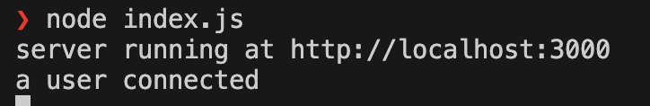
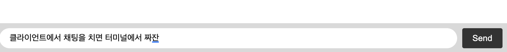
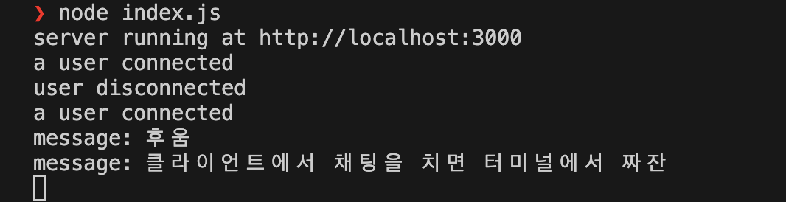

# Tutorial

### Step #1 Project initialization

### Step #2 Serving HTML

### Step #3 Integrating Socket.IO

Socket.IO는 두 부분으로 구성된다.:

1. Node.JS HTTP 서버와 통합(또는 마운트)되는 서버(socket.io 패키지)
2. 브라우저 측에서 로드되는 클라이언트 라이브러리(socket.io-client 패키지)

개발 과정에서 socket.io가 자동으로 클라이언트를 제공하므로 지금은 하나의 모듈만 설치하면 된다. :

##### 서버

서버(HTTP 서버) 객체를 전달하여 socket.io의 새 인스턴스를 초기화한다.
들어오는 소켓에 대한 연결 이벤트를 수신 대기하고 콘솔에 기록한다.

```js
// index.js
import { Server } from "socket.io";

const io = new Server(server);

io.on("connection", (socket) => {
  console.log("a user connected");
});
```

##### 클라이언트

io 글로벌(및 엔드포인트 `GET /socket.io/socket.io.js`)을 노출하는 socket.io-client를 로드하고 연결한다.

- 클라이언트 측 JS 파일의 로컬 버전을 사용 : node_modules/socket.io/client-dist/socket.io.js
- CDN : `<script src="https://cdn.socket.io/4.7.4/socket.io.min.js"></script>`

```html
<!-- index.html -->
<script src="/socket.io/socket.io.js"></script>
<script>
  const socket = io();
</script>
```

기본적으로 페이지를 제공하는 호스트에 연결을 시도하기 때문에 io()를 호출할 때 URL을 지정하지 않는다.

```bash
npm install socket.io
```

- 결과 터미널 이미지
  

### Step #4 Emitting events

> Socket.IO의 기본 개념 : 원하는 데이터와 함께 원하는 모든 이벤트를 보내고 받을 수 있다는 것.
> (JSON으로 인코딩할 수 있는 모든 객체를 사용할 수 있으며 바이너리 데이터도 지원 됨)

사용자가 메시지를 입력하면 서버가 이를 채팅 메시지 이벤트로 받는다.

```html
<script src="/socket.io/socket.io.js"></script>
<script>
  const socket = io();

  const form = document.getElementById("form");
  const input = document.getElementById("input");

  form.addEventListener("submit", (e) => {
    e.preventDefault();
    if (input.value) {
      socket.emit("chat message", input.value);
      input.value = "";
    }
  });
</script>
```

```js
io.on("connection", (socket) => {
  socket.on("chat message", (msg) => {
    console.log("message: " + msg);
  });
});
```

- 클라이언트
  

- 서버 터미널
  

### Step #5 Broadcasting

### Step #6 Connection state recovery

**Connection state recovery(연결 상태 복구)** : 먼저 연결이 끊어졌을 때 끊어지지 않은 것처럼 처리한다.

서버가 전송한 모든 이벤트를 임시로 저장하고 클라이언트가 다시 연결될 때 상태를 복원하려고 시도한다.

- restore its rooms(방 복원)
- send any missed events(놓친 이벤트 보내기)

즉, 서버 연결이 끊긴 후에 채팅을 쳐도 연결되었을 때 채팅이 자동으로 보내진다.
(일시적으로 연결이 끊긴 후(wifi에서 4G로 전환하는 경우), 클라이언트의 상태를 동기화할 필요가 없다.)

> - 서버가 갑자기 충돌하거나 다시 시작될 때, 클라이언트 상태가 저장되지 않는 경우 등의 상황이 발생한다. 즉, 항상 작동하는 것이 아니다.
> - 스케일업 할 때, 항상 활성화 할수 있는 것은 아니다.

##### 서버

```js
// index.js
const io = new Server(server, {
  connectionStateRecovery: {},
});
```

임의로 연결을 끊는 코드

```html
<form id="form" action="">
  <input id="input" autocomplete="off" /><button>Send</button>
  <button id="toggle-btn">Disconnect</button>
</form>

<script>
  const toggleButton = document.getElementById("toggle-btn");

  toggleButton.addEventListener("click", (e) => {
    e.preventDefault();
    if (socket.connected) {
      toggleButton.innerText = "Connect";
      socket.disconnect();
    } else {
      toggleButton.innerText = "Disconnect";
      socket.connect();
    }
  });
</script>
```

### Step #7 Server delivery

재접속(reconnection)시 클라이언트의 상태를 동기화하는 일반적인 방법

- 서버가 전체 상태를 전송
- 클라이언트가 마지막으로 처리한 이벤트를 추적하고 서버가 누락된 부분을 전송하는 방식

1. **클러스터 모듈 사용**: Node.js의 클러스터 모듈을 사용하여, 각기 다른 포트에서 리스닝하는 여러 워커 프로세스를 생성한다. 이렇게 하면 각 CPU 코어가 별도의 프로세스를 처리할 수 있다.
2. **Socket.IO와 클러스터 어댑터**: 실시간 양방향 통신을 위해 Socket.IO를 사용하고, 클러스터 어댑터를 통해 여러 워커 프로세스 간의 이벤트와 데이터를 공유할 수 있게 합니다. 이는 워커들 사이에서 소켓 연결 상태를 동기화하고 메시지를 교환할 수 있게 해 줍니다.
3. **SQLite3**: 데이터베이스 작업을 위해 SQLite3를 사용하며, sqlite 패키지를 통해 비동기적으로 데이터베이스를 다룰 수 있다. 웹 서버 내에서 데이터 저장 및 조회 등의 용도로 사용될 수 있다.
4. **다양한 포트에서의 리스닝**: 각 워커 프로세스는 환경 변수 PORT에 지정된 포트에서 서버를 실행합니다. 이 포트 번호는 프라이머리 프로세스에서 워커를 생성할 때 각기 다르게 설정하여, 각 워커가 서로 다른 포트에서 리스닝하도록 한다.

```js
import express from "express";
import { createServer } from "node:http";
import { Server } from "socket.io";
import sqlite3 from "sqlite3"; // SQLite3 데이터베이스와의 상호작용을 위한 모듈
import { open } from "sqlite"; // SQLite 데이터베이스를 쉽게 다루기 위한 래퍼
import { availableParallelism } from "node:os"; // 사용 가능한 CPU 코어 수를 가져오기 위한 모듈
import cluster from "node:cluster"; // 클러스터링 기능을 사용하기 위한 모듈
import { createAdapter, setupPrimary } from "@socket.io/cluster-adapter"; // Socket.IO 클러스터 어댑터

// 1. 클러스터의 프라이머리(마스터) 프로세스인지 확인 : 클러스터링 환경에서 마스터 또는 부모 프로세스를 의미함
if (cluster.isPrimary) {
  const numCPUs = availableParallelism(); // 1. 사용 가능한 CPU 코어 수를 가져옴
  // 사용 가능한 CPU 코어 수만큼 워커 프로세스 생성
  for (let i = 0; i < numCPUs; i++) {
    cluster.fork({
      PORT: 3000 + i, // 4. 각 워커에게 다른 포트를 할당
    });
  }

  // 1. 프라이머리 프로세스에서 클러스터 어댑터 설정
  setupPrimary();
} else {
  // 워커 프로세스
  const app = express(); // Express 애플리케이션 인스턴스 생성
  const server = createServer(app); // HTTP 서버 생성
  const io = new Server(server, {
    // Socket.IO 서버 설정
    connectionStateRecovery: {},
    adapter: createAdapter(), // 클러스터 어댑터 사용 설정
  });

  // [여기에 추가적인 서버 로직을 작성할 수 있습니다.]

  // 각 워커는 다른 포트에서 리스닝
  const port = process.env.PORT; // 환경 변수에서 포트 번호를 가져옴

  server.listen(port, () => {
    console.log(`server running at http://localhost:${port}`);
  });
}
```
